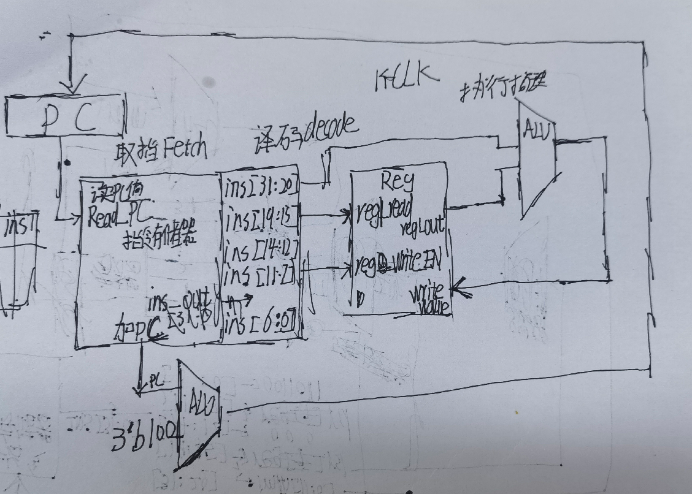

# 用RTL实现最简单的处理器
**处理器执行指令的基本流程**:
> `取指令` -> `译码` -> `执行指令` -> 存储器访问(指令由读写内存的行为时) -> 结果写回(将得到的数据写回对应的寄存器)  

一个PC的值唯一对应一个指令  

# 注意点
1. 使用verilog时: 在宏定义的标识符前添加学号前缀  
   - 如`define ysyx_22040000_SIZE 5`  

