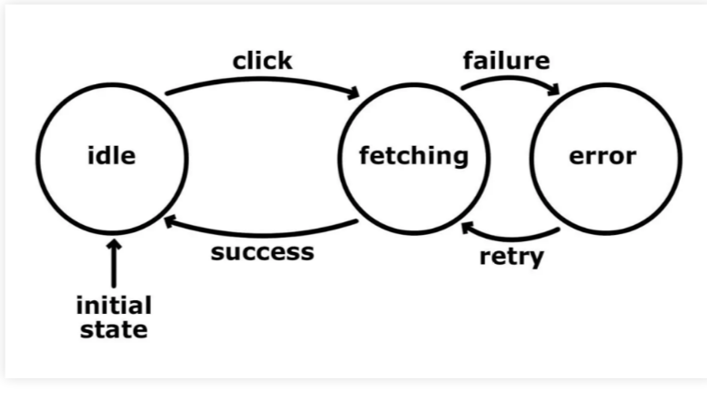
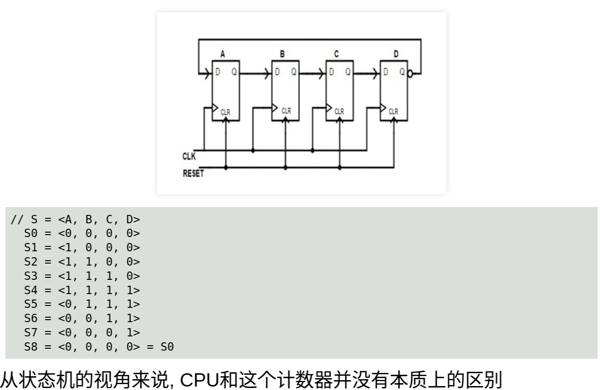

# 状态机
**一个不是特别严谨的定义**  
- 状态集合S = {S1, S2, ...}
- 激励事件
- 状态转移规则
    - 描述每个状态在不同激励事件下的次态(next state)
- 初始状态S0 ∈ S
    

## 计算机系统都是状态机  

这三个抽象层次，程序，指令集，cpu都可以用状态机来理解

## C程序的状态机模型
- 状态集合`S = {<V, PC>}`
    - `V = {v1, v2, v3, ...}` = 程序中所有变量的取值
        - 包括全局变量和局部变量
    - `PC` = 程序计数器 = 当前执行的语句位置
- 激励事件
    - 执行PC指向的语句
- 状态转移规则
    - 语句的语义(semantics)
- 初始状态`S0 = <V0, main函数的第一条语句>`
### 例子
```c
/* 1 */ int main() {
/* 2 */   int x = 1;
/* 3 */   int y = 2;
/* 4 */   int z = x + y;
/* 5 */   printf("z = %d\n", z);
/* 6 */   return 0;
/* 7 */ }

//状态机
// S = <x, y, z, PC>
  S0 = <?, ?, ?, 2 > // '?'表示未初始化
  S1 = <1, ?, ?, 3 >
  S2 = <1, 2, ?, 4 >
  S3 = <1, 2, 3, 5 >
  S4 = <1, 2, 3, 6 > // 输出"z = 3"
  S5 = <1, 2, 3, 结束>
```

## CPU = 数字逻辑电路 = 状态机
- 状态集合`S = {<时序逻辑元件的值>}`
    - 具体包括寄存器, 存储器, 触发器等
- 激励事件
    - 组合逻辑
- 状态转移规则
    - 由设计中的组合逻辑电路决定
    - 依据: 架构师的设计文档
- 初始状态`S0 = <复位时时序逻辑元件的值>`
### Johnson计数器


## 指令集也是个状态机
### 指令集是什么

