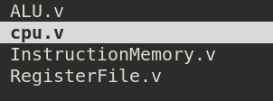

# 进度汇报
**当前进度**: B阶段实现NPC的第一条指令ADDI  

**本周学习进展**:  
1. 完成了PA2阶段1  
2. 配置好了neovim下的verilog环境  
   > 利用vim插件vtags实现了verilog各个模块之间的跳转  

3. 学习了vim的自动命令:  
   > 实现了每次保存.v文件，自动更新.v文件的tags 
   >> `autocmd BufUnload *.v :!python3 /home/awjl/vtags-3.11/vtags.py`

   > 实现了每次进入.md文件，将tab缩进改为2格  

4. 回顾了verilog相关知识点  
5. 根据自身理解，大郅搭建了一个npc的框架，vsrc文件目录如下:  
   

