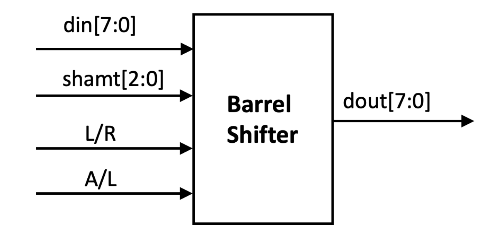

# 移位寄存器
|  控制位 |  工作方式  |
|  ----  |  ----  |
| 000 | 清0 |
| 001 | 置数 |
| 010 | 逻辑右移 |
| 011 | 逻辑左移 |
| 100 | 算术右移 |
| 101 | 左端穿行输入1位值，并行输出8位值 |
| 110 | 循环右移 |
| 111 | 循环左移 |

逻辑移位: 不管是左移还是右移，都是空缺处补0  
算术移位: 算术移位要保证符号位不改变，算术左移同逻辑左移一样; 算术右移最左面的空位补符号位。  
循环: 将移出去的那一位补充到空出的最高/低位的移位方式  
置数: 将一个8位的数据输入到寄存器中  

左端串行输入1位数值，并行输出8位数值: 指每个时钟到来时右移一位，并且移入的最左位由外部开关决定是1还是0，输出同其他情况一样为同时输出8位。
这个功能在进行串行转换为并行时比较有用，可以将时间上顺序输入的8个bit存入移位寄存器，在8个周期后形成一个8bit数一起输出。后续键盘串行输入可以利用这个功能。
## 使用verilog描述移位寄存器
```verilog
Q <= {Q[0],Q[7:1]}  //循环右移
Q <= {Q[7],Q[7:1]}  //算术右移
```

# 桶形移位器  
  
din: 输入数据  
dout: 输出数据  
shamt: 移位位数  
L/R: 表示左移和右移，置1为左移，置0为右移  
A/L: 算术逻辑选择，置1为算术移位，置0为逻辑移位  


