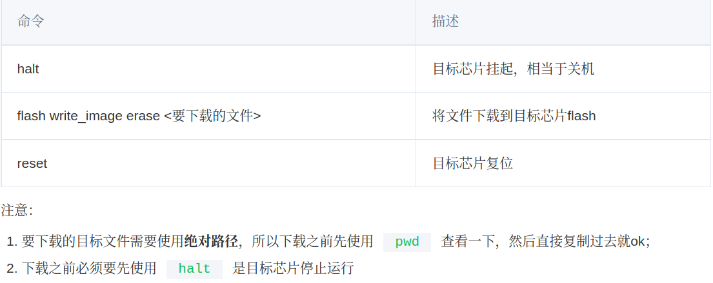

# 使用openocd下载程序到stm32
1. 使用如下命令 **连接到目标芯片**  
    - openocd -f <接口配置文件>  -f <目标芯片配置文件>
        - 接口配置文件目录： /usr/local/share/openocd/scripts/interface/
           - 即选择是jlink,stlink还是其他等等的地方
        - 目标芯片配置文件: /usr/local/share/openocd/scripts/target/

3. **新建一个终端**,使用`telnet`连接到openocd
    - `talnet localhost 4444`
    - **接下来可以用命令来控制他们**
    -  

4. 退出: `ctrl+]` 然后输入`q`  
    >一定要退出,不然下次就不能连接了 

## 遇到的问题
openocd无法找到 **stlink**:  
解决办法：  
  1. 找到openocd源码 `cd ~/Documents/openocd`
  2. 使用命令`./configure --enable-stlink`
  3. make 和  sudo make install  

注意: 如遇到无法找到其他的设备，也可以用类似的方法来解决  

---

openocd连接jlink时报错:`Error: Selected transport is not supported by the devic`:  
解决办法:  
  1. 找到`/usr/local/share/openocd/scripts/interface/jlink.cfg`  
  2. 修改其中的内容,因为默认是用的jtag连接，而我的设备是需要swd，因此我需要作如下:  
  3. `transport select swd`  
## 简化方法
将命令写入makefile中  
详细见模板 ~/workspace/stm32/FWLIB_Template/Makefile  
