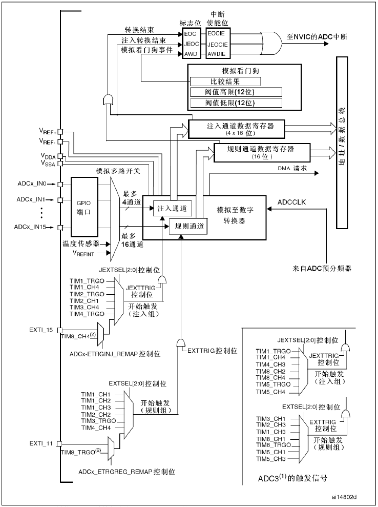

# 模拟/数字转换(ADC)
## ADC 介绍
STM32f103有3个ADC，精度为12位。  
每个ADC有18个通道，可测量16个外部和2个内部信号源  
ADC1和ADC2都有16个外部通道，ADC3根据CPU引脚的不同通道数也不同  

各通道的A/D转换可以单次、连续、扫描或间断模式执行.  
## ADC功能框图
  

---

**ADC引脚**  
|  名称      |    信号类型       |  注解   	|
| ------------- |-------------  | ------- |
|    VREF+   |    输入，模拟参考正极 | ADC使用的高端/正极参考电压  |
|    VDDA    |    输入，模拟电源     | 等效与VDD的模拟电源          |
|    VREF-   |    输入，模拟参考负极 | ADC使用的低端/负极参考电压    |
|    VSSA    |    输入，模拟电源地   |  等效与VSS的模拟电源地        |
|    ADCx_IN[15:0]      |    模拟输入信号       | 16个模拟输入信号              |

