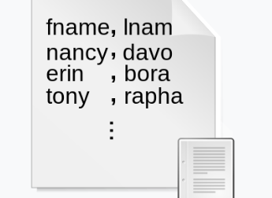

# csv-逗号分隔值
以纯文本形式存储表格数据(数字和文本)  
文件的没一行都是一个数据记录，每个记录有一个或多个字段组成(字段之间用`逗号`分隔)  
格式可以如下:  
  

## 格式规范  
1. 每一行位于一个单独的行上，用回车换行符CRLF(<font color=purple>\r\n</font>)分割  
```csv
aaa,bbb,ccc CRLF
zzz,yyy,xxx CRLF
```

2. **最后一行**记录可以**没有**回车换行符  
3. 空格也是字段的一部分  
4. 
