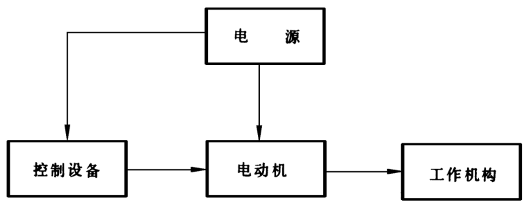
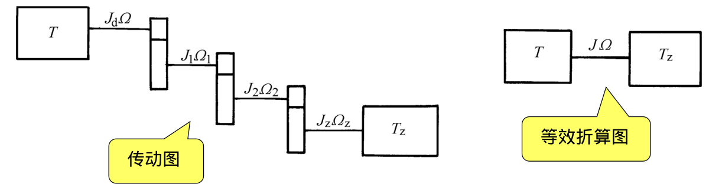
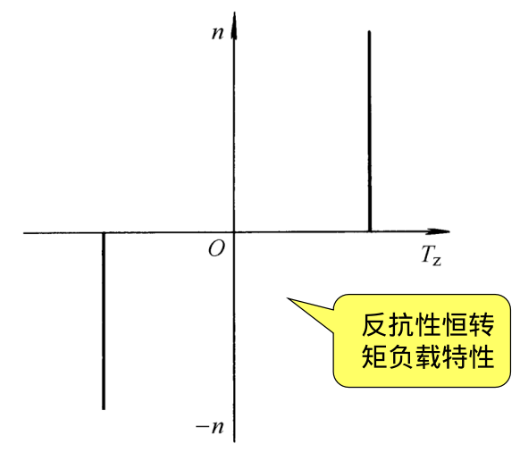
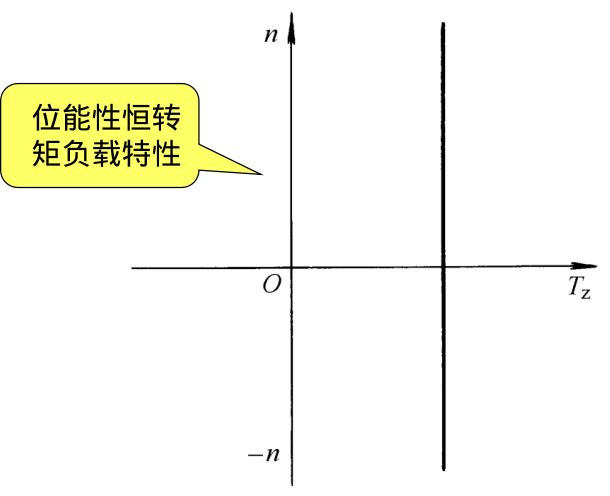
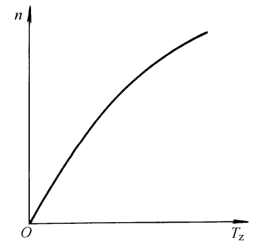
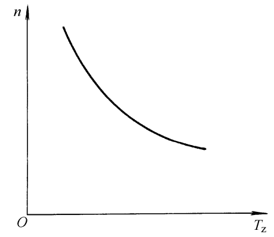

# 第八章: 电力拖动系统动力学基础
> **拖动**: 应用各种原动机使生产机械产生运动，以完成一定的生产人物  
> **电力拖动**: 以各种电动机作为原动机的拖动方式称为"电力拖动"  

## 电力拖动系统的运动方程式
  

> **电力拖动装置**分为电动机，工作机构，控制设备及电源四个组成部分  

> 在许多情况下，电动机与工作机构并不通州，而在两者之间有传动机构  

### 运动方程式
1. 对于直线运动:(1)$F-F_Z = m\frac{dv}{dt}$  
   - >F: 拖动力(N)  
   - >$F_Z$:阻力(N)  
   - >$m\frac{dv}{dt}$: 惯性力(N)  
2. 对于旋转运动:(2)$T-T_Z = J\frac{d\Omega}{dt}$  
   - >T: 电动机产生的拖动转矩,$T = T_e - T_0$  
   - >$T_Z$: 负载转矩($N\cdot m$)  
   - >$J\frac{d\Omega}{dt}$: 惯性转矩  
   - >$\Omega  = \frac{2\pi n}{60}$  
3. 转动惯量:(3)$J = mr^2 = \frac{GD^2}{4g}$,单位$Kg\cdot m^2$  
   - >m,G: 旋转部分的质量和重力  
   - >r,D: 惯性半径与惯性直径(不是圆柱体的半径与直径)  
   - >g: 重力加速度,$g = 9.81m/s^2$  
4. 式(2)的实用形式:(4)$T -T_Z = \frac{GD^2}{375}\frac{dn}{dt}$  
   - >$GD^2$: 飞轮惯量($N\cdot m^2)$,$GD^2 = 4gJ$  

--- 
**由(4)可对电动机的工作状态分析**:
1. 当$T = T_Z$,$\frac{dn}{dt} = 0$:电动机静止或等速旋转，电力拖动系统处于稳定运转状态  
2. 当$T > T_Z$,$\frac{dn}{dt} > 0$: 电力拖动系统处于加速状态  
2. 当$T = T_Z$,$\frac{dn}{dt} = 0$: 电力拖动系统处于减速状态  

### 运动方程式中转矩的正负符号分析
运动方程式的一般形式:$\pm T - (\pm T_z) = \frac{GD^2dn}{375dt}$  
> 规定某个转动方向为正方向，则转矩T,$T_Z$正向取正，反向取负  

### 各种形状旋转体转动惯量的计算
了解后面内后之后再说  

## 转矩、力、惯量和质量的折算

**目的**: 将实际的拖动系统等效为单轴系统  
**折算原则**: 保持两个系统传送的功率及存储的动能相同  
**折算参量**:工作机构转矩$T_z'$,系统中个轴的转动惯量($J_1,J_2,...$)  
### 工作机构转矩$T_Z'$的折算
> 用电动机轴上的负载转矩$T_z$来反映工作机构轴上的转矩$T_Z'$的工作  

由传送功率不变:$T_Z\Omega = T_Z'\Omega_Z$  
得:$T_z = \frac{T_z'}{\Omega/\Omega_Z} = \frac{T_z'}{j}$   
   - >j: 电动机轴与工作机构轴间的转速比,$j = \Omega/\Omega_Z  = n/n_z$
      - 如果传动机构为多机齿轮或带轮变速，则总的转速比应为各级转速比的乘积.$j = j_1\cdot j_2 \cdot j_3 \cdot\cdot\cdot$

### 工作机构直线作用力的折算
由传送功率不变:$T_Z\Omega = F_Zv_Z$  
得: $T_Z = 9.55\frac{F_Zv_Z}{n}$  
   - >$F_Z$: 工作机构直线作用力  
   - >$v_Z$: 中途提升速度

### 传动机构与工作机构飞轮惯量的折算
$GD^2 = GD_d^2 + \frac{GD_1^2}{(n/n_1)^2}+\frac{GD_2^2}{(n/n_2)^2} + ... + \frac{GD_Z^2}{(n/n_Z)^2}$

### 工作机构直线运动质量的折算
由转动惯量$J_Z$,质量$m_z$中存储的动能相等  
得:$J_Z\frac{\Omega^2}{2} = m_z\frac{v_z^2}{2}$  
化简得:$(GD_z^2) = 365\frac{G_zv_z^2}{n^2}$  

## 生产机械的负载转矩特性$T_Z = f(n)$
### 恒转矩负载特性:分为负能性，反抗性
> 恒转矩负载特性指: 负载转矩与转速无关的特性  

### 通风机负载特性
$T_z = Kn^2$  

### 恒功率负载特性
$T_Z = K/n$  

