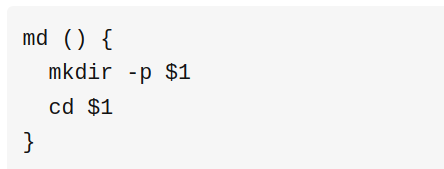

# 概述
1. 本质：是一个shell脚本文件
2. 每一次bash启动时，都会加载他
# 常包含内容
## 别名
- 包含用户想要用的别名，通过使用alias
    - alias ll="ls -a"
        - 可以通过ll命令显示所有隐藏文件
## 函数
```shell
#语法大多数都是如此
function_name () {
 command_1
 command_2
}
```

- \$1代表第一个参数，就是在函数名后紧跟着的文本
    - 如 md aaa
        - aaa就是第一个参数

