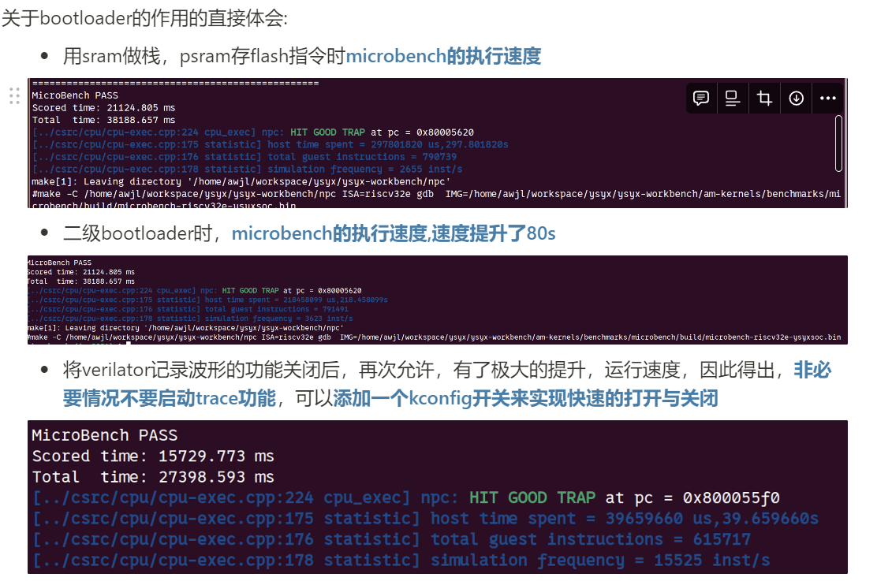

# 2024.6.10 ~ 2024.7.7 进度汇报
1. 准备分享会PPT;    

2. 配置neovim环境;  
   - >使用lazy.nvim包管理器来重新管理nvim插件  
   - >重新配置了Lsp,format,cmp  
      - >为verilog,c,cpp等语言实现了上述支持  

3. **NPC学习内容**:  
   - SoC:完成了`更实用的Soc`部分
      - 解决了一次指令，造成重复访存的问题  
   - SoC: 完成了`可重复编程的非易失存储器`(flash)  
      - 实现了基于SPI协议的位翻转模块   
      - 实现了通过XIP的方式访问flash  
      - ...
   - SoC: 实现了PSRAM存储器
      - 实现了PSRAM颗粒的仿真行为模型  
      - 为PSRAM添加了QPI模式，可以自由切换  
      - 实现了二级bootloader  
   - 对链接脚本理解的更加深刻,也能够编写复杂一点的链接脚本了  
---

**心得**：  
bootloader对程序的速度提升确实十分的大  

