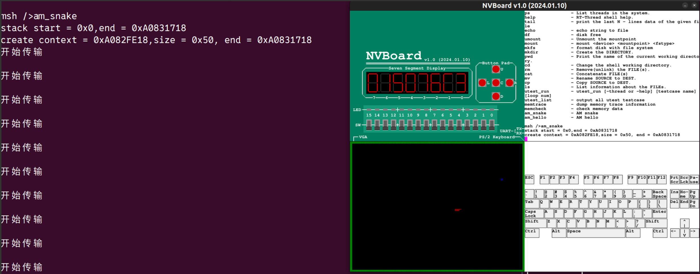
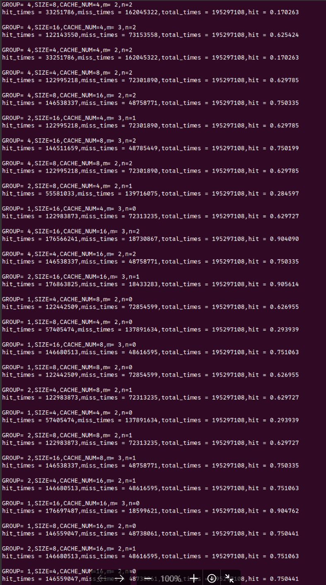

# 2024.7.22 ~ 2024.8.4 进度汇报
**NPC学习内容**:
- SoC:  
   - 添加了SDRAM.
   - 添加了GPIO,PS2,VGA  
- 成功在RTT上运行游戏，并能够play  
   - 
- Cache:
   - 添加了性能计数器  
      - 
   - 校准了APB设备的访存延迟
   - 添加了宏开关: 打开/关闭DPI-C相关的RTL代码
   - 实现了icache,icachesim 
      - icache: 可以定制大小和块数量 
      - icachesim: 可以批量运行(多线程)不同的参数组合。
         - 
   - 重构了AXI,面积减小了6000,但频率也从600降低到了500
   - 实现了sdram的突发传输，一次传输4条指令 
   - 校准了AXI设备的访存延迟  

---

**心得**：

**解决问题**: 
1. 解决了RTT-thread生成的bin文件很大的问题，之前以为是链接脚本的问题,后来发现这不是问题，而是因为包含了许多am-app进来  

