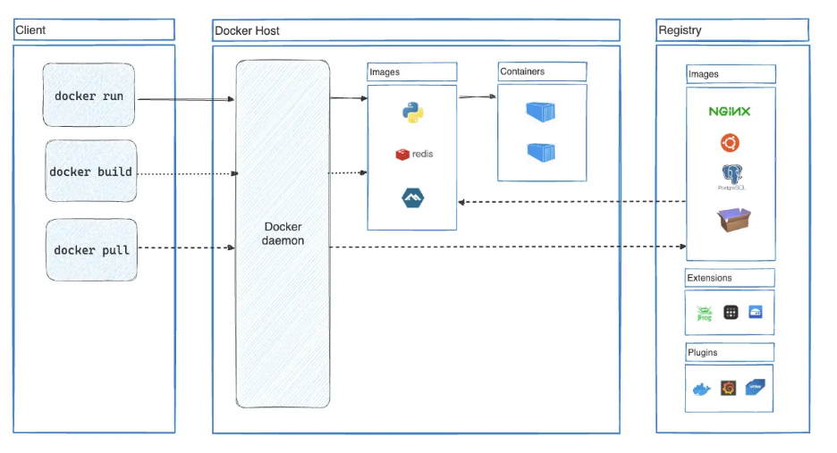

# [docker架构](https://docs.docker.com/get-started/docker-overview/#docker-architecture)

`Docker-client`通过 `UNIX sockests`或`一个网络接口`使用`REST API` 与`Daemon`通信  
> Docker-client 与 daemon可以在同一个系统下  

## Docker daemon
**作用**:   
- 监听Docker API请求,实际执行命令的后台服务。
- 管理Docker对象，如镜像、容器、网络和卷
- 与其他daemon通信以管理Docker服务

## Docker registries
- **功能**: 存储docker的镜像。`Docker hub`是所有人都可以使用的公开的registries  
- **补充**: 我们可以建立私人的registry,并上传我们自己的镜像  

## Docker objects
> :bulb: **objects**: images,containers,networks,volumes,plugins and so on.

### Images
- **概念**: 镜像是一个只读模板，包含创建Docker容器的说明。 

- **补充**: 通常，一个镜像是基于另一个镜像，进行一些额外的定制。 如基于ubuntu镜像的镜像  

-  **创建images**: 需要创建一个`Dockerfile` ,用简单的语法定义创建镜像和运行镜像所需的步骤  
   - > :star: Dockerfile中的每一条指令都会在镜像中创建一个层。当更改Dockerfile并重建镜像时，只有以更改的层才会被重置。  

### Containers
- **概念**: 镜像的可运行实例。容器由其映像以及创建或启动容器时提供的任何配置选项定义。  
- **管理**: 可以通过`docker API`和`CLI`创建、启动、停止、移动或删除容器  

- **性质**: 可以将容器连接到一个或多个网络，为其附加存储，甚至根据当前状态创建新的镜像。  

- **性质**: 默认情况下，容器与其他容器及其主机之间的隔离相对较好我们可以控制容器的网络、存储或其他底层子系统与其他容器或主机的隔离程度。

- **性质**: 删除容器时，未存储在持久化存储中的对其状态的任何更改都会消失   

