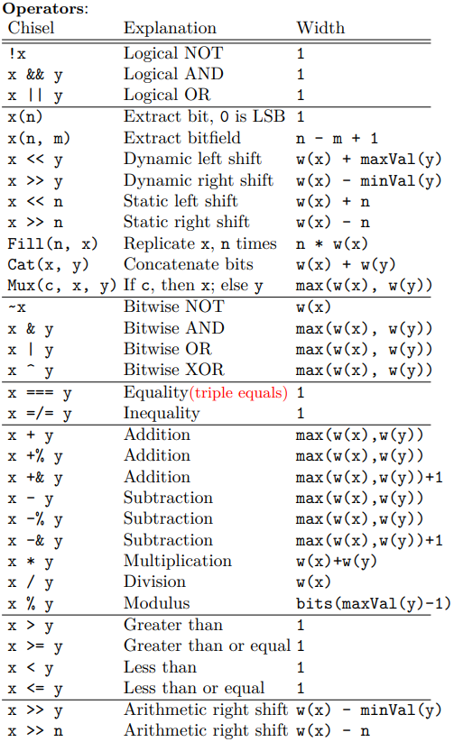

# 基础知识
## Chisel wire操作符
```scala
val x = Wire(Uint())
x := y  // 连接wire型y到x
```

## When
```scala
when(condion1) {
    ……
} .elsewhen(condition2) {
    ...
} .otherwise }
    ...
}
```
when块没有返回值  

## Swithch 
```Chisel
switch(x) {
    is(value1) {
    ...
    }
    is(value2) {
    ...
    }
}
```

## math helper
```
log2Ceil(in:Int): Int log2(in) rounded up
log2Floor(in:Int): Int log2(in) rounded down
isPow2(in:Int): Boolean True if in is a power of 2
```

## Enum
> val s1 :: s2 :: ... :: sn :: Nil = Enum(nodeType:Uint, n:Int)  
>> s1,s2，……是互补相同的值  
>> nodetype 是s1,s2 ，……的类型,可以省略  
>> n :元素个数


## 基本数据类型
```
Bool() type, boolean value
true.B or false.B literal values

UInt(32.W) type 32-bit unsigned
UInt() type, width inferred
77.U or "hdead".U unsigned literals
1.U(16.W) literal with forced width

SInt() or SInt(64.W) like UInt
-3.S signed literals
3.S(2.W) signed 2-bits wide value -1
```

## 状态元件
### Registers
```scala
val my_reg = Reg(UInt(32.W))
RegInit(7.U(32.w)) //reg with initial value 7
RegNext(next_val) //每经过一个时钟都会更新，值为上一个周期时next_val的值
RegNext(next, init) //update, with init
RegEnable(next, enable) //update, with enable gate
```
输出前一个时钟周期的输入信号的值  
```scala
val reg = RegNext(io.in,0.U) // reg的值将会是输入信号in在上一个时钟周期的值,0.U是初始化值
```

### 读写存储器
> val my_mem = Mem(n:Int, out:Data)  
>> out 内存元素的类型  
>> n 内存深度  
> 使用，通过索引访问元素  
>> val readVal = my_mem(addr:UInt/Int)

## 操作符
  
### 关于加减乘除运算结果的位宽
#### 加法与减法一样:
Z = x + y : 则z的位宽为 max( w(x), w(y))  
Z = x +& y : 则z的位宽为 max( w(x), w(y)) + 1  

#### 详细可以见图片，有介绍


