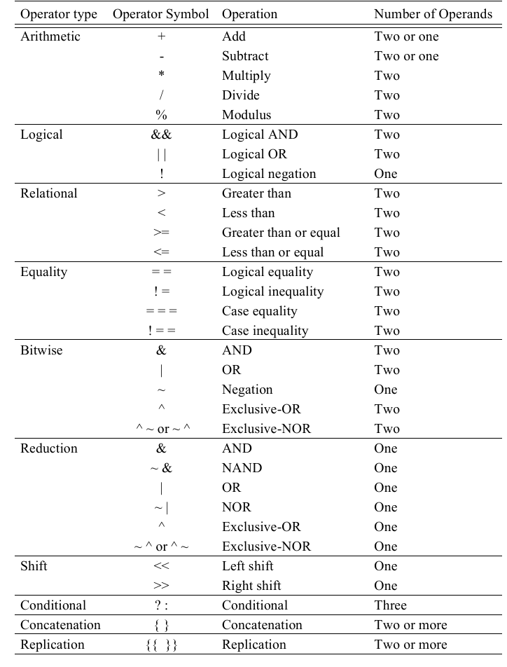

#操作符
 <font color=red>操作符将net,register操作数当作`无符号数`，将real，interger当作`有符号数`</font>  
  
<font color=颜色>文字</font>
## {} 连接
是把多个变量联结在一起  
```verilog
wire [1:0] x,y;
wire [3:0] z;
z = {x,y} // z[3:2] = x,z[1:0] - y
```

## {{}} 复制
{i{j,k,...}}是一种简便的，i表示有多少个{j,k,...}  
```verilog
wire  x,y;
wire [3:0] z;
integer i = 2;

z = {i{x,y}} ;
```
<font color=red>相当与z[3:2] = {x,y}, z[1:0] = {x,y}</font>,即复制了i个{j,k,...}  

## logical operators
&&,||,!  
当表达式返回一个非零数是，被看作 logical 1  
当表达式为x 或 z时，通常被看作一个false的条件  

> !x还是x  

## equality
### logical equality
比较两个值  
> 如果表达式的操作数中任意一个为x，z将返回x  

### case equality
case equality<font color=purple>`一位一位`的比较两操作数的值，包括x,z</font>  

## reduction归约操作符  
是单目操作符，将一个向量的每一位进行比较  
有&,|, ^ , ~^
> example  
>> &4‘b0111  
>>> 表示0 & 1 & 1 & 1  

## 三目运算符?:
格式:  
```verilog
conditionnal_expression ? (cond_expr1 ? true_expr1 : false_expr1)
                        : (cond_expr2 ? true_expr2 : false_expr2);
```


