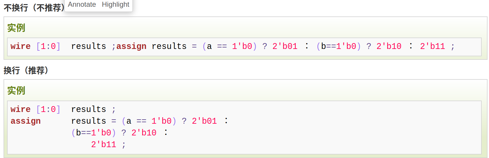
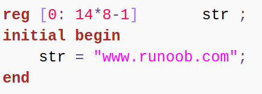
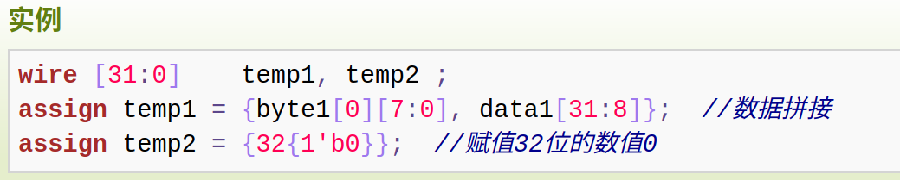
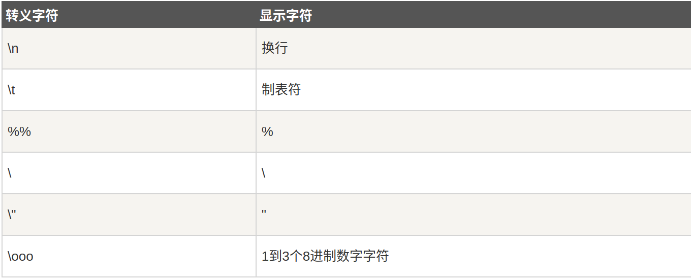

# 基础知识
## 命令行格式要求
1. 区分大小写
2. 可以在一行填写,也可以在`多行填写`。
3. `**每个语句必须以分号为结束符**`


## 数字的几种表示方法
### 常量constants
当表示十进制时，被当作有符号数。  
> 如127，-1  

当表示其他模制的数时，被当作是无符号数  
> 如4'b0000  
> -9'o352表示十进制的234,是无符号数  

### 数值种类（表示四种电平逻辑）
- `0`: 逻辑0或‘假’
- `1`: 逻辑1或‘真'
- `x`或`X`: 未知
- `z`或`Z`: 高阻态
- 上拉则逻辑值为1,下拉则0
### 整数数值表示方法
- 指明位宽(详细间./basic/基本语法.md)
- 不指明位宽，会自动分频位宽
- `负数表示`
    - 添加一个`-`即可
- `科学计数法`：
    1. 1.2e4  表示12000
    2. 1_0001e4 表示100010000
    3. 1E-3  表示0.001
### 字符串表示
- 一个字符算八位
- 是由双引号包起来的字符队列
- 不能多行书写,即不能包含回车符
-   


## 数据类型 
两种: wire 与 reg  
### 线网(wire),表示net
`定义`: 网络是连接模块内或模块间硬件元素的一根或一组电线  
如果没有驱动元件连接到wire型变量，缺省值一般为“Z”  
output,input默认被声明为wire型变量  

### 寄存器(reg)
寄存器变量表示可以保持一个值的变量  
`Verilog 寄存器`与`硬件寄存器`功能上类似，但在概念上是不同的。  
> verilog寄存器是<font color=blue>硬件寄存器</font>的抽象象征，被声明为reg  
> 硬件寄存器是有如D触发器，JK触发器等存储元素组成的。  
 
#### 存储器-寄存器数组
是一种寄存器数组，可以用来描述RAM或ROM的行为。
```verilog
reg [msb:lsb] memory_name [first address:last address];
//实例
reg               membit[0:255] ;  //256bit的1bit存储器
reg  [7:0]        mem[0:1023] ;    //1Kbyte存储器，位宽8bit
reg [15:0]        buff_reg;
// 寄存器初始化
mem[511] = 8'b0 ;                  //令第512个8bit的存储单元值为0
buff_reg = 16'h7ab5;
```

## 整数，实数，时间  寄存器变量
`实际上也属于寄存器类型`
### 整数(integer)
1. 使用interger来声明，声明时不用位宽
    - 位宽与编辑器有关。
    - 一般为32位
    - **属于有符号数**
### 实数(real)
1. 使用real来声明
2. 可用十进制或科学计数法来表示
3. 声明不能带有范围，默认值为0
4. 将实数复制给整数时，有效部分只有整数部分

### 时间(time)
1. 使用time来声明
2. 作用： 对仿真时间进行保存
3. 其宽度一般为64bit，通常调用`$time`获取当前仿真时间
```verilog
//example
time       current_time ;
initial begin
       #100 ;
       current_time = $time ; //current_time 的大小为 100
end
```

## 数组
在 Verilog 中允许声明 reg, wire, integer, time, real 及其向量类型的数组。  
数组中没一个元素都可以作为一个标量或向量
```verilog
//实例
integer          flag [7:0] ; //8个整数组成的数组
reg  [3:0]       counter [3:0] ; //由4个4bit计数器组成的数组
wire [7:0]       addr_bus [3:0] ; //由4个8bit wire型变量组成的数组
wire             data_bit[7:0][5:0] ; //声明1bit wire型变量的二维数组
reg [31:0]       data_4d[11:0][3:0][3:0][255:0] ; //声明4维的32bit数据变量数组
```

## 向量
1. 当位宽格式大于1时，wire或reg即可声明为乡里那个的形式，形如:  
```verilog
reg [3:0]      counter ;    //声明4bit位宽的寄存器counter
wire [32-1:0]  gpio_data;   //声明32bit位宽的线型变量gpio_data
wire [8:2]     addr ;       //声明7bit位宽的线型变量addr，位宽范围为8:2
reg [0:31]     data ;       //声明32bit位宽的寄存器变量data, 最高有效位为0
```
`注意`: data[0:8]表示，最高位是0位，所以当有data[0:8]=data_high[8:0]时，data的最高位是data_high的最低位  


2. 对于以上变量，我们可以使用其中的某一一变量的某一位或者某一段  
```verilog
wire [9:0]     data_low = data[0:9] ;
addr_temp[3:2] = addr[8:7] + 1'b1 ;
```
3. verilog还支持指定bit后固定位宽的向量域选择**`访问`**
    - 如a = data[3+:7],表示a = data[3:9]
    - 如b = data[14-:6],表示b = data[14:9]

4. 对信号重新组合成新的向量时，需要借助大括号。


### 多维向量
```verilog 
reg [7:0] y[15:0];
//初始化
initial begin
y[0] = 8'h10;
...
y[15[ = 8'h11;
```
由上可知，y[i]是一个位宽为8的数据(i的范围为0-15)  

### parameter-用于表示常量
用来表示常量  
用关键字`parameter`声明  
`**只能赋值一次**`,不过通过实例化的方法，可以更改参数在模块中的值  
`局部参数`用localparam来声明，它的值不可被改变  

### 字符串
保存在reg类型的变量中，每个字符占用一个字节8bit  
不能多行书写  
若寄存器变量的宽度`大于`字符串的大小，则使用0来填充左边的空余位  
若寄存器变量的宽度`小于`字符串的大小，则截取字符串左边多余的部分  


