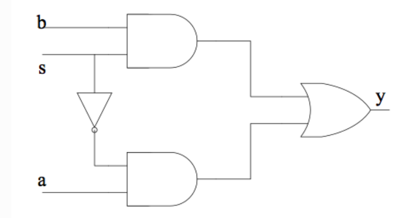

# 真正的描述电路 = 实例化 + 连线
## 建模方式
以一个2选1多路选择器为例:  
  
## 数据流建模（推荐）
主要是通过连续赋值语句`assign`来描述电路的功能  
```verilog
module m_mux21(a,b,s,y);
   input a,b,s; 
   output y;

   assign y = (~s&a)|(s&b);

endmodule
```

### 结构化建模
主要是通过逐层例化子模块的方式来描述电路的功能  
```verilog
module my_and(a,b,c);
    input a,b;
    output c;
    
    assign c = a & b;
endmodule

module my_or(a,b,c);
  input  a,b;
  output c;

  assign c = a | b;
endmodule

module my_not(a,b);
  input  a;
  output b;

  assign b = ~a;
endmodule

module mux21b(a,b,s,y);
  input  a,b,s;
  output y;

  wire l, r, s_n; // 内部网线声明
  my_not i1(.a(s), .b(s_n));        // 实例化非门，实现~s
  my_and i2(.a(s_n), .b(a), .c(l)); // 实例化与门，实现(~s&a)
  my_and i3(.a(s),   .b(b), .c(r)); // 实例化与门，实现(s&b)
  my_or  i4(.a(l),   .b(r), .c(y)); // 实例化或门，实现(~s&a)|(s&b)
endmodule
```

### 行为建模（不推荐）
是通过类似面向过程的编程语言来描述电路的行为  
该方法，不关注逻辑门的直接实现，而更关注于系统的体系架构。  
```verilog
module mux21c(a,b,s,y);
  input   a,b,s;
  output reg  y;   // y在always块中被赋值，一定要声明为reg型的变量

  always @ (*)
    if(s==0)
      y = a;
    else
      y = b;
endmodule
```

## 模块例化
在一个模块中引用另一个模块，对其端口(input，output，inout)进行相关连接，叫做模块例化。  
在数字系统设计过程中，通常需要将一个打的系统切分成多个小的子模块。  
> 另一方面可以将小模块作为一个可重复使用的单元，在不同的项目中重复使用。  

<font color=blue>模块例化建立了描述的层次</font>  

### 模块例化方法-命名端口链接
将需要例化的模块端口与外部信号按照其名字进行连接，<font color=red>端口顺序任意</font> 。  
这种方法是比较推荐的。  
例化一次1bit全加器的例子:  
```verilog
full_adder1  u_adder0(
    .Ai     (a[0]),
    .Bi     (b[0]),
    .Ci     (c==1'b1 ? 1'b0 : 1'b1),
    .So     (so_bit0),
    .Co     (co_temp[0]));
```
如果某些端口，不需要在外部连接，`例化时` 可以<font color=blue>不连接</font>(悬空，或者删除（即在例化时不写该端口）)  
> 输入端口不可以删除，不用则可以悬空，不过一般不建议悬空，可以选择给那个端口赋一个常量  

### 顺序端口连接（不推荐）
按照模块声明时端口的顺序与外部信号进行匹配连接，位置要严格保持一致。  
代码从书写上占用相对较少的空间，但代码可读性价格内地，也不易于调试。  
实例如下:  
```verilog
//module_name   自定义的名字(模块中的参数);
full_adder1  u_adder1(
    a[1], b[1], co_temp[0], so_bit1, co_temp[1]);
```

### 端口连接规则  
#### 输入端口
模块例化时，从模块外部来讲， input 端口可以连接 wire 或 reg 型变量。这与模块声明是不同的，从模块内部来讲，input 端口必须是 wire 型变量。  
#### 输出端口
模块例化时，从模块外部来讲，output 端口必须连接 wire 型变量。这与模块声明是不同的，从模块内部来讲，output 端口可以是 wire 或 reg 型变量。  
#### 输入输出端口
模块例化时，从模块外部来讲，inout 端口必须连接 wire 型变量。这与模块声明是相同的。  
#### 悬空引脚
在端口例化处留空白即可，如`.Ai      (),`  
悬空信号的逻辑功能表现为高阻状态(逻辑值为z)  


### 位宽匹配
当例化端口与连续信号位宽不匹配时，端口会通过`无符号数的右对齐`或`截断方式`进行匹配  
```verilog
full_adder4  u_adder4(
    .a      (a[1:0]),      //input a[3:0]
    .b      (b[5:0]),      //input b[3:0]
    .c      (1'b0),
    .so     (so),
    .co     (co));
```
该例化结果会导致：`u_adder4.a = {2'bzz, a[1:0]}, u_adder4.b = b[3:0] 。`


### 用generate进行模块例化
<font color=red>用generate语句进行多个模块的重复例化</font>  
重复例化4个1bit全加器组成一个4bit全加器的代码如下:  
```verilog
module full_adder4(
    input [3:0]   a ,   //adder1
    input [3:0]   b ,   //adder2
    input         c ,   //input carry bit
 
    output [3:0]  so ,  //adding result
    output        co    //output carry bit
    );
 
    wire [3:0]    co_temp ;
    //第一个例化模块一般格式有所差异，需要单独例化
    full_adder1  u_adder0(
        .Ai     (a[0]),
        .Bi     (b[0]),
        .Ci     (c==1'b1 ? 1'b1 : 1'b0),
        .So     (so[0]),
        .Co     (co_temp[0]));
 
    genvar        i ;
    generate
        for(i=1; i<=3; i=i+1) begin: adder_gen
        full_adder1  u_adder(
            .Ai     (a[i]),
            .Bi     (b[i]),
            .Ci     (co_temp[i-1]), //上一个全加器的溢位是下一个的进位
            .So     (so[i]),
            .Co     (co_temp[i]));
        end
    endgenerate
 
    assign co    = co_temp[3] ;
 
endmodule
```


