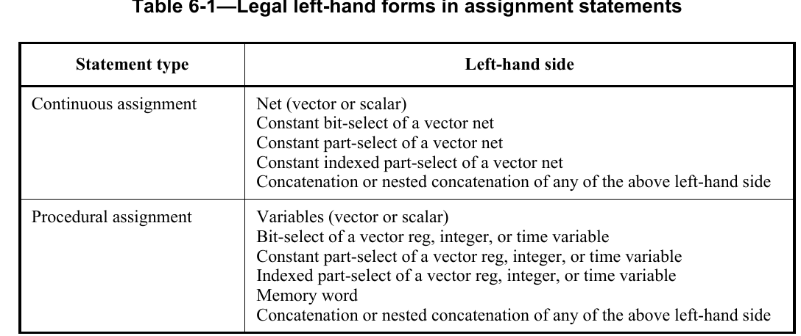

# assignments
分为声明赋值，连续赋值和过程赋值  
> 声明赋值: 在数据声明时赋值  
> 连续赋值: 用来给<font color=red>nets</font>型数据赋值  
> 过程赋值: 用来给<font color=red>variables</font>型数据赋值  




## 声明赋值
因为一个net只能被声明一次，因此对于一个特定的net只能声明复制一次  


## 连续赋值
连续赋值应将值驱动到网络上，包括向量和标量  
对于一个net，可以接受<font color=red>多个连续赋值形式</font>的赋值  
每当<font color=red>右边的值发生变化时</font>,就会发生这种赋值  
```verilog
assign eg1 = eg2; //每当eg2的值发生改变时，eg1的值也会随着改变
```
连续赋值提供了一种<font color=purple>无需指定门的互连</font>就可以对`组合逻辑建模`的方法。
相反，该模型指定了驱动网络的<font color=purple>逻辑表达式</font>  


# 剩下的内容，还未看，要看，就接着看标准手册的6.1.3 delay  
