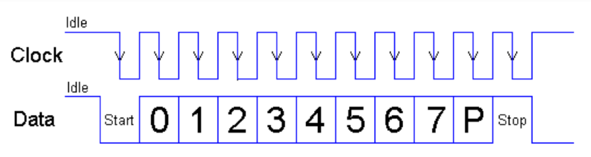

# PS/2接口控制器及键盘输入
PS/2是个人计算机串行I/O接口的一种标准

## PS/2接口的工作时序
PS/2接口使用两根信号线，一根传输时钟`PS2_CLK`, 另一根传输数据`PS2_DAT`  
当PS2_DAT和PS2_CLK信号线都为高电平时，处于空闲状态，键盘才可以给主机发送信号。  
如果将PS2_CLK信号置低，键盘将准备接受主机发来的命令  
  
当用户按键或松开时，键盘以每帧11位的格式串行传送数据给主机,同时PS2_CLK时钟信号上传输对应的时钟。  
第一位是开始位(`逻辑0`),后面跟着8位数据位(低位在前),一个奇校验位和一个停止位(`逻辑1`)  
每位都在时钟的`下降沿`有效.  
  
