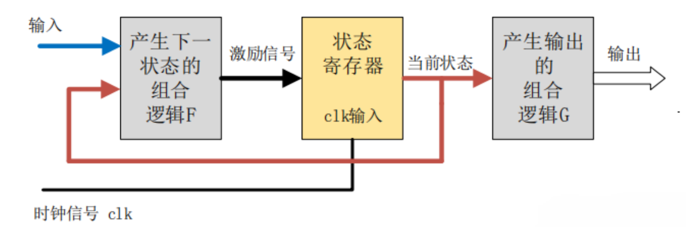
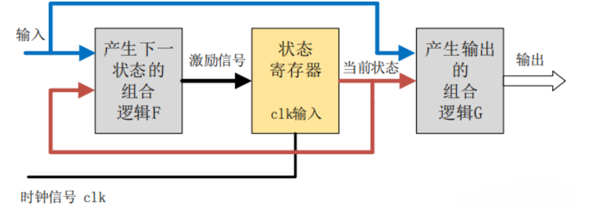
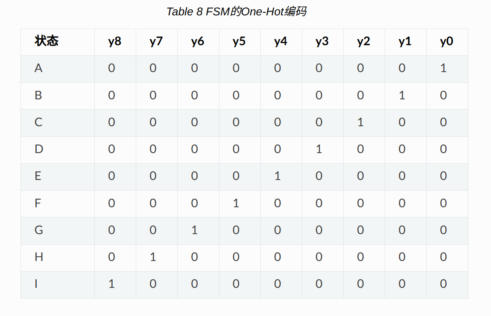

# 有限状态机
有限状态机: 是一个在有限个状态见进行转换和动作的计算机模型  
> 有限状态机的组成:  
>> 起始状态，一个`输入列表`(包含了所有可能的输入信号序列)，一个`状态转移函数`，一个`输出端`  

## 有限状态机数字电路结构的组成
有限状态机: 数字电路系统中十分重要的电路模块;是一种输出取决于过去输入和当前输入的时序逻辑电路。
是组合逻辑电路和时序逻辑电路的组合。  
> 组合逻辑电路部分:  
>> 一部分用来产生有限状态机下一个状态的<font color=purple>次态逻辑</font>  
>> 另一部分用于产生输出信号的输出逻辑  

> 状态寄存器: 一组具有"记忆"功能的寄存器，这些寄存器的功能是<font color=purple>记忆有限状态机的内部状态</font>  

## 状态机类型
### Moore型状态机
输出只与当前状态有关，与当前输入无关  
输出会在一个的完整周期内保持稳定,即使此时<font color=red>输入信号变化，输出也不会变化</font>。
输入对输出的影响要导下一个时钟周期才能反映出来。  
  

### Mealy型状态机
Mealy 型状态机的输出，不仅与`当前状态有关`，还取决于`当前的输入信号`。
Mealy 型状态机的输出是在<font color=red>输入信号变化以后立刻发生变化</font>，且<font color=red>输入变化可能出现在任何状态的时钟周期内</font>。
因此，同种逻辑下，Mealy 型状态机输出对输入的响应会比 Moore 型状态机早一个时钟周期。
  

## 状态机设计: <font color=red>3段式</font>(推荐)
- (0)首先，根据状态的个数确定状态编码。利用编码给状态寄存器赋值。  
```verilog
    //machine state decode机器状态编码
    parameter            IDLE   = 3'd0 ;
    parameter            GET05  = 3'd1 ;
    parameter            GET10  = 3'd2 ;
    parameter            GET15  = 3'd3 ;
```
- (1)状态机第一段，时序逻辑，非阻塞赋值，<font color=red>传递(状态)寄存器的状态</font>  
```verilog
    //(1) state transfer
    always @(posedge clk or negedge rstn) begin
        if (!rstn) begin
            st_cur      <= 'b0 ;
        end
        else begin
            st_cur      <= st_next ;
        end
    end
```
- (2)状态机第二段，组合逻辑，阻塞赋值，根据<font color=purple>当前状态</font>和<font color=purple>当前输入</font>，<font color=red>确定下一个状态机的状态</font>。  

- (3)状态机第三段，时序逻辑，非阻塞赋值，根据当前状态(与当前输入-Mealy型的需要)，<font color=red>确定输出信号</font>。  

## 状态机的编码方式 
### 采用顺序二进制编码的方式  
> 优点:  
>> 节省了保存状态向量的逻辑资源  
> 缺点:  
>> 输出是要对状态向量进行解码以产生输出  
>> 当芯片受到辐射或者其他干扰时，可能会造成状态机跳转失常，甚至跳转到无效的编码状态而出现死机  

### One-hot编码  
对于任何给定的状态，其状态向量中只有1位是`1`,其他所有位状态都为`0`,n个状态就需要n位的状态向量，所以one-hot编码最长。  
> 优点:
>> 对于状态的判断非常方便，如果某位为 1 就是某状态， 0 则不是此状态。  
>> 从一个状态到另一个状态的状态跳转速度非常快，而顺序二进制编码从一个状态跳转到另外一个状态需要较多次跳转，并且随着状态的增加，速度急剧下降。  
>> one-hot编码的状态机稳定性高  



