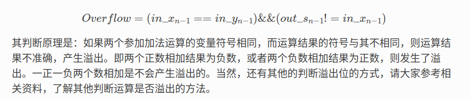

# 负数的补码
负数的补码 = 除符号位全部取反 + 1  

## 8位符号数-128的表示方法
以`8位有符号整型为例`:  
用`1000 0000`表示-128  
八位有符号整数的范围为-128～127  

# 两数相加减时,如何判断溢出 .
  

## 当减数时最小负数时，结果的溢出判断应特别处理  
比如，-1-(-128),理论结果应该为127,结果未溢出；但是，实际上，+128（-(-128)的等效值）已经超出了127的最大表示范围了，已经溢出，不过，因为是中间结果，被忽略掉了罢了。事实上，溢出是存在的。所以，针对这类情况，我们在做是否溢出判断时，得格外小心。

# 两数相加的符号位判断
和数的符号位 = (两数的符号位之和 + 产生的进位) (若产生进位，则舍弃进位)  
