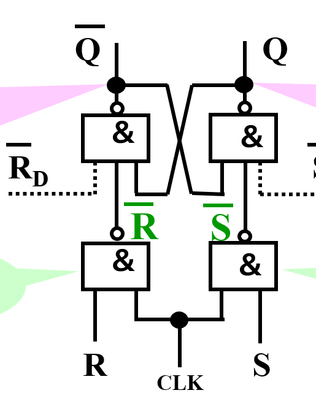
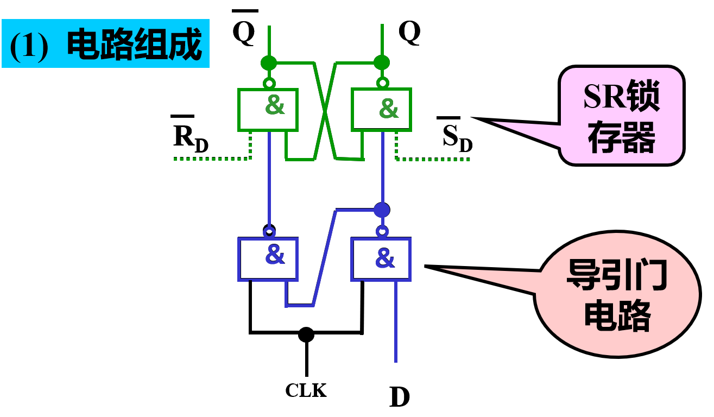
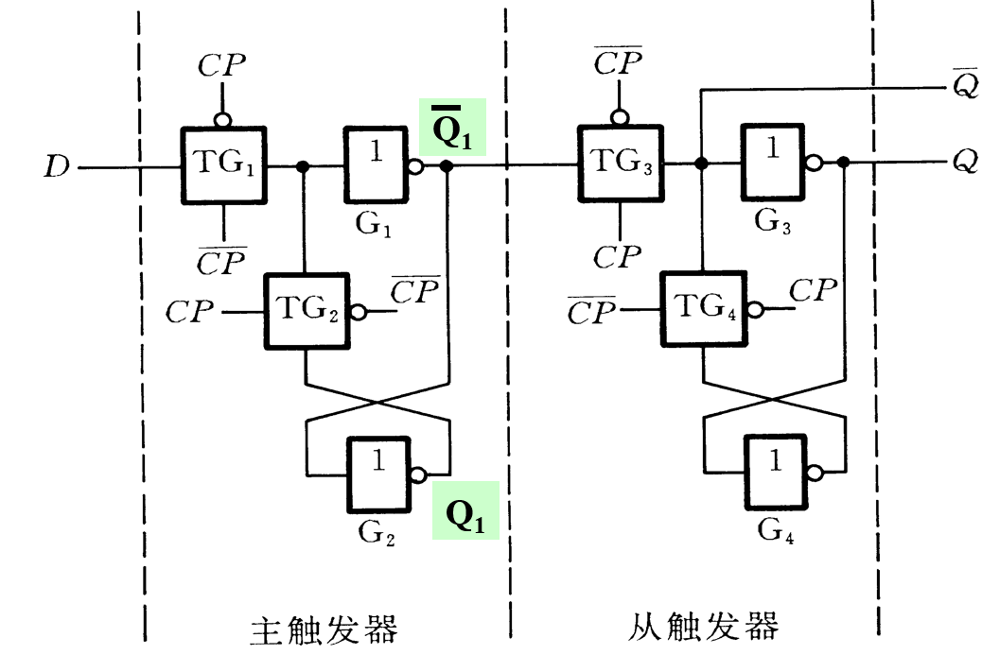
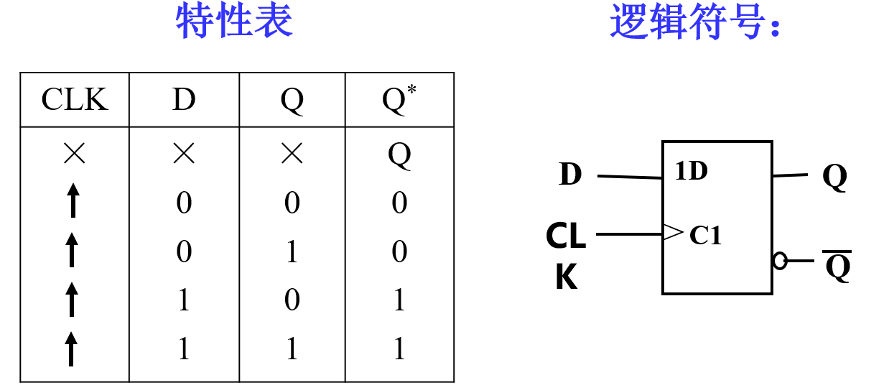
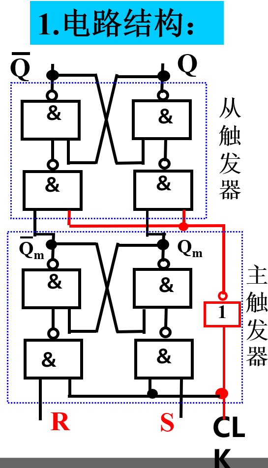
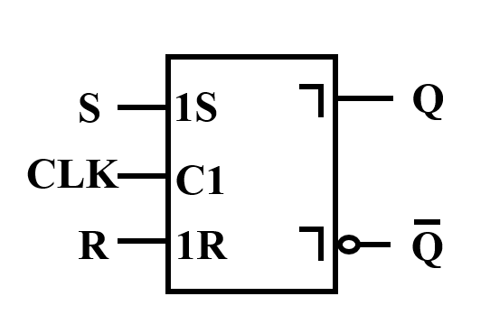
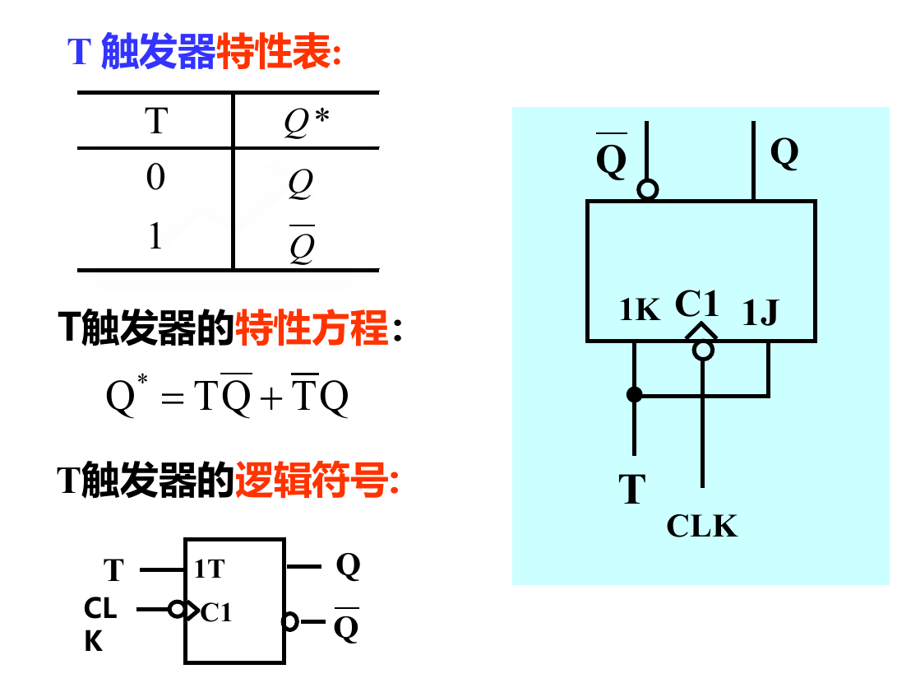
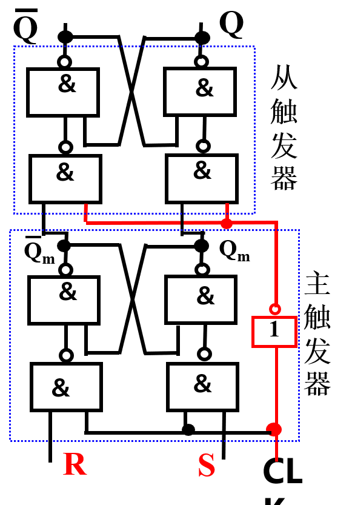
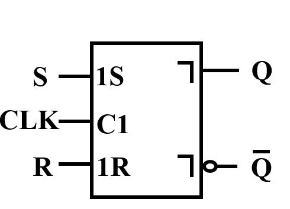
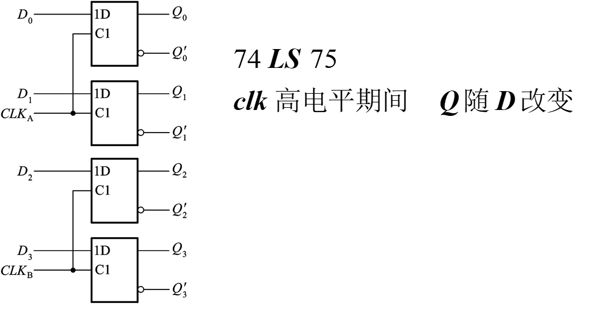

# 触发器
## 电平触发器
只在CLK = 1时，Q的状态才会改变  

### 电平触发SR触发器(高点平有效)
  

#### 功能表：  

|CLK R S | Q |
| :--: | ----  |
| 0 X X | 保持 |
| 1 0 0  | 保持|
| 1 0 1  |  1  |
| 1 1 0  |  0  |
| 1 1 1  | 禁止|

#### 特性方程: 
Q* = S + R'Q  

#### 约束条件
SR = 0  
> SR = 1,clk = 1时，触发器处于禁止状态  

#### 输出电平无法确定的两种情况
情况1: clk = 1时，S,R同时有1,1变为0,0  
情况2: 当clk ，s,r = 1,且clk 变为 0时， 此时输出的S‘,R'从0,0变为1,1  

### 电平触发的D触发器  

特性方程:Q* = D (无约束条件)  
> CLK = 1时，S = D, R = D'  
> CLK = 0时，保持状态  

#### 特性表
|  CLK  D  Q  |  Q*  |
|  ---   |  ---   |
| 0        X   X | 保持 |
| 1        0   0 | 0 |
| 1        0   1 | 0 |
| 1        1   0 | 1 |
| 1        1   1 | 1 |

## 边沿触发的触发器  

触发器只在时钟跳转（上升沿/下降沿）时触发  

### 边沿D触发器(上升沿有效)

特性方程: Q* = D (状态在clk上升沿时发生改变)  

## 脉冲触发的触发器
每个周期输出端的状态只能改变一次  

### 主从SR触发器（每个clk周期的下降眼）

 

|  CLK  |  S  R  |  Q  |  Q*  |
|  ---   |  ---   |  ---   |  ---   |
| X | X  X | X | Q |
| 下降沿 | 0  0 | 0 | 0 |
| 下降沿 | 0  0 | 1 | 1 |
| 下降沿 | 1  0 | 0 | 1 |
| ... |
特性表和SR锁存器一样，只是只有在CLK下降沿时，Q*才会改变状态  
约束条件: SR = 0  

## T触发器 
T = 1时，每来一个脉冲其状态翻转一次  
T = 0时，状态保持不变  
  

## 主从JK触发器(下降沿有效)
脉冲触发方式的功能特点: CLK = 1时，主触发器接受输入端的信号，CLK下降沿来临时，F主的输出传递得到F从  
> 所以说脉冲触发器每个clk周期状态只改变一次  

 

### 特性方程
Q* = JQ' + K'Q  
JK = 1时，Q状态翻转  
J+K = 0时，Q状态保持  
J ^ Q = 1时，Q* = J  

### 特性表
|  J K  |  Q*  |
|  ---   |  ---   |
| 0 0 | Q |
| 0 1 | 0 |
| 1 0 | 1 |
| 1 1 | Q' |

### 一次性变化问题
在CLK = 1的全部时间里需要保证输入始终保持不变，否则会导致主触发器记忆一个错误的状态  
只有在CLK=1的全部时间里输入始终保持不变的条件下，用CLK下降沿到来时的输入状态决定触发器的次态才肯定是对的。  

# 寄存器 
1. 用于寄存一组二值代码，N位寄存器由N个**触发器**组成，可存放一组N位二值代码  
2. 每个触发器可置1,置0  
实例：  
  

# 存储器

