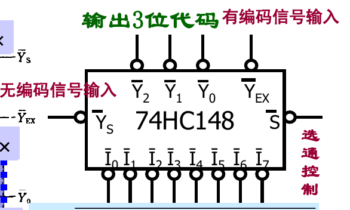
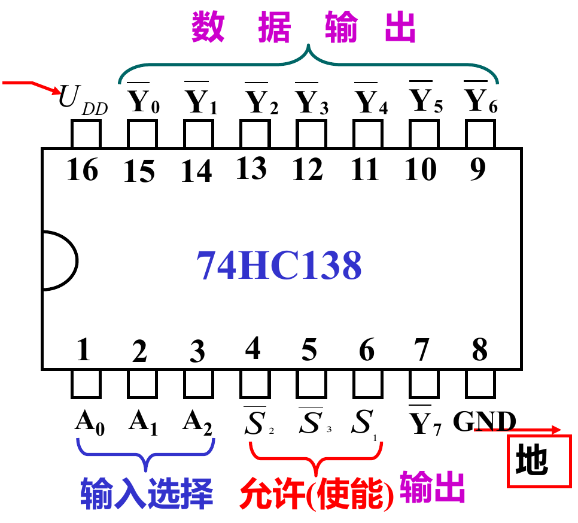
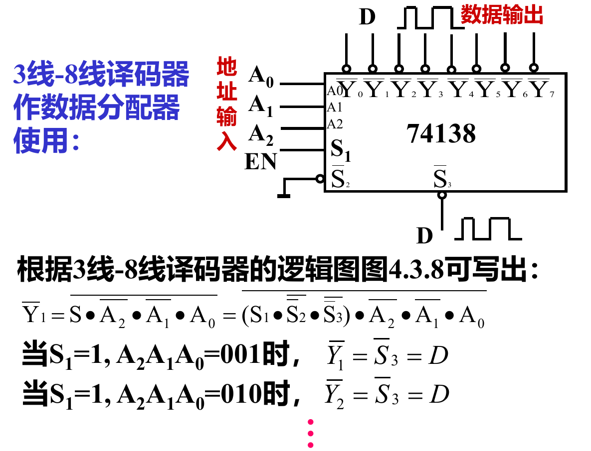
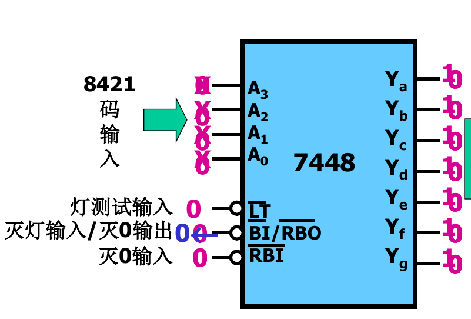
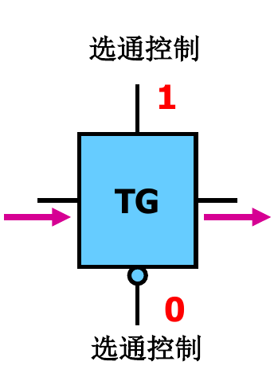
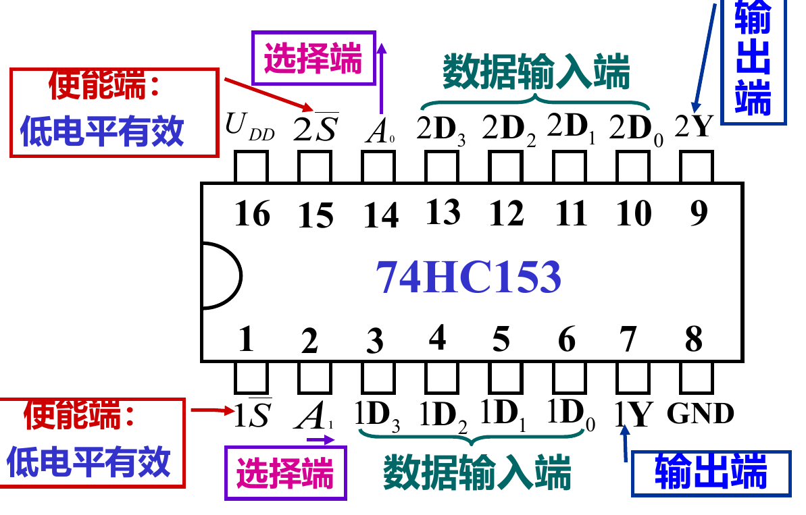
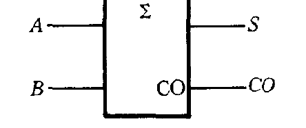
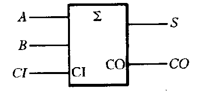
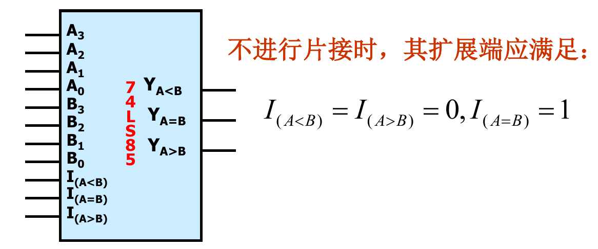

# 74HC148: 优先编码器(不需要记住)  
  
I7的优先级最高，I0最低  

# 74HC138: 3-8线译码器  

能很好的实现组合逻辑函数  
因为每个输出Yi都是输入变量A2A1A0的最小项  
> 译码器输出的函数式中，实际还包括了S1,S2',S3'  
>> 如Y1’ = (S*A2'*A1'*A0)', 其中S = S1×S2''*S3''  

## 能构成数据分配器  
将一个数据源来的数据根据要求送到多个不同的通道上去的器件  
  

# 7448: 显示译码器  
  
LT': 灯测试输入，使灯的七段同时都亮  
RBI': 灭零输入，灭掉不希望显示的零(如001,灭掉1前面的两个0)  
BI': 灭灯输入, 灭掉所有灯  

# TG

# 74HC153: 双4选1数据选择器

# 74HC151: 八选一数据选择器  
Y: 输出Di  

# 半加器

S = A异或B  
进位: Co = AB  

# 全加器
  
S = A异或B异或CI  
CI: 来自上一位的进位  
Co: 进位信号  
Co = CI*(A异或B) + AB  

# 74LS85 多位数值比较器  
   
不进行片接时，I(A</>B) = 0，I(A=B) = 1
片接成8位数值比较器，1片的Y分别连上2片的I  

