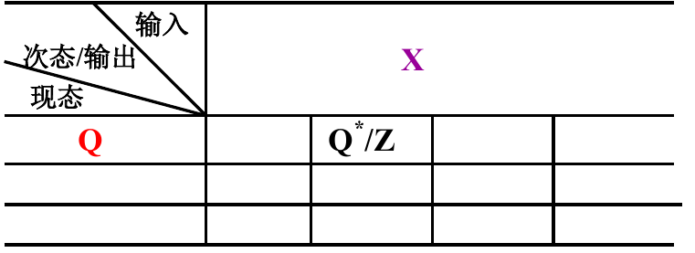
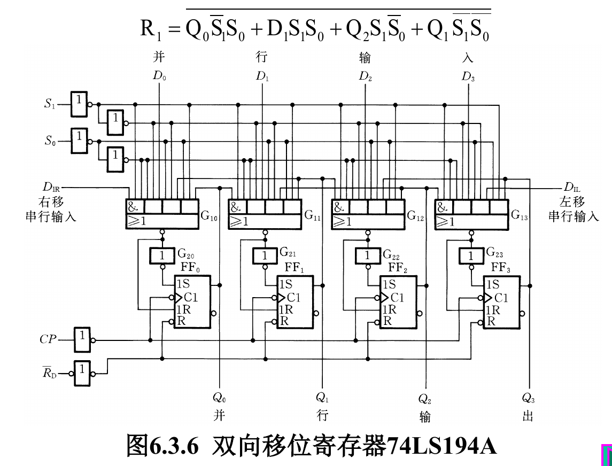
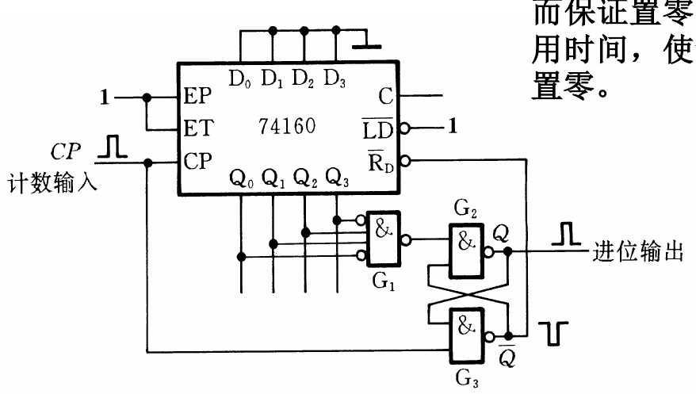

# 时序逻辑电路概述
时序电路的特点: 具有记忆功能  
时序电路的基本单元: 触发器

## 时序电路的基本结构
  

X:时序逻辑电路的的输入信号  
Y:时序逻辑电路的输出信号  
Z:存储电路的输入信号  
Q:存储电路的输出信号  

### 输出/驱动/状态方程
Y = F(X,Q) ---- 输出方程  
Z = G(X,Q) ---- 驱动方程  
Q* = H(Z,Q) ---- 状态方程  

## 时序逻辑电路分类
- **同步时序逻辑电路**
    - 所有触发器的始终输入端接同一个时钟脉冲元
- **异步时序逻辑电路**
    - 没有统一的时钟脉冲元
    - 时钟脉冲元甚至可以其他触发器的输出信号  

# 时序逻辑电路的分析方法
## 同步时序逻辑电路的分析方法
### 分析步骤:  
1. 根据逻辑图，写出各触发器的`驱动方程`  
2. 将各驱动方程带入相应触发器的特性方程，求得各触发器的`状态方程`，从而得到时序逻辑电路的`状态方程组`  
3. 根据逻辑图，写出电路的`输出方程`  
4. 根据三大方程 描述时序电路的`状态转换表`或`状态转换图`或`时序图`。
5. 确定时序逻辑电路的`逻辑功能`  

### 状态转换表,状态转换图，状态及流程图和时序图
#### 状态转换表
记录了在当前时刻的输入与当前的状态下，当前的输出情况与下一时刻的状态变化情况  
> 把当前的输入变量值与状态值 带入输出方程与状态方程，就可得到当前的输出值和电路的次态  

#### 状态转换图  
反映时序逻辑电路状态转换规律及输入输出的取值关系的图形。  
  
> Q1Q0表示状态  
> X/Z分别为输入信号，输出信号  
>> 有时还会有形如/C的形式，表示/CLK  

##### 一个将状态转换表表示为状态转换图的示例

这个状态转换图的/1 /0 表示的是/CLK  

## 异步时序逻辑电路的分析方法  
1. 写三大方程  
2. 写状态转换表  
3. 作状态转换图  
4. 检验其能否自启动  

## 自启动
三个触发器本应有八个稳定状态,可上图电路的状态图中只有五个状态。如果由于某种原因进入了其余的三个状态当中的任一个状态,若电路`能够自动返回到计数链` ( 即有效循环 ) ,人们就称其为能自动启动。

# 若干常用的时序逻辑电路  

## 寄存器

### 4位寄存器74L1S75

RD'异步清零端  

### CC4076:三态输出的4位寄存器

### 移位寄存器 
"移位"就是将寄存器所存的各位数据，在移位脉冲的作用下，依次向左或向右移动。   

#### 四位串入串出的左/右移寄存器
左移- 等价于将输入数据从高位到低位输出  
右移- 等价于将输入数据从低位到高位输出
  

#### 双向移位寄存器
可以通过设置控制端S来控制左右移，然后使得左移右移的D0,1,2,3对应的Q与DIL/R顺序相反  
S = 0 左移，S = 1右移  
##### 具体设计电路如下
 

##### 74LS194A多功能移位寄存器(CP上升沿有效)
可直接对D0,1,2,3置数(这种将直接左移/右移输出数据，不需要经过4个脉冲将数据传给D0,1,2,3)  
可以通过DIR/DIL来一位一位输入数据(需要经过四个脉冲后，再通过clk来输出要输出的数据)  
  
  
##### 工作原理
1. RD‘ = 0时
    - 清零，Q3Q2Q1Q0 = 0000
2. RD' = 1时:
    - CP0 = CP1 = CP2 = CP3 = CP'
3. CP上升沿有效
  

## 计数器
### 计数器功能与分类
`计数器的功能`:  
记忆输入脉冲的个数;用于定时,分频，产生节拍脉冲及进行数字运算等等  

`计数器的分类`:  
按工作方式分: 异步/同步计数器  
按功能分:加法计数器，减法计数器，可逆计数器  
按计数器的计数容量分:不同进制计数器(如二进制，二-十进制等等)  

### 同步计数器
#### 74160十六进制加法计数器  
  
|  引脚  |  功能  |
|  ---   |  ---   |
| RD' | 异步清零  |
| LD‘ | 同步置数  |
| EP,ET | 计数使能端  |
| Q0,1,2,3 | 输出 |
| D0,1,2,3 | 要置的数 |

#### 74160和74161
74160: 十进制计数器  
74161: 十六进制计数器  
其他功能一致  

#### 任意进制计数器的构成方法
##### 方法
- 反馈清零法（RD’）
    - 同步清零(要构成M进制则需要M-1个状态,在到达M-1状态时，等待下一个脉冲，然后跳到零状态))  
    - 异步清零(要构成M进制则需要M个状态,在到达M状态时，瞬间跳到零状态)  
    - 若M状态不是该计数器的最高计数进制，则需要将相应的Q与非给RD‘来使能异步清零端
- 反馈置数法-是和与有置数功能的计数器  
    - 利用置数端来实现M进制计数器  
    - 当计数器到达指定状态时，使LD‘ = 0,此时发生置数，开始新的计数循环。  

##### 级联
若所要求的进制大于计数器最大进制，可以采用级联的方式  
M = N1 × N2
> M: 级联后的进制数  
> N1,N2: 两片计数器的进制数  
> 如两片十进制的160级联，则最高进制为100位  

##### 设计步骤 M<N
###### 用同步清零端或置数端归零构成M进制计数器
1. 写出状态Sm-1的二进制代码，即如Q3Q2Q1Q0
2. 求归零逻辑，即求是的RD’或LD‘置0的逻辑表达式
3. 画连线图  

###### 用异步清零端构成M进制计数器
2. 其他步骤同上
2. 求归零逻辑，即求是的RD’置0的逻辑表达式
3. 画连线图  

##### 存在的问题
置零信号持续时间极短，置零可能不完全  
解决办法: 可以通过一个SR触发器来暂存一下RD’或LD‘=0  
如一个实现六进制的采用异步清零的电路如下：  
  
实现的具体效果: 使得置零时间能够延长  

## 顺序脉冲发生器
能够生成一组在时间上有一定先后顺序的脉冲信号  
### 简单的顺序脉冲发生器
  

### 由中规模集成电路构成的顺序脉冲发生器
  

# 时序逻辑电路的设计方法
## 设计步骤
1. 有给定的逻辑功能求出原始状态图或状态转换表
    1. 确定输入变量，输出变量及该电路应该包含的状态。
    2. 画出原始状态图。
2. 状态化简  
    将等价的状态进行合并。  
    > 等价的状态: 在**相同的输入**下,有**相同的输出**且向同一个状态转换  
    > 
3. 状态化简,画出编码形式的状态图及状态表  
    状态编码: 给简化的状态图中每个状态制定一个二进制代码
4. 确定触发器的类型和个数
5. 求电路的输出方程，各触发器的驱动方程
6. 画逻辑电路图，并检查自启动能力

### 利用状态转换图的卡诺图得输出，驱动方程
  
卡诺图中的数字由`状态/输出`组成  
不同的X，Q1Q0对应了状态图的不同状态  

### 检查电路能否自启动
1. 将多余状态带入状态方程和输出方程  
2. 分别求出X=0/1下的次态和输出  
3. 根据以上判断能否自启动  
