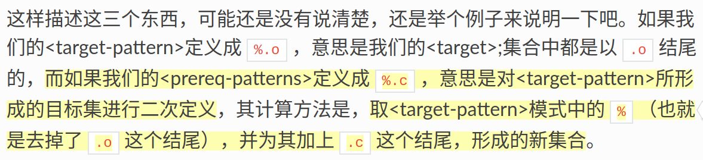
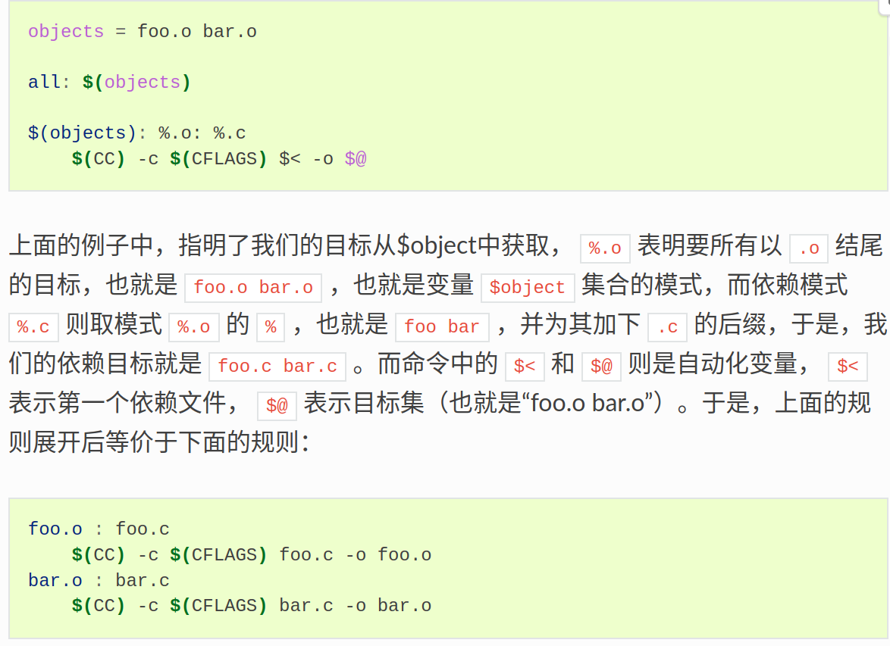

# 静态模式
## 语法格式
``` makefile
    <targets ...> : <target-pattern> : <prereq-patterns ...>
    <commands>
    ...
```
1. targets : 定义了一系列的目标文件，可以有通配符
2. target-pattern : 指明了targets的模式，即目标集的模式
3. prereq-patterns : 是目标的依赖模式，它对target-pattern形成的模式再进行一次依赖目标的定义。

## 例子和一些解释：
1. 解释:
 
2. 例子：

