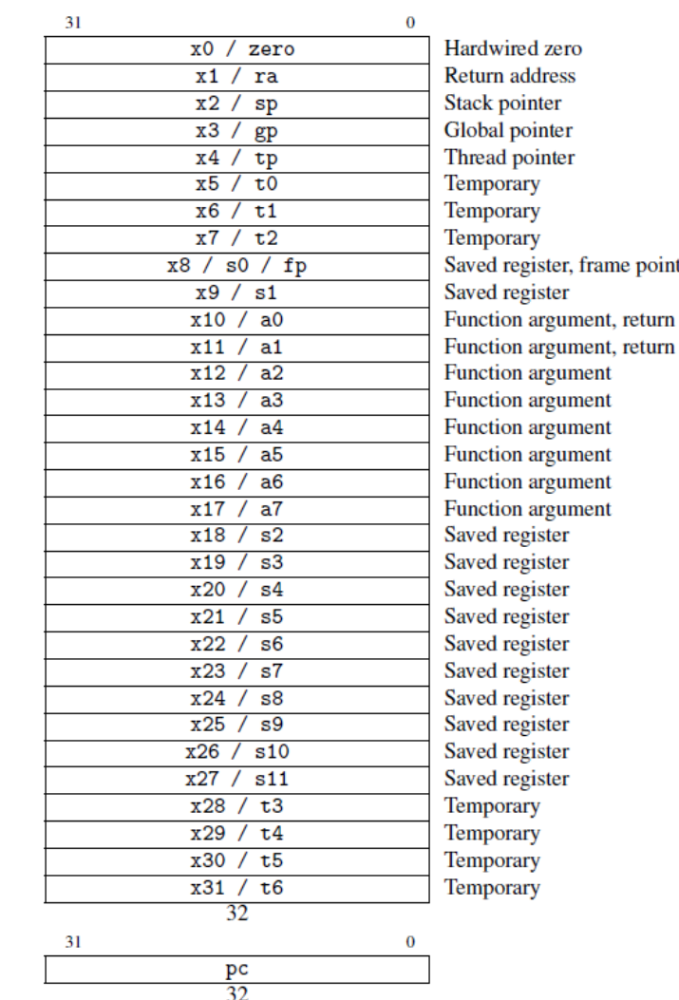
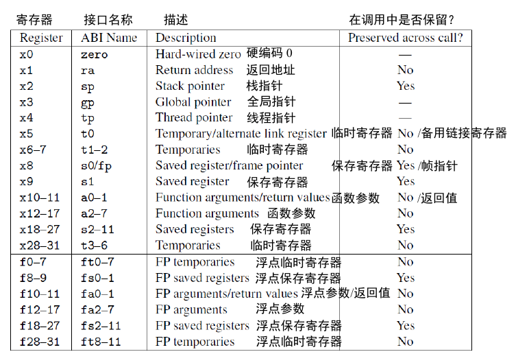

# 基础知识
## 寄存器
RV32I 有 31 寄存器加上一个值恒为 0 的 x0 寄存器。  

各个寄存器及其功能:  

## 指令
不同类型的指令格式:  
> R: 用于`寄存器-寄存器`操作  
> I: 用于`短立即数`和`访存load`操作  
> S: 用于`访存store`操作  
> B: 用于`条件跳转`操作  
> U: 用于`长立即数`  
> J: 用于`无条件跳转`  

# 整数计算
## aupic指令
1. aupic加上普通加载或存储指令中的12位立即数偏移量，可以访问任何32位pc相对地址的数据  
2. 将aupic中的20位立即数与jalr中12位立即数的组合，可以将执行流转到任何32位PC相对地址  

# RISC-V汇编语言

# 杂项
### 立即数
立即数总是符号扩展，符号位总是在指令中最高位  
可以用立即数表示负数  

### jal指令
jal指令的立即数需要×2，进行符号扩展后，再添加到PC上  
> 因为PC总是偶数，所以要保证地址的最低位为0  

