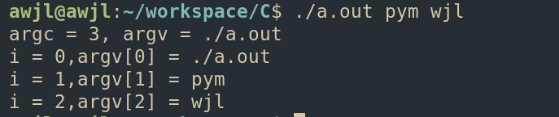

`int main(int argc, char* argv[])`  

bash: `./a.out pym wjl`  
> argc:记录了传递给main函数的参数个数  
>> argc = 3,因为有三个参数，分别为`./a.out`,`pym`,`wjl`  

> argv: 记录了所有的命令行参数  
>> argv[0] 保存了程序运行时的路径`./a.out`  
>> argv[1] 保存了第二个参数`pym`  
>> argv[2] 保存来第三个参数`wjl`  

