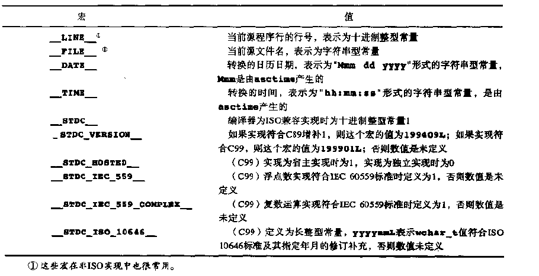

# 预处理器命令

## #define

### 对象式宏定义
格式:`#define name sequence-of-tokens`  
例子:`#define FLAGS 1`  

### 函数式宏定义
可以声明正式参数名，放在括号中，用`逗号`分割  
格式: `#define name(identifier-list)  sequence-of-tokens`  
> identifier-list之后，可以有`...`，表示`可变参数表`  

> 左括号与宏名<font color=red>之间不能由空格</font>.  

> 可以采用空参数表,可以模拟不带参数的函数.  

> 宏的参数可以是函数(或宏)调用,但函数参数表中的逗号<font color=red>不能影响宏参数的分析</font>  

> 参数可以是字符串  

> 正确的使用括号可以保证编译器不会错误地解释复杂的实际参数  
>> 例子如下:
```c++
#define incr(v,low,high) \
   for {(v) = (low); (v) <= (high); (v)++)

#define SQUARE(x) x*x
// 如果遇到x=z+1,则会变为z+1*z+1,显然是错误的
// 因此应该改为如下
#define SQUARE(x) (x)*(x)
```

### 将记号转换为字符串
在宏定义中出现的`#`记号当作<font color=red>一元“字符串化”运算符</font>,后面跟着的是宏正式参数名。  
例子: `#define TEST(a,b) printf(#a "<" #b "=%d\n", (a)<(b))`  
> 展开如下`printf("a" "<" "b" "=%d\n",(a)<(b))`  
> 拼接相邻字符串后为`printf("a<b=%d\n",(a)<(b))`  

### 宏扩展中的记号合并
合并运算符`##`  
可以将两个记号合并成一个记号。  
> 例子: `#define TEMP(i) temp ## i`  
> `TEMP(1)则表示为temp1`  

### 预定义宏
标准C语言预处理器要求定义某些对象式宏。每个预定义宏的名称以两个下划线字符开头和结尾。  
预定义宏<font color=red>不能被取消定义</font>或<font color=red>由编程人员重新定义</font>  
  
__LINE__和__FILE__可以打印某种错误信息，如下:  
`fpringtf(stderr,"INternal error: line %d, file %s\n",__LINE__,__FILE__ );`

### 取消宏定义与重新定义宏  
取消宏定义: `#undef name`  

### 宏中的<font color=purple>可变参数表</font>
函数式宏的最后一个参数或唯一正式参数可以是省略号,表示宏接受可变数目的参数表:  
```c++
#define name(identifier-list, ...) sequence-of-tokens
#define name(...) sequence-of-tokens 
```
尾部参数(包括逗号)合并成一个预处理记号序列，称为可变参数。  
#### __VA_ARGS__
`__VA_ARGS__`被看作是合并的可变参数的宏参数,即用多余参数表替换__VA_ARGS__,包括逗号分隔符。  
__VA_ARGS__只能出现在参数表中包括`<font size=5>省略号</font>`的宏定义中  
<font color=red>加强版变参宏: `## __VA_ARGS__`</font>  
> 加上## 的作用在于,当可变参数的个数为0时，这里的##起到八前面多余的`,`去掉的作用，否则编译会出错。  

```c
#define edebug(format, ...) fprintf (stderr, format, ##__VA_ARGS__)
```

---

<font color=red>具有可变参数的宏常用于带可变数目参数的函数接口，如printf</font>  
```c
#define my_printf(...) printf(__VA_ARGS__)
myprintf("x = %d", x);
//这里__VA_ARGS__代替了两个变量"x=%d",x  
```

## #include文件包含
> #include "filename"  
>>  通常优先搜索本地位置(如编程人员的当前目录)，也搜索标准位置  
> #include <filename>  
>> 在某个标准位置搜索文件。  

