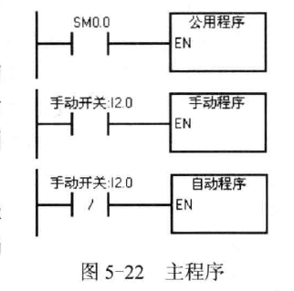

# 第三章
## CPU的存储区(重要)
1. **过程映像输入寄存器(I)**:  
   > 在每个<font color=purple>扫描周期开始</font>时，CPU对物理输入点进行采样,用过程映像输入寄存器来保存采样值  

2. **过程映像输出寄存器(Q)**:  
   > 在<font color=purple>扫描周期末尾</font>，CPU将过程映像输出寄存器的数据传送给输出模块  

3. **变量存储器(V)**: 
   > 用来在程序执行过程中存放中间结果,或者用来保存与过程或任务有关的其他数据  

   > <font color=purple>能被所有POU访问</font>  

4. **位存储器(M)**:  
   > M0.0~M31.7,又称为标志存储器，用于存储中间状态或其他控制信息  

5. **定时器(T)**:  
   > 当前值为16位有符号整数  
   > 用定时器地址T?可以访问定时器的当前值  

6. **计数器(C)**:  
   > 用来累计其输入脉冲电平上升沿的次数  

7. **高级计数器(HC)**
   > 用来累计比CPU的扫描速率更快的事件  

8. **累加器寄存器(AC)**:  
   > CPU提供了4个<font color=purple>32位</font>累加器(AC0~AC3)  

9. **特殊存储器(SM)**:  
   > `SM0.0`: 一直为ON  
   > `SM0.1`: 仅在第一个扫描周期为ON  
   > `SM0.4`: 提供周期为1min的时钟脉冲  
   > `SM0.5`: 提供周期为1s的时钟脉冲  
   > `SM1.0`: 计算结果为零标志  
   > `SM1.1`: 计算结果溢出或错误标志  
   > `SM1.2`: 计算结果为负数标志  

10. 局部存储器(L):  
    > 各[POU](#相关概念)都有自己的局部存储器,<font color=purple>均有64bit的存储空间</font>  
 
    > 局部存储器<font color=purple>仅在它被创建的POU有效</font>  
 
    > 作为暂时存储器，或用来作子程序的输入、输出参数  

11. 模拟量输入(AI):  
    > 将显示世界连续变化的模拟量按比例转换为一个字长的数字量  
 
    > 用区域标识符AI,表示数据长度的W(字)和起始字节的地址来表示模拟量输入的地址,如AIW16  

12. 模拟量输出(AQ):  
    > 将长度为一个字的数字转换为现实世界的模拟量  

13. 顺序控制继电器(S):  
    > 32B的顺序控制继电器SCR用于组织设备的顺序操作

# 第四章 功能指令
## 数据处理指令
### 比较指令与数据传送指令(<font color=red>重要</font>)
1. **字节、字、双字的块传送指令**:  
   > **功能**:块传送指令将起始地址为IN的<font color=purple>N个连续的存储单元</font>中的数据，传送到OUT指定地址开始的N个存储单元  
   >> **N**: 取值范围为1~255  

   > **指令表指令**: <font color=red>BMx &ensp; IN, OUT, N</font>  
   >> `x`: 可以为B(字节), W(字), D(双字)  

   > **梯形图**: BLK_MOV_x  
   >> `x`: 可以为B(字节), W(字), D(双字)  

2. **字节交换指令**:  
   > **功能**: 交换输入参数IN指定的数据类型为`WORD`的字的高字节与低字节  

   > **注意**: 应采用脉冲执行方式，否则每个扫描周期都要交换一次  

   > **指令表指令**: <font color=red>SWAP &ensp; IN</font>  

   > **梯形图**: SWAP  

3. **字节、整数、双整数和实数比较指令**:  
   > <font color=purple>以`LD`、`A`、`O`开始的比较指令分别表示`开始`，`串联`和`并联`</font>  

   > 指令: 具体看书P76,举例如**LDB>= VB0, VB2**  


### 移位指令与循环移位指令(<font color=red>重要</font>)
数据类型“x"可以为: B, W, DW(指令表为D)  
如果源操作数和目标操作数相同，移位指令和循环指令应采用<font color=blue>脉冲执行方式</font>  

1. **右移位和左移位指令**:  
   > **功能**: 将输入IN中的二进制数各位的值向右/左移动N位，送给输出OUT指定的地址  
   >> 移位指令对移出位<font color=purple>自动补0</font>  
   >> 对有符号数移位时，<font color=purple>符号位也被移位</font>  
   >> `SM1.1`将保存最后一次移出的位的值 
 
   > **指令表指令**:   
   >> `左移位`: <font color=red>SLx &emsp;OUT, N</font>  
   >> `右移位`: <font color=red>SRx &emsp;OUT, N</font>  

   > **梯形图**: SHR_x, SHL_x  

2. **循环右移位和循环左移位指令**:  
   > **功能**: 将输入IN中的各位的值向右/左循环移动N位，<font color=purple>移出来的位返回导另一端空出来的位</font>，送给输出OUt指定的地址  
   >> `SM1.1`将保存最后一次移出的位的值  
   >> N如果大于允许值，则循环移位前应对N进行求模运算  
  
   > **指令表指令**: 
   >> `循环右移位`: <font color=red>RRx &emsp; OUT, N</font>  
   >> `循环左移位`: <font color=red>RLx &emsp; OUT, N</font>  

   > **梯形图**: ROR_x, ROL_x  

3. **移位寄存器指令**:(<font color=red>可以用来进行指定位数的循环移位</font>)  
   > **功能**: 将DATA端输入的位的值移入移位寄存器  
   >> `S_BIT`参数: 指定移位寄存器的<font color=purple>最低位地址</font>  
   >> `字节型变量N`: 指定移位寄存器的<font color=purple>长度和移位方向</font>(负值为右移，正值左移)  

   > **移位寄存器的最大长度为**64位  

   > **指令表指令**: <font color=red>SHRB &emsp; DATA, S_BIT, N</font>  

   > **梯形图**: SHRB  

### 数据转换指令与表格指令
&emsp;&emsp;&emsp;&emsp;&emsp;&emsp;&emsp;&emsp;&emsp;&emsp;&emsp;&emsp;&emsp;&emsp;&emsp;&emsp;&emsp;&emsp;*标准转换指令*
|  指令描述  |  语句表指令  |  梯形图  |  说明  |
|  ----  |  ----  |  ----  |  ----  |
| 字节转换为整数 | BTI &emsp;IN,OUT | B_I |  |
| 整数转换为字节 | ITB &emsp;IN,OUT | I_B | 整数转换为字节指令只能转换0~255 |
| 整数转换为双整数 | ITD &emsp;IN,OUT | I_DI |  |
| 双整数转换为整数 | DTI &emsp;IN,OUT | DI_I |  |
| 双整数转换为实数 | DTR &emsp;IN,OUT | DI_R |  |
| 整数转换为BCD码 | IBCD &emsp;OUT | I_BCD |  |
| BCD码转换为整数 | BCDI &emsp;OUT | BCD_I | <font color=purple>输入输出参数使用同一个地址</font> |
| 实数四舍五入为双整数 | ROUND&emsp;IN,OUT | ROUND |  |
| 实数截取取整为双整数 | TRUNC&emsp;IN,OUT | TRUNC | 小数部分被舍去 |

1. **标准转换指令**
   > 转换后的数值超出输出的允许范围，移出标志位`SM1.1`将置为ON  
   > 有符号的整数转换为双整数时，符号位被扩展为高位字  

2. **段码指令:**
   > **功能**: 根据输入字节IN的低4位对应的十六进制，产生点亮7段显示其各段的代码，并送到输出字节OUT  
   > **指令表指令**: <font color=red>SEG &emsp;IN, OUT</font>  
   > **梯形图**: SEG  

4. **解码指令与编码指令**:  
   - **解码(Decode或称为译码)指令**:  
       > **功能**: 根据输入字节IN的低4位表示的位编号，将输出字OUT的位 置位为1  
 
       > **指令表指令**: <font color=red>DECO &emsp;IN,OUT</font>  
 
       > **梯形图**: DECO  

   - **编码(Encode)指令**:
       > **功能**: 将输入字IN中的最低有效位(有效位的值为1)的位编号写入输出字节OUT的最低4位  
 
       > **指令表指令**: <font color=red>ENCO &emsp;IN,OUT</font>  
 
       > **梯形图**: ENCO  

5. **表格指令**(<font size=5 color=red>不常用</font>): 表格由一片连续的V存储区组成  
    1. **TL**: <font color=purple>最大条目数</font>，表格中的第一个数  

    2. **EC**: 表格内实际条目数  

    3. **ATT**: 添表指令  
        > **功能**:向表格TBL中增加一个参数DATA指定的整数值,新数据位于上一次填入的数后面    
 
        > **指令表指令**: <font color=red>ATT &emsp;DATA,TBL</font>  
 
        > **梯形图**: AT_T_TBL  
 

    4. **FIFO**: 先入先出指令  
        > **功能**: 从TBL指定的表格中移出最先放进去的第一个跳入，并将它送入DATA指定的地址，剩余的各条目一次向上移动一个位置  
 
        > **指令表指令**: <font color=red>FIFO &emsp;TBL,DATA</font>  
  
        > **梯形图**: FIFO  


    5. **LIFO**: 后入先出指令  
        > 功能: 从TBL指定的表格中移出最后放进的条目，并将它送入DATA指定的地址  
 
        > **指令表指令**: <font color=red>LIFO &emsp;TBL,DATA</font>  
  
        > **梯形图**: LIFO

    6.  **查表指令**:  
        > **功能**: 从指针INDX所指的地址开始查TBL指定的表格，搜索与数据PTN的关系满足输入参数CMD定义的条件的数据  
        >> CMD为1～4时:搜索条件分别为`<>`,`=`,`<`,`>`  
 
        > **语句表指令**: <font color=red>FNDx &emsp;TBL, PTN, INDX</font>  
 
        > **梯形图**: TBL_FIND  

6. **存储器填充指令**:  
    > **功能**: 用IN指定的字值填充从地址OUT开始的N个连续的字  
 
    > **指令表指令**: <font color=red>FILL &emsp;IN, OUT, N</font>  
     
    > **梯形图**: FILL_N  


### 实时时钟指令
|  指令描述  |         *语句表指令*          |  梯形图 |
|    ----    |            ----             |  ----   |  ----  |
| 读取实时时钟 | <font color=red>TODR &emsp;T</font> | READ_RTC     |
| 设置实时时钟 | <font color=red>TODW &emsp;T</font> | SET_RTC  |


> <font size=4 color=purple>T: 以字节地址T开始的8B(8个字节)事件缓存区</font>  
>> 依次存放的是: 年的低两位、月、日、时、分、秒、0、星期的代码  

> 时间的数据类型为<font color=purple>字节型BCD码</font>，用十六进制的数的显示格式输入和显示BCD码  
>> 如年的表示: 16#23,表示2023年

> 星期的表示方法: 1表示星期7,2～6表示星期1～6,0表禁用星期  


## 数学运算指令
> <font color=purple>tip: 运算时，运算的变量是什么数据类型，便要用相应数据类型的指令</font> 

### 四则运算指令与递增/递减指令(<font color=red>重要</font>)
**指令对SM的影响(对浮点数函数运算也一样):**  
> SM0.0(运算结果为0)  
> SM1.1(有溢出、运算期间生成非法值或非法输入)  
> SM1.2(运算结果为负)  
> SM1.3(除数为0)
#### 加减乘除指令
1. **运算执行形式**:  
    - *梯形图*中,运算执行如下:  
        > `IN1 + IN2 = OUT`, **IN1 - IN2 = OUT**, `IN1 * IN2 = OUT`, **IN1 / IN2 = OUT**

    - *语句表*中,运算执行如下:  
        > `IN1 + OUT = OUT`, **OUT - IN1 = OUT**(<font color=purple>与梯形图不同</font>), `IN1 * OUT = OUT`, **OUT / IN1 = OUT**(<font color=purple>与梯形图不同</font>) 

2. **数据类型**: 整数(I), 双整数(DI或D), 实数(浮点数, R)  

3. **MUL**:整数相乘产生双整数  
   > **功能**:将两个16位整数相乘，产生一个32位乘积, <font color=purple>指令表中32位的OUT的低16位被用作乘数</font>  

   > **语句表指令**: <font color=red>MUL &emsp;IN1, OUT</font>  

   > **梯形图**: MUL  

4. **DIV**: 带余数的整数除法  
   > **功能**: 将两个16位整数相除， 产生一个32位结果，高16位为余数，低16为为商,<font color=purple>指令表中32位的OUT的低16位被用做被除数</font>  

   > **语句表指令**: <font color=red>DIV &emsp;IN1, OUT</font>  

   > **梯形图**: DIV  

5. **加减乘数指令和梯形图的名称**:  
   > **指令表指令**: +(-,*,/)x &emsp; IN1, OUT  
   >> 如+R IN1, OUT  

   > **梯形图**: ADD_X, SUB_X, MUL_X, DIV_X  

#### 递增与递减指令
1. **运算执行形式**:  
   > 梯形图中: IN + 1 = OUT 和 IN - 1 = OUT   
   > 语句表中: OUT + 1 = OUT 和 OUT - 1 = OUT  

2. **递增指令**:  
   > 语句表指令: <font color=red>INCx &emsp;OUT</font>  

   > 使用实例:
    ```c
        MOVD    &VB200, AC1
        INCD    AC1  // 因为AC1为双字存储单元，所以用INCD,而不是INCB...
    ```

3. **递减指令**:  
   > 语句表指令: <font color=red>DECx &emsp;OUT</font>  

### 浮点数函数运算指令(了解)
1. **三角函数指令**:  
   > **注意**: 使用前应将以度为单位的角度值乘pi/180，转换为弧度值  

   > **指令**: 
   >> <font color=red>SIN &emsp;IN, OUT</font>  
   >> <font color=red>COS &emsp;IN, OUT</font>  
   >> <font color=red>TAN &emsp;IN, OUT</font>  

2. **自然对数指令**:  
   > **功能**: 用于计算输入值IN的自然对数  

   > **指令**: <font color=red>LN &emsp; IN, OUT</font>  

3. **自然指数指令**: 
   > **功能**: 用于计算输入值IN的以e为底的指数  

   > **指令**: <font color=red>EXP &emsp; IN, OUT</font>  

4. **平方根指令**:  
   > **功能**: 将32位正实数IN开平方  

   > **指令**: <font color=red>EXP &emsp; SQRT, OUT</font>  

### 逻辑运算指令
1. **数据类型x**: B, W, DW(或D)  

2. **取反指令**:  
   > **功能**: 将输入IN中的二进制数<font color=purple>逐位取反</font>,将运算结果装入输出参数OUT指定的地址(语句表是对OUT进行取反)  

   > **指令**: <font color=red>INVx &emsp;OUT</font>  

   > **梯形图**: INV_x  

3. **逻辑运算指令**: 
   > `与`运算指令: <font color=red>ANDx &emsp;IN1, OUT</font>  
   >> 梯形图: WAND_x  

   > `或`运算指令: <font color=red>ORx &emsp;IN1, OUT</font>  
   >> 梯形图: WOR_x  

   > `异或`运算指令: <font color=red>XORx &emsp;IN1, OUT</font>  
   >> 梯形图: WXOR_x  

## 程序控制指令
### 跳转与标号指令 
1. **跳转指令**: 
   > **功能**: 是程序跳转到对应标号LBL处  

   > **指令**: <font color=red>JMP &emsp;N</font>  

2. **标号指令**: 
   > **功能**: 用于标号，操作数n范围为0～255  

   > **指令**: <font color=red>LBL &emsp;N</font>  

3. **特点**:  
   > 1) 多条跳转指令可跳转导同一标号处  
   > 2) 跳转指令和标号指令必须在同一个[POU](#相关概念)中  

4. 跳转对定时器和功能指令的影响(<font color=brown>暂时不太理解</font>)


### 循环指令(<font color=red>重要</font>)
|  指令描述  |         *语句表指令*          |  梯形图 |
|    ----    |            ----             |  ----   |  ----  |
|    循环    | <font color=red>FOR &emsp;INDX, INIT, FINAL</font> | FOR     |
|  循环结束  |     <font color=red>NEXT</font>                    | NEXT    |
1. **FOR指令参数介绍**:  
   > `INDX`: 索引值或当前循环次数计数器  
   > `INIT`: 初始值  
   > `FINAL`: 结束值,大于结束值时结束循环  
   > <font color=purple>参数类型均为INT</font>  

2. 符合FOR指令的逻辑条件时，反复执行FOR和NEXT之间的指令  

3. **允许循环嵌套**，最多8层  


### 其他指令(不重要)
见书P90

## 局部变量与子程序  
### 局部变量
1. 局部变量的声明类型:  
    - 临时变量(TEMP)  
    - 输入参数(IN)  
    - 输出参数(OUT)  
    - 输入_输出参数(IN_OUT)  

2. `主程序和中断程序`的局部变量表只有TEMP变量,`子程序`中有四种  

3. 数据类型: BYTE,INT,DWORD,WORD,REAL  
#### 局部变量表
&emsp;&emsp;&emsp;&emsp;&emsp;&emsp;&emsp;&emsp;&emsp;&emsp;*一个实例*
| 序号 |  地址  |  符号  |  变量类型  |  数据类型  |  注释  |
| ---- |  ----  |  ----  |  ----  |  ----  |  ----  |
|   1   | LD0 | 地址指针 | IN | DWORD |  |
|   2   | LB4 | 字节数B | IN | BYTE |  |
|   3   | LB5 | 异或结果 | IN_OUT | BYTE |  |

### 子程序的编写与调用(重要）
1. 一个项目最多可以有128个子程序  

2. 子程序或中断程序在执行到末尾时自动返回，不必加返回指令;也可以使用条件返回指令  

3. 在子程序中尽量使用局部变量，避免使用全局变量或全局符号,方便移植  

4. **子程序中的定时器**:  
    > 停止调用子程序时: 
    >> 100ms定时器停止计时，当前值保持不变
    >> 1ms的T32和10ms的T33将继续定时  

5. **子程序的调用**:  
    > **指令**: <font color=red>CALL &emsp;子程序号，参数1, 参数2, ..., 参数n</font>  
    >> *指令参数*: 第一个参数为输入参数,其次是输入_输出参数,最后是输出参数  
    >> 常数只能作为输入参数  
    


## 中断程序与中断指令(不重要)
### 中断指令
1. **启用中断指令**:  
   > **功能**: 全局性的启用对所有被连接的中断事件的处理  

   > **指令**: <font color=red>ENI</font>  

2. **禁止中断指令**:  
   > **功能**: 全局性的禁止对所有中断事件的处理  

   > **指令**: <font color=red>DISI</font>  

3. **中断连接指令**:  
   > **功能**: 用来建立中断事件EVNT和处理该事件的中断程序INT之间的联系，并启用该中断事件  

   > **指令**: <font color=red>ATCH &emsp;INT, EVNT</font>  

4. **中断分离指令**:  
   > **功能**: 用来断开用参数EVNT指定的中断事件与所有中断程序之间的联系,从而禁止处理该中断事件  

   > **指令**:<font color=red>DTCH EVNT</font> 

5. **清除中断事件**:  
   > 功能: 用来从中断队列中清除所有类型为EVNT的中断事件 

   > 指令: <font color=red>CEVENT &emsp; EVNT</font>  

### 中断事件及对应中断号
#### 通信中断
|  中断号  |  中断事件  |
|  ----  |  ----  |
| 8 | 字符接收 |
| 9 | 发送完成 |
| 23 | 接受信息完成 |

#### I/O端口(重要)
|  中断号  |  中断事件  |
|  ----  |  ----  |
| 0 | I0.0的上升沿 |
| 1 | I0.0的下升沿 |
| 2 | I0.1的上升沿 |
| 3 | I0.1的下升沿 |
| 4 | I0.2的上升沿 |
| 5 | I0.2的下升沿 |
| 6 | I0.3的上升沿 |
| 7 | I0.3的下升沿 |


#### 定时(重要)
|  中断号  |  中断事件  |
|  ----  |  ----  |
| <font color=purple>21(重要)</font> | T32的当前值等于预设值 |
| <font color=purple>22(重要)</font> | T96的当前值等于预设值 |
| 10 | 定时中断0,<font color=brown>使用SMB34来设置定时间隔</font> |
| 11 | 定时中断1,<font color=brown>使用SMB35来设置定时间隔</font>  |

---
<font size=4>中断的执行过程</font>:  
1. 使用指令`ENI`: 启用中断  

2. 使用指令`ATCH`: 建立中断事件EVNT和处理该事件的中断程序INT之间的关系  

3. 执行完中断程序的最后一条指令之后，将会从中断程序返回  
   > 或使用指令`CRETI`退出中断程序  

---
<font color=purple>中断优先级</font>: `通信中断` > `I/O中断` > `定时中断`  


1. 注意: 在中断程序中不应改写其他程序使用的存储器，应尽量使用它的临时局部变量和它调用的子程序的局部变量，或者使用分配给它的全局变量  

2. 中断程序不能嵌套  

## 字符串指令(暂时不看)
### 字符、字符串与数据的转换指令


# 第五章 数字量控制系统梯形图程序设计方法
## 顺序控制设计法与顺序功能图  
1. **顺序控制**: 按照生产工艺预先规定的顺序，在各个输入信号的作用下，根据内部状态和时间的顺序，在生产过程中各个执行机构自动地有秩序的进行操作  

2. **顺序功能图**: 
    > 功能: 描述控制系统的控制过程、功能和特性的一种图形  
    > <font color=purple>组成</font>: `步`、`有向连线`、`转换`、`转换条件`和`动作`


### 步与动作
1. **步**: 
    > 概念: 系统的一个工作周期被划分为若干个顺序相连的阶段，这些阶段叫步  

    > 表示: 用编程元件<font color=purple>位存储器M</font>或<font color=purple>顺序控制继电器SCR</font>代表各步  
    >> 矩形方框代表步，方框中是代表该步的编程元件的地址  


2. **初始步**(每个顺序功能图至少应该有一个): 
    > 概念: 与系统的初始状态相对应的步称为初始步  
    > 表示: 用<font color=purple>双线方框</font>表示  

3. **活动步**:
    > 概念: 系统处于某一步所在的阶段时，该步处于活动状态，称为活动步  

    > 与动作的关系:  
    >> `处于活动状态时`: 相应的动作被执行  
    >> `处于不活动状态时`: 停止执行相应的<font color=purple>非存储型动作</font>  

4. **动作的修饰词**:  
    > `N`: 默认就是N，表示是非存储型动作  
 
    > `S`: 置位(<font color=purple>存储型动作</font>)
    >> 描述: 当步变为不活动步时动作继续，知道动作被复位  
 
    > `R`: 复位
    >> 描述: 被修饰词S、SD、SL或DS起动的动作被终止  
 
    > L,D,P,SD,DS,SL见书  

5. **动作**: 与对应步进行相连,用矩形框内的文字或地址表示动作  

### 有向连线与转换条件
1. **有向连线**: 顺序功能图的步的活动状态的进展按有向连线规定的路线和方向进行  
    > `习惯方向`: 从上到下，从左到右  
    >> <font color=purple>习惯方向时，有向连线上的箭头可以忽略</font>  

2. 转换:  
    > 功能: 将相邻的两步分割开  
    > 表示: 用有向连线上与有向连线垂直的短画线表示  

3. 转换条件:  
    - 概念: 使系统由当前步进入下一步的信号称为转换条件  
    - 转换条件来源: 外部的输入信号，PLC内部产生的信号  
    - 上升沿: 转换条件前加一个<font color=purple>向上的箭头</font>  
    - 下降沿: 转换条件前加一个<font color=purple>向下的箭头</font>  
    - 与: 用`·`表示  
    - 或: 用`+`表示  
    - 非: 条件头上加一个横杠  

### 顺序功能图的基本结构
1. 单序列: 每一步的后面仅有一个转换，每一个转换的后面只有一个步。没有分支和合并  

2. 选择序列:<font color=purple>一般只允许同时选择一个序列</font>  
    > `分支`: 选择序列的开始称为分支,转换符号在水平线(<font color=purple>单横扛</font>)**下**  
    > `合并`: 选择序列的结束称为合并,转换符号在水平线**上**  

3. 并行序列: 用来表示系统同时工作的几个独立部分的工作情况  
    > `分支`: 并行序列的开始称为分支,转换符号在水平线(<font color=purple>双横杠</font>)**下**    
    > `合并`: 并行序列的结束称为合并,转换符号在水平线**下**   
    > 唯有所有前级步都处于活动状态时，并且满足合并转换条件时，才能进行合并  

### 顺序功能图中转换实现的基本规则 
1. 转换实现的条件:
    1. 该转换所有的前级步都是活动步  
    2. 相应的转换条件得到满足  

2. 转换实现应完成的操作:  
    1. 使所有由有向连线与相应转换符号相连的后续步都变为活动步  
    2. 是所有由有向连线与相应转换符号相连的前级步都变为不活动步  

3. 绘制顺序功能图时的注意事项:  
    1. 两个步绝不能直接相连，必须用一个转换将他们分隔开  
    2. 两个转换不能直接相连，必须用一个步将他们分隔开  

## 使用置位/复位指令的顺序控制梯形图的设计方法(<font color=red>重点</font>)
控制系统的梯形图的典型结构如下:  


### 单序列的编程方法
<font size=5>步的控制电路的设计</font>:   

使<font size=4>后续步对应的位存储器**置位**</font>,使所有<font size=4>前级步对应的位存储器**复位**</font>的条件:  
   > 某一转换所有的`前级步对应的位存储器的常开触点`与`转换条件对应的触点或电路`**串联**
---
<font size=5>输出电路的设计</font>:  
根据顺序功能图: 用代表步的位存储器的常开触点或它们的并联电路来控制输出位的线圈  

### 选择序列与并行序列的编程方法
大郅相同与前

## 使用SCR指令的顺序控制梯形图设计方法
### 顺序控制继电器指令(<font color=red>重要</font>)
1. **LSCR**:  
    > 功能: 用来表示一个程序段的开始  
 
    > 指令表指令: <font color=red>LSCR &emsp;S_bit</font>  
    >> S_bit: 顺序控制继电器的S的地址  
 
    > 梯形图: SCR

2. **SCRT**:  
    > 功能: 用来表示SCR段之间的转换，即步的活动状态的转换  
    >> 当SCRT得电后，将S_bit指定的顺序功能图的后续步置位为ON，当前步复位为OFF  
 
    > 指令表指令: <font color=red>SCRT &emsp;S_bit</font>  
    >> S_bit: 顺序控制继电器的S的地址  
 
    > 梯形图: SCRT

3. **SCRE**:  
    > 功能: SCR程序段结束  
 
    > 指令表指令: <font color=red>SCRE</font>  
 
    > 梯形图: SCRE
---
1. SCR指令直接连接到左侧母线上  
2. SCR指令的限制:
    - 不能在不同的程序中使用相同的S位  
    - 不能在SCR段之间使用JMP及LBL指令  
    - 不能在SCR段中使用FOR、NEXT、和END指令  

3. 用LSCR和SCRE将顺序控制程序划分为若干个SCR段  


## 指针寻址
1. 访问字节时，指针值+1  
2. 访问字时，指针值+2  
3. 访问双字时，指针值+4  


## 相关概念
1. **BCD码**: 用4位二进制数表示1位十进制数  

2. **程序组织单元POU**: 主程序、子程序和中断程序统称为程序组织单元  

3. 间接寻址的指针(如&VB200)为<font color=purple>双字存储单元</font>  


