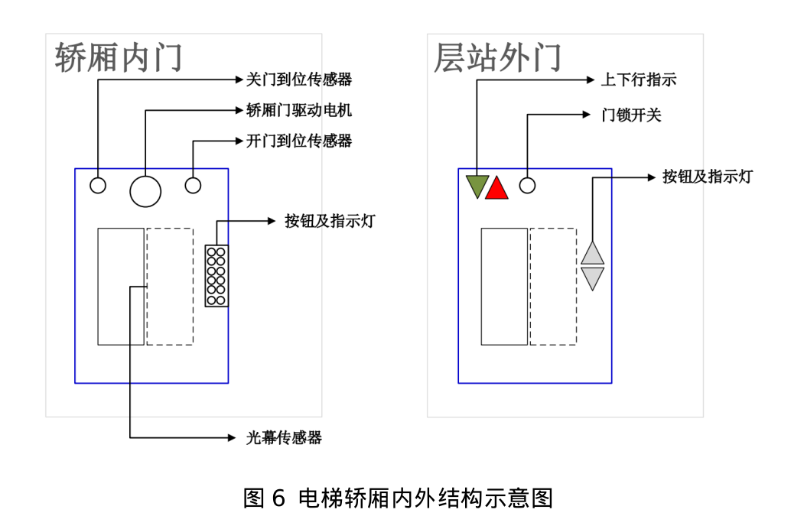
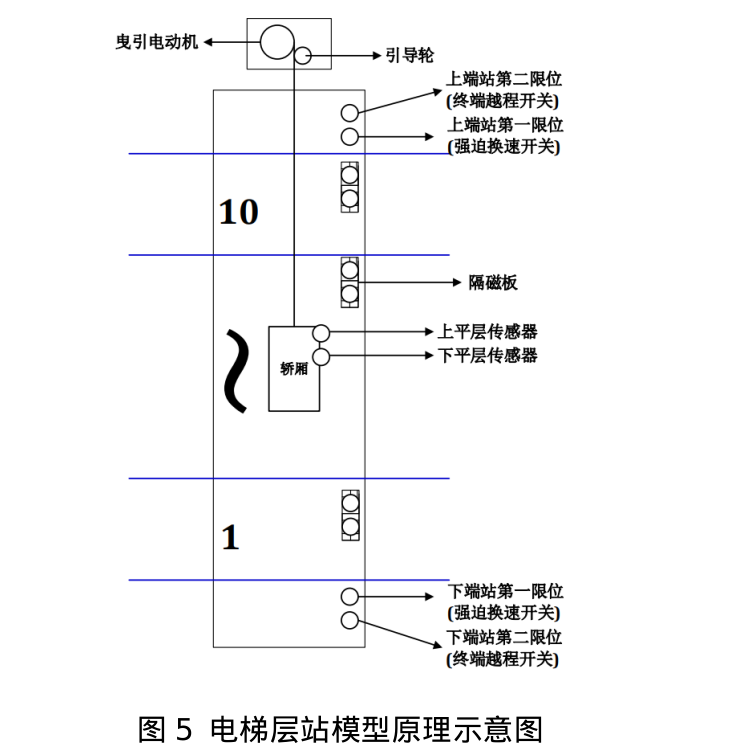
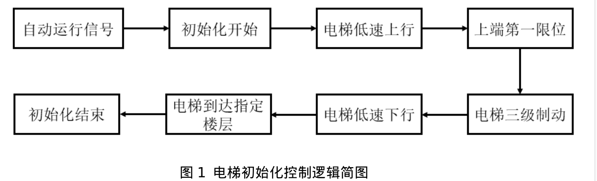

# 十层电梯控制系统设计
## 电梯相关结构

## 各部分控制逻辑
### 细节
到某一层时需要打开风扇与照明
### 运动控制
低速上(下)行: 低速接触器上电，上(下)行接触器上电  

减速制动: 使用的是低速接触器  
一级加速: 使用的是高速接触器  

### 初始化控制
**控制逻辑**:  收到自动运行信号 **->** 开始`初始化过程`  **->** 发出准备就绪信号  
  - 若多次收到自动运行信号，则停在`端层`(第一层)待命  

**初始化过程**:  

### 开关门控制逻辑
**控制逻辑**:到达指定`平层` -> 发出停层信号 -> 启动开关门程序 -> 开门 -> 关门 -> `门锁信号`  

**开关门逻辑**:  
  

**有人进入表示方式**: 利用一个io口的值来表示是否有人进入，io = 1则表示有人进入  

**开门时间计时**: 从开门到位后开始计算，到关门到位时停止,超时强制关门  
>当按住开门按钮时，开门的延时程序先不启动，同时不启动开门时间计时也

影响开门状态的因素: 按住开门按钮，有人进入，超载  

### 楼层及运行方向显示

### 启停控制
起动时，使用一级加速  
减速制动:按时间原则进行三级再生发电制动减速，直至平层停车(抱闸线圈断电,制动器抱闸)  

### 选择应答机制

---

## 特殊情况处理方式
1. 满载时: 只对内呼信号作出响应  
2. 到达最高层时，取消其他所有选层指令  
3. 短时间内选层按钮按下两次，则选层取消  
4. 禁止反向登陆  
5. 超载时，将发出音频或视频信号，保持开门状态  

## 运行保护
非检修状态，电梯连续运行超过了运行时间限制器规定的时间后，其中没有平层开关动作过，就认为检测到钢丝绳打滑故障，停止一切行为  

给到`维修成功信号`才能正常运行

## 运行监控
...

## 速度规划
通过比较与目标楼层差来确定电梯的当前运行速度  

---

## 杂项
**回路符号说明**:  
|符号|说明	        |符号   |说明        |
| -- | --           | --    | --         |
|SK	 |上行接触器	|KK	    |高速接触器  |
|XK	 |下行接触器	|MK	    |低速接触器  |
|1A	 |一级加速	    |2A	    |一级减速制动|
|3A	 |二级减速制动	|4A	    |三级减速制动|
|YA	 |抱闸制动回路  |

---

**相关信号**:  
自动运行信号  
准备就绪信号  
停层信号(到达制定平层信号)  
故障信号  
维修成功信号  

---

**传感器**:  
**称重变送器**: 测量范围为0-2000kg,输出信号为0～10v  
  - 问题: 如何检测输出电压  

**开门到位传感器**  
**关门到位传感器**  
