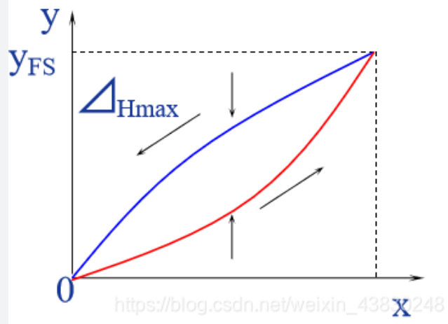

# 第一章
**传感器的定义**: 能感受被测量并按照一定规律转换成可用输出信号的器件或装置  
**变送器**: 凡能<u>输出标准信号</u>的传感器  
**传感器按<u>物理现象分类</u>**:`结构性传感器`，`物性型传感器`  

# 第二章
## 静态特性及性能指标
**静态特性**: 测量范围、灵敏度、线性度、迟滞、分辨力、稳定性、精度等  
### :star:灵敏度
**定义**: 输出量的增量和输入量的增量之比的极限值  
**公式**: $ S = \lim\limits_{\Delta x\to0}(\frac{\Delta y}{\Delta x}) = \frac{dy}{dx}$

> 串联系统的灵敏度: 各个环节的灵敏度分别为`S_1,S_2,...S_n`,则总灵敏度为$S = S_1S_2...S_n$  

### :star:线性度
**定义**: 实际输出-输入特性曲线与其拟合直线不吻合的程度称为线性度$e_L$  
**公式**: $e_L = \pm\frac{\Delta L_{max}}{y_{FS}} × 100\%$  
   - > $\Delta L_{max}$: 实际特性曲线与你和直线间的最大偏差  
   - > $y_{FS}$: 传感器满量程输出  

#### 拟合直线的不同求法 
**端基线性度**: 直接连接实测特性曲线的两个端点得到的直线  
   - 方程: $y = kx + b$  
      - 通过带入两个端点即可得方程  
   - k可以用来代表灵敏度  

**最小二乘线性度**:  
   - 具体看书

### 迟滞(也叫回程误差)

**概念**: 传感器在正行程和反行程的过程中，其输出-输入曲线不重合的现象  
**公式**: $e_H = \frac{\Delta H_{max}}{y_{FS}}×100\%$
   - > $\Delta H_{max}$: 正反行程输出值间的最大插值

### 分辨力和分辨率
**分辨力**: 能引起输出量发生变化时输入量的最小变化量$\Delta x_{min}$  
**分辨率**: 全量程中最大的$\Delta x_{min}$(因为分辨率必须在整个量程中都满足)与满量程`L`之比的百分数  

### 稳定性
**概念**: 保持输入信号不变，输出信号随时间或温度变化而出现缓慢变换的程度  
**衡量指标**: 
   - > 时漂: 输入信号不变，系统的输出随时间变换的现象  
   - > 温漂: 输入信号不变，系统的输出随环境温度变换的现象  

## 动态特性及性能指标
**动态特性**: 指输入量随时间变换时，传感器的响应特性  

## 测量误差
### 测量误差的表示方法
1. **绝对误差**($\Delta x$): 测量值x与真值$A_0$之差
   - > x: 仪表示数  
   - > $A_0$: 理论真值是未知的，一般用高一即标准仪器的测量值来代替真值   
2. **相对误差**:
   - 实际相对误差:$\delta_A = \frac{\Delta x}{A_0}×100\%$  
   - 示值相对误差:$\delta_x = \frac{\Delta x}{x}×100\%$
3. **引用误差**: $q = \frac{\Delta x}{L}×100\%$  
   - 最大引用误差:$q_{max} = \frac{\Delta x_{max}}{L}×100\%$
      - > :star:准确度等级G:$|q_{max}| \leq G\%$  
         - :star:准确度等级G分为:`0.05`, `0.1`, `0.2`, `0.5`, `1.0`, `1.5`, `2.0`, `2.5`, `5.0`  
   - $L$: 仪表量程  

### :star:测量误差的分类(需能判断)
分类:随机误差,系统误差，粗大误差  
   - **随机误差**: 相同测量条件下，多次测量同一被测量时，测量误差的值不可预知  
   - **系统误差**: 相同测量条件下，多次测量，结果总是向一个方向偏移  
      - > 来源: 仪器误差，理论误差，个人误差，环境误差  
   - **粗大误差**: 相同测量条件下，多次测量时，明显歪曲了测量结果的误差  

## 校表 选表问题
校表: 书P19 例2-1  
选表: 书P19 例2-2  

