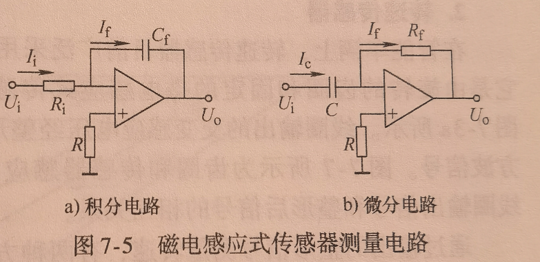

# 第七章 磁电式传感器
## 磁电感应式传感器
**原理**: 利用电磁感应原理将被测量(振动、位移、转速等)转换成电信号  
> 他可以将速度转换为电信号，故可称为速度传感器  

### 测量电路
  

> 电容两端电压(知电流i): $U = \frac{1}{C}\int idt$  
> 电容通过电流(知电压U):$i = C\frac{dU}{dt}$ 

#### 位移测量(积分电路)
**积分放大器输入电压**:$U_i = e = sv$  
> 该输入电压是传感器的输出电压  
> s:可能是传感器的灵敏度  
> v: 是速度  

**积分放大器输出电压**:$U_o  = -\frac{1}{C}\int idt = -\frac{1}{CR}\int U_idt $  
> 根据测量输出电压值即可测得位移  

#### 加速度测量(微分电路)
**微分放大器输入电压**:$U_i = e - sv$  
> 该输入电压是传感器的输出电压 
> v: 是速度

**微分放大器输出电压**:$U_o = -Ri = -RC\frac{dU_i(t)}{dt}$  
> 根据测量输出电压值即可测得加速度  

## 霍尔式传感器
:star:**输出电压**:$U_H = K_HIB$  
- $K_H$: 器件的灵敏度  
   - > :star:$K_H = -\frac{1}{ned}$(可以用于求载流子浓度)  
      - >$n$: 载流子浓度  
      - >$e$: 电子电量,$e = 1.6 \times 10^{-19}$  
      - >$d$: 霍尔器件的厚度  

....

