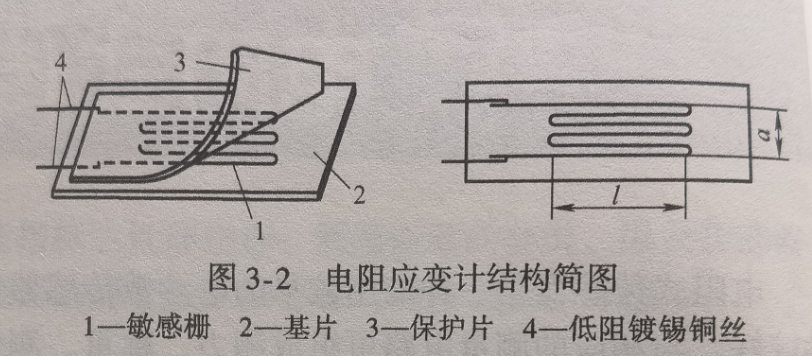
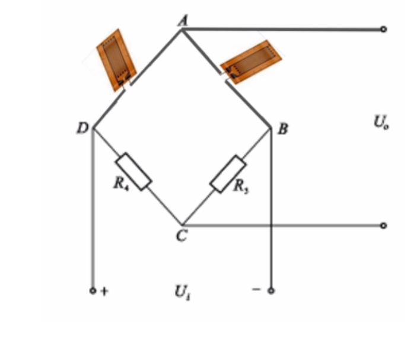
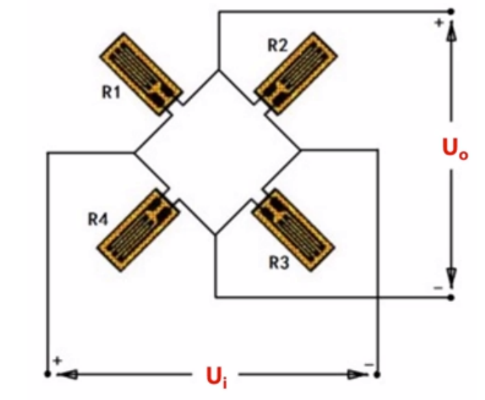

# 第三章 电阻式传感器
## 电阻应变片结构和工作原理
### 电阻应变片(计)结构
敏感栅，基片，保护片，低阻镀锡铜丝  

### :star:电阻应变效应
**概念**: 金属导体(半导体)的电阻值随变形而发生改变的现象  
#### 重要公式
1. 电阻计算公式:$R = \rho\frac{L}{A}$ 
   - > $\rho$ —— 金属丝电阻率($\Omega\cdot m$)  
   - > $L$ —— 金属丝长度($m$)
   - > A —— 金属丝的横截面积($m^2$),$A = \pi r^2$  
2. $\frac{dR}{R} = (1 + 2\mu + \lambda E)\varepsilon$  
   - **原理**: 电阻计算公式的全微分  
      - > $\frac{dR}{R} = \frac{dL}{L} - \frac{dA}{A} + \frac{d\rho}{\rho}$  
   - 轴向线应变: $\varepsilon = \frac{dL}{L}$    
   - 泊松比: $\mu = - \frac{\frac{dr}{r}}{\varepsilon}$,$\mu > 0$  
   - 半导体材料压阻系数: $\lambda$  
   - 半导体材料的弹性膜量: $E$
3. :star:$\frac{dR}{R} = K_0\varepsilon$  
   - $K_0$: 单根金属丝的灵敏度系数  
      - > :star:物理意义: 当金属丝发生单位长度应变时，K0为电阻变换绿与其应变的值  
   - $\varepsilon$: 轴向线应变

#### 金属与半导体应变效应存在的不同
**金属材料**: 应变效应以结构尺寸变化为主  
**半导体材料**: 应变效应主要基于压阻效应  

## 测量电路
**桥臂比**: $R1:R2 = R3:R4 = 1:n$  
**输出电压灵敏度**:$K_V = \frac{U_L}{\frac{\Delta R_1}{R_1}}$ 

### 单壁直流电桥
**输出电压**: $U_L = U_E\frac{n}{(1+n)^2}\frac{\Delta R_1}{R_1}$  
**输出电压灵敏度**:$K_V = \frac{U_L}{\frac{\Delta R_1}{R_1}} = \frac{n}{(1+n)^2}U_E$  
非线性误差(n = 1): $\delta_u = \frac{1}{2}K_0\varepsilon$  

  

### 双臂直流电桥(半桥，差动桥)
**输出电压**:$U_L = 2U_E\frac{n}{(1+n)^2}\frac{\Delta R}{R}$  
非线性误差(n = 1):0  
  

### 全臂电桥(全桥)
**输出电压**:$U_L = 4U_E\frac{n}{(1+n)^2}\frac{\Delta R}{R}$  
非线性误差(n = 1):0  

### 解题思路
1. 计算出桥臂比$R1:R2$
2. 利用$K_0\varepsilon = \frac{dR}{R}$根据$\varepsilon,K_0,\frac{\Delta R}{R}$中的两个求另一个值  
3. 根据电桥类型求输出电压$U_L$  
4. 求$K_V$  

## 在无人装备中的应用
电阻式位置传感器  
应变式加速度传感器  
应变式力觉传感器  
...  

