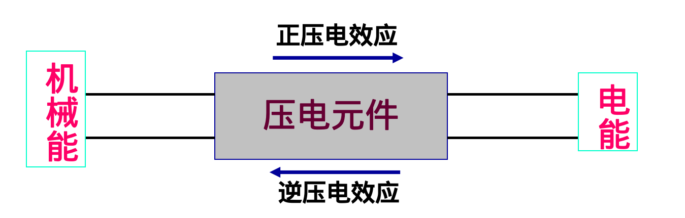

# 第六章 压电式传感器
## 压电效应

**正压电效应**: 压电材料在一定方向上受到外力产生变形时，其内部产生极化现象，将在它的两个相对表面上出现正负电荷  
**负压电效应**: 在压电材料的极化方向上施加电场,材料将产生形变  

## 测量与计算
当石英晶片在沿X轴方向受到压应力时:  
- :star:$U_X = \frac{q_X}{C_X} = d_{11}\frac{F_X}{C_X}$  
   - $F_X$: 沿晶轴X方向施加的压缩力  
      - > $F_X = P\times A$(压力X受力面积)
   - $d_{11}$:压电系数  
   - $q_X$: 垂直于X轴平面上电荷  
      - > $q_X = d_{11} \times F_{X}$  
   - $C_X$: 电极面间电容(电极板与X轴方向垂直)  
      - >$C_X = \frac{\varepsilon_r \varepsilon_0S}{d}$ 

---

- **压电材料电容值**:$C_a = \frac{\varepsilon_r \varepsilon_0S}{d}$  
   - $S$: 极板面积  
   - $d$: 晶体厚度  
   - $\varepsilon_r$: 压电晶体的相对介电常数  
   - $\varepsilon_0$: 真空介电常数  
- **基本公式**:$U_a = \frac{q}{C_a}$  

### 计算步骤
1. **求q**: $q_X = d_{11} \times F_{X}$  
2. **求C**: $C_a = \frac{\varepsilon_r \varepsilon_0S}{d}$  
3. **求U**: $U = \frac{q}{C}$  

### 压电片串并联
**串联(以两片为例)**: 电荷不变，电压变为原来的两倍，电容变为原来的一半  
> 总电荷$Q' = Q$  
> 总电压$U' = 2U$  
> 总电容$C' = C/2$  

**并联(以两片为例)**:电压不变，电荷电容变为原来的两倍    
> 总电荷$Q' = 2Q$  
> 总电压$U' = U$  
> 总电容$C' = 2C$  

### 根据灵敏度计算电压
1. 分析灵敏度的单位  
2. 根据单位及已知值来计算C,Q,U  
3. 利用$Q = CU$即可的要求的值  

