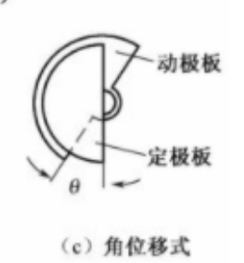
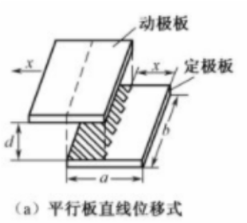
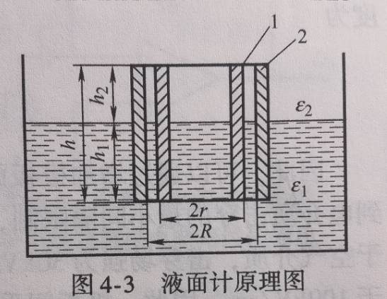
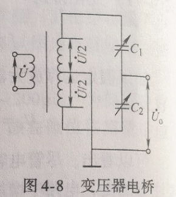
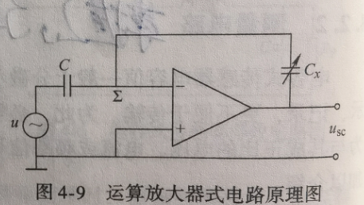

# 第四章 电容式传感器
电容计算公式: $C = \frac{\varepsilon S}{d}$
> $\varepsilon$: 电容极板间介质的介电常数  
> $S$: 两极板覆盖的面积  
> $d$: 两极板间的距离  
> 该公式就相当于工作原理

## :star:电容式传感器的分类
### 变面积型电容式传感器
> **用途**: 通常用于测量cm数量级的位移  

> 电容初始值: $C_0 = \frac{\varepsilon S}{d}$  

1. **角位移型电容式传感器**:  
    -  
    - >$C_{\theta} = C_0(1-\theta)/\pi$  
2. **直线位移型电容传感器**:  
    -  
    - >$C_{\theta} = C_0(1 - \frac{x}{a})$  
    - 灵敏度： $K = \frac{dC_x}{dx} = - \frac{C_0}{a}$  

### 变介电常数型电容式传感器
  

> **用途**: 适用于液面、厚度的测量  

**公式**:   
> $C = C_1 + C_2 = A + Kh_1$  
> $K = \frac{2\pi(\varepsilon_1-\varepsilon_2)}{\ln(R/r)}$  
> $A = \frac{2\pi h \varepsilon_ 2}{\ln(R/r)}$  

**参数含义说明**:  
> $h$: 电极总长度  
> $h1$: 液位高度  
> $\varepsilon_1$: 液体的介电常数  
> $\varepsilon_2$: 空气的介电常数  
> $R,r$: 两个同心圆电极半径  

### 变极距型电容式传感器
> **用途**: 通常用于测量$\mu m$数量级的位移  

**背景**: 极板1固定，极板2向上活动$\Delta d$  
**公式**: $C = \frac{\varepsilon S}{d - \Delta d} = C_0\frac{1}{1-x}$  
   - x: 极板间距离的变换率,$x = \Delta d/d$  

**灵敏度**: $ K = \frac{C_0}{d}(1+x+x^2+...)$  
   - >当x变换极小时$K \approx \frac{C_0}{d}$

--- 

## 测量电路
### :star:变压器电桥
   

- C1,C2: 是两个[差动电容](#差动电容)  

**公式**: $U_o = \frac{C1-C2}{C1+C2} \cdot \frac{U}{2}$  
**公式推导原理**:  
   - > $U_o = \frac{U}{Z_1+Z_2}\cdot Z_2 - \frac{U}{2}$  
   - > $Z = \frac{1}{jwC}$

**例子**: 差动电容是变极距型电容式传感器  
   - $C_1 = \frac{\varepsilon_0 S}{d_0 -\Delta d}$  
   - $C_2 = \frac{\varepsilon_0 S}{d_0 + \Delta d}$  
   - $U_o = \frac{\Delta d}{d_0}\cdot \frac{U}{2}$  

### :star:运算放大器式电路
   

**公式**:$u_{sc} = - \frac{1/jwC_x}{1/jwC}u = -\frac{C}{C_x}u$  

## 电容式传感器在无人装备中的应用

---
## 基础知识
### 差动电容
差动电容:他们的电容值会相互影响，具体体现为他们间的相对运动和相对位置的改变  
> 即他们之间的变化可能是相对的  
