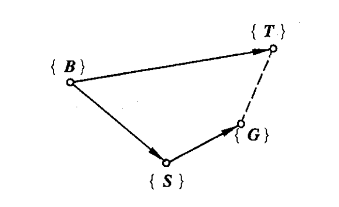

# 第三章
## 基础: 位姿描述和坐标系描述
#### 位置描述
位置矢量$^Ap =
\begin{pmatrix}
p_x \\
p_y \\
p_z
\end{pmatrix}$  
> 描述了点p在坐标系{A}中的位置

>左上标:代表了参考坐标系  

#### 姿态描述
$^A_BR = \begin{bmatrix}
^AX_B & ^AY_B & ^AZ_B
\end{bmatrix} = 
\begin{bmatrix}
\cos(X_B,X_A) & \cos(Y_B,X_A) & cos(Y_B,X_A) \\
\cos(X_B,Y_A) & \cos(Y_B,Y_A) & cos(Y_B,Y_A) \\
\cos(X_B,Z_A) & \cos(Y_B,Z_A) & cos(Y_B,Z_A)
\end{bmatrix}$  
> $^A_BR$表示{B}相对于{A}的姿态  
> 下标B:表示是坐标系{B}的姿态  
> 上标A: 表示参考坐标系是{A}  

> $^AX_B$是{B}轴的x方向单位向量在{A}的各单位方向向量上的投影  
>> 其可以描述出该单位方向向量的姿态  

> $^A_BR = ^A_BR^{-1} = {^A_BR}^T$  

> 若{B}和{A}的姿态相同，则旋转矩阵为:
$\begin{bmatrix}
1 & 0 & 0 \\
0 & 1 & 0 \\
0 & 0 & 1
\end{bmatrix}$

---
由上可描述任意刚体的位置和姿态:  
> 位置: $^{O_i}_{O_j}P$:是刚体j原点与参考系{i}原点间的位置矢量  
> 姿态: $^{O_i}_{O_j}R$: 用上述方式表示

#### 坐标系描述
坐标系的矩阵表达式:$T = 
\begin{bmatrix}
\vec{n} & \vec{o} & \vec{a} & \vec{p}
\end{bmatrix}$

## 点的坐标变换
> 背景:点在不同坐标系中的描述不同  

### 平移变换
特点: {A},{B}姿态相同，原点不重合(即改变了位置)  
> 不会受旋转变换的影响，因为平移变换的对象是点(坐标系的原点)  

目的: 知点p在{B}中的位置$^Bp$,求点p在{A}中的位置矢量$^Ap$  
公式: $^Ap = ^Bp + ^Ap_{O_B}$  
> $^Ap_{O_B}$:是{B}原点在{A}中的位置矢量  

解题步骤:  
1. 通过平移变换可算出$^Ap_{O_B}$  
2. 利用公式即可得结果  

### 旋转变换
特点: {A},{B}原点重合,姿态不同  
目的: 知点p在{B}中的位置$^Bp$,求点p在{A}中的位置矢量$^Ap$  
公式: $^Ap = {^A_BR}{^Bp}$  

解题步骤:  
1. 求旋转矩阵$^A_BR$  
2. 利用公式即可  

#### 饶x,y,z轴的旋转矩阵
**推导过程**:可用书P70例3-2的解答过程来理解  
1. 将旋转轴(如z轴)作为垂直与纸面的垂线，然后在纸面画出其他两轴(如x,y轴)  
2. 假设旋转角度为$\theta$可计算出$x_B$在{A}中的投影结果为$\vec{X}_B = \vec{n} = 
{\begin{bmatrix}
\cos{\theta} & \sin{\theta} & 0
\end{bmatrix}}^T$  
3. 可计算出$y_B$在{A}中的投影结果为$\vec{y}_B = \vec{o} = 
{\begin{bmatrix}
\cos(\theta+90) & \cos{\theta} & 0
\end{bmatrix}}^T = 
{\begin{bmatrix}
-\sin{\theta} & \cos{\theta} & 0
\end{bmatrix}}^T$  
3. 可计算出$z_B$在{A}中的投影结果为$\vec{z}_B = \vec{a} = 
{\begin{bmatrix}
0 & 0 & 1 
\end{bmatrix}}^T$  
 
**结果**:  
$Rot(x/y/z,\theta) = 
\begin{bmatrix}
\vec{n} & \vec{o} & \vec{a} 
\end{bmatrix}$  

$Rot(x,\theta) = 
\begin{bmatrix}
1 & 0 & 0 \\
0 & c\theta & -s\theta \\
0 & s\theta & c\theta
\end{bmatrix}$

$Rot(y,\theta) = 
\begin{bmatrix}
c\theta & 0 & s\theta \\
0 & 1 & 0 \\
-s\theta & 0 & c\theta
\end{bmatrix}$

$Rot(z,\theta) = 
\begin{bmatrix}
c\theta & -s\theta & 0 \\
s\theta & c\theta & 0 \\
0 & 0 & 1 
\end{bmatrix}$  

#### 重点:绕多个`固定`轴旋转的旋转矩阵 
绕固定坐标轴一次转动时，每个旋转矩阵要根据旋转次序从右往左乘  
**原理**:
> 因为绕固定轴旋转一次得到的新坐标系是原来的坐标系基础上左乘R(Z或X或Y)  
> 若继续饶固定轴旋转，即又在之前旋转的基础上左乘R(Z或X或Y)  
> 所以每个旋转矩阵要根据旋转次序从右往左乘

**例子** {B}先绕x轴旋转30,再绕z轴旋转40,求旋转矩阵$^A_BR$?  
$^A_BR = Rot(z,40)Rot(x,30)$  

#### 重点:绕多个`运动`轴旋转的旋转矩阵 
绕动坐标轴一次转动时，每个旋转矩阵要从左往右乘  

**原理**:
> 每一次旋转都是在新的坐标系的轴上旋转，然后是一个逆的过程，具体不太好描述，可以通过旋转变换的公式来具体理解  
> 下面通过一个例子来详细展现原理  

例子:先绕{i}的$x_i$轴旋转$\theta_1$得到{B1},再绕{B1}的$y_1$轴旋转$\theta_2$得到{B2}，最后绕{B2}的$z_2$轴旋转$\theta_3$得到{j},求旋转矩阵$^i_jR$?  
$\begin{array}{lcl}
^ip    & = &Rot(x_i, \theta_1)^{B1}p \\
^{B1}p & = & Rot(y_1, \theta_2)^{B2}p\\
^{B2}p & = & Rot(z_2, \theta_3)^{j}p \\
\end{array}$  
最终可得:  
$^ip = Rot(x_i,\theta_1)Rot(y_1,\theta_2)Rot(z_2,\theta_3)^jp$  
即旋转矩阵是按照旋转次序从左往右乘  

### 复合变换
特点: 姿态不同，也不共原点  
注意: 向量相加,需两向量所处坐标系的方位相同  

公式:$^Ap = ^Cp + ^Ap_{O_{AB}} = {^A_BR} ^Bp + ^Ap_{O_{AB}}$   
> 中间坐标系{C}: 与{A}姿态相同,原点与{B}原点重合  

## 齐次坐标和齐次变换
### 齐次坐标表示
#### 点的齐次坐标表示
直角坐标:$p = 
{\begin{bmatrix}
x & y & z
\end{bmatrix}}^T$  
齐次坐标通式:$ p = 
{\begin{bmatrix}
a & b & c & k  
\end{bmatrix}}^T, k \neq 0$  
> $a = kx, b = ky, c = kz$  
> 坐标原点:$[ 0, 0, 0,1]^T$  

#### 坐标轴的齐次坐标表示
通式:${\begin{bmatrix}
a & b & c & 0 
\end{bmatrix}}^T$  
> x轴:[1 0 0 0]$^T$   
> y轴:[0 1 0 0]$^T$   
> z轴:[0 0 1 0]$^T$   

### 齐次变换
齐次变换矩阵:  
$^A_BT = 
{\begin{bmatrix}
& ^A_BR & &  ^Ap_{BO}  \\
0 & 0 & 0 & 1
\end{bmatrix}}_{4X4}$

> 表示了坐标系{B}相对于{A}的位姿(位置和姿态)  

#### 纯平移的齐次变换
特点: 旋转变换矩阵$^A_BR == I_{3×3}$  
表述: $Trans(a,b,c) = 
\begin{bmatrix}
1 & 0 & 0 & a \\ 
0 & 1 & 0 & b \\ 
0 & 0 & 1 & c \\ 
0 & 0 & 0 & 1 
\end{bmatrix}$  
> a,b,c分别代表了沿x,y,z轴平移的距离

#### 纯旋转的齐次变换
$Rot(x,\theta) = 
\begin{bmatrix}
1 & 0 & 0 & 0\\
0 & c\theta & -s\theta & 0\\
0 & s\theta & c\theta & 0 \\
0 & 0 & 0 & 1
\end{bmatrix}$

$Rot(y,\theta) = 
\begin{bmatrix}
c\theta & 0 & s\theta & 0\\
0 & 1 & 0 & 0\\
-s\theta & 0 & c\theta & 0 \\
0 & 0 & 0 & 1
\end{bmatrix}$

$Rot(z,\theta) = 
\begin{bmatrix}
c\theta & -s\theta & 0 & 0\\
s\theta & c\theta & 0 & 0\\
0 & 0 & 1  & 0 \\
0 & 0 & 0 & 1
\end{bmatrix}$  

---
#### 齐次变换矩阵的其他表现形式 
$^A_BT = Trans(a,b,c)^A_BR_{4×4}$  
> 其中$^A_BR$可以用纯旋转的齐次变换表示  
>> 例子: 先绕{A}的x轴旋转30度，再绕{A}的y轴旋转40度,则旋转矩阵为$^A_BR = Rot(y,40)Rot(x,30)$

####齐次变换的相对性 
变换是想对于固定坐标系中的各坐标轴旋转或平移,则齐次坐标变换矩阵依次左乘  
变换是想对于自身坐标系中的各坐标轴旋转或平移,则齐次坐标变换矩阵依次右乘  

例题:见书P75例3-7  

#### 齐次变换矩阵的逆矩阵
$T^{-1} = 
\begin{bmatrix}
n_x & n_y & n_z & -\vec{p}\vec{n} \\
o_x & o_y & o_z & -\vec{p}\vec{o} \\
a_x & a_y & a_z & -\vec{p}\vec{a} \\
0 & 0 & 0 & 1 
\end{bmatrix}$
> $\vec{n},\vec{o}, \vec{a}$即为$^Ax_B,^Ay_B,^Az_B$的简写

## 刚体变换
  

$^B_TT ={^B_ST}{^S_GT}{^G_TT}$  

--- 
物体变换的表述:  
1. 求出物体的齐次变换矩阵  
2. 物体各点位置矢量左乘上$^A_BT$即可  

