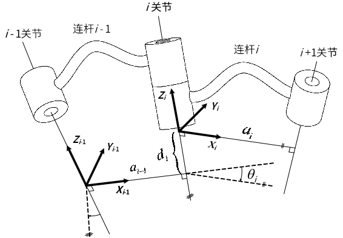

# 第四章 机器人运动学
研究的是机器人工作空间与关节空间之间的影射关系  
> 正运动学: 给定机器人各关节变量，计算机器人末端的位置姿态  
>> 即`关节变量`=>`位置姿态`  

> 逆运动学: 已知机器人末端的位置姿态，计算机器人对应位置的全部关节变量  

---
## 连杆
### 连杆坐标系
1. 称基座为连杆0,不包含在n个连杆内  
2. `关节1`处于基座与`连杆1`之间  
3. :star:`连杆i`距基座近的一端的关节为`关节i`，据基座远的一端的关节为关节`i+1`  
4. 固连于基座上的坐标系为坐标系{0},建立在关节1上
   - 若用改进DH,则坐标系{0},{1}是重合的

### 连杆参数
**连杆参数**: 连杆长度$a_i$,连杆扭角${\alpha}_i$, 连杆偏距$d_i$, 关节角$\theta_i$
> 只有$d_i$,$\theta_i$是关节变量  

**各连杆参数的含义**:
  - `连杆尺寸参数`:由连杆两端关节轴的相对关系决定  
    -  `连杆长度`: 两关节的轴线的<u>公垂线</u>的长度  
    -  `连杆扭角`:两关节轴线的夹角  

  - `连杆之间的连接关系`:用连接两个连杆的关节轴的特性来表示  
    - `连杆偏距`:描述了两连杆之间的一个距离关系  
      - >关节i上的两条公垂线($a_i,a_{i-1}$)之间的距离,沿关节轴线测量
    - `关节角`: 描述了连杆i想对于连杆i-1绕关节i轴线的旋转角度  

**不同关节类型对关节变量的影响**:  
- 关节i是转动关节: $\theta_i$是关节变量，其他<u>三个参数固定不变</u>  
- 关节i是移动关节: $d_i$是关节变量，其他<u>三个参数固定不变</u>  

#### 特殊情况下连杆参数的值
关节i,关节i-1轴线平行时$\alpha_{i-1} = 0$  
关节i,关节i-1轴线相交时$a_{i-1} = 0$,指向任意  

## D-H建模
标准D-H建模: 将坐标系{i}建立在`i+1`关节的轴线上  
改进D-H建模(重要):将坐标系{i}建立在`i`关节的轴线上  

### D-H关节坐标系建立(改进非标准,与书上存在不同)
建立原则:先中间，后两边  

1. **中间坐标系{i}的建立:** 由`关节i,i+1`和`连杆i`决定   
   - 原点$O_i$: `关节i`轴线与`关节i+1`公垂线的交点  
     - 当$z_i$,$z_{i+1}$相交时，原点$O_i$为其交点  
     - 当$z_i$,$z_{i+1}$平行时，原点$O_i$取使偏置为零处的点  
   - $z_i$轴:与`关节i`轴线重合  
     -  指向任意  
   - $x_i$轴: 与`关节i`和`关节i-1`轴线的公垂线重合，指向从`i`到`i+1`  
     - 当关节i和关节i+1轴线相交时,$x_i$轴是两轴线所成平面的法线  
   - $y_i$轴: 由右手螺旋法则得到   

2. **{0}的建立:**  
   - $z_0$轴: 与关节1轴线一致  
   - :star:关节1是旋转关节时,$d_0 = 0$  
   - :star:关节1是移动关节时,$\theta_0 = 0$  
   - 关节1变量为0时，坐标系{0},{1}重合  

3. **{n+1}的建立:**  
   - $z_{n+1}$轴: 沿关节n轴线方向  
   - :star:关节n是旋转关节时,$d_{n+1} = 0$  
   - :star:关节n是移动关节时,$\theta_{n+1} = 0$  
   - 关节n变量为0时，坐标系{n},{n+1}重合  

  

--- 
#### 利用连杆坐标系确定D-H参数(即连杆参数)  
$a_{i-1}$: 从$Z_{i-1}$到$Z_i$沿$X_{i-1}$测量的距离  
$\alpha_{i-1}$: 从$Z_{i-1}$到$Z_i$绕$X_{i-1}$旋转的角度  
$d_{i}$: 从$X_{i-1}$到$X_i$沿$Z_i$测量的距离  
$\theta_{i}$: 从$X_{i-1}$到$X_i$绕$Z_i$旋转的角度  

### 连杆变换
相邻连杆坐标系{i},{i-1}的齐次变换矩阵:  
- 四个参数:$a_{i-1},\alpha_{i-1},d_i,\theta_i$  
- 有四个基本子变换:  
   1. 绕$X_{i-1}$轴旋转$\alpha_{i-1}$ => $z_i$轴  
   2. 沿$X_{i-1}$轴移动$a_{i-1}$  
   3. 绕$Z_i$轴旋转$\theta_i$ => $x_i$轴  
   4. 沿$Z_i$轴移动$d_i$  

