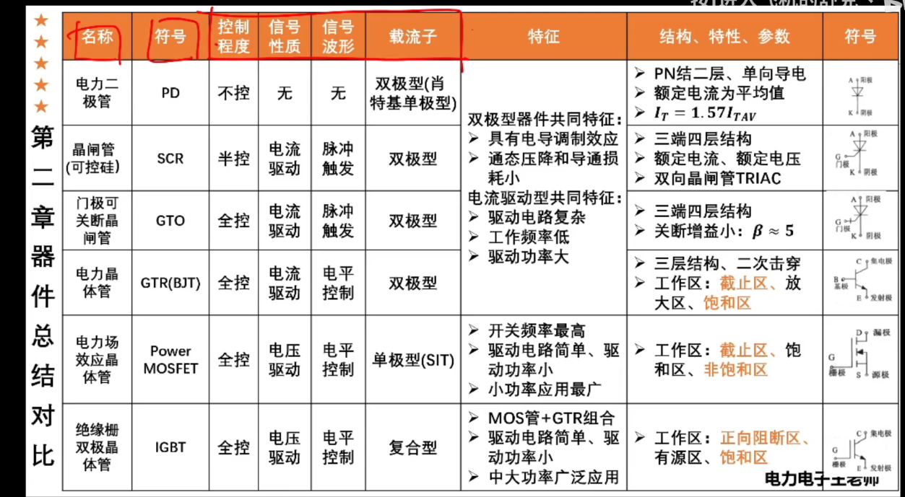

# 考试重点
公频f为50HZ  
## 第一章
1. (背)电子技术包括`信息电子技术`和`电力电子技术`两大分支  

2. (背)电力电子学是由`电力学`，`电子学`，`控制理论`  

3. 斩控方式: 采用全控型器件的电路的主要控制方式为脉冲宽度调制方式  

## 第二章 电力电子器件
1. 电力电子器件: 指可直接用于`处理电能`的主电路中,实现`电能的变换或控制`的电子器件  

2. 主电路: 直接承担电能的变换或控制任务的电路  

3. 晶闸管导通的条件，维持导通的条件，如何关断  
   > 1: 承受正向电压，门极给予触发脉冲  
   > 2: 保持电流大于维持电流  
   > 3: 通过施加反向电压使得电流小于维持电流  

4. (背)当温度降低时，晶闸管的触发电流会增加,正反相漏电流会下降  

5. (背)能够二次击穿的电力电子器件:`GTR`  

6. 晶闸管额定电压电流的计算  
   > 额定电压: 承受最大电压Um的2～3倍  
   
   > 额定电流: 
   >> 1. 确定流过晶闸管的电流的有效值I  
   >> 2. 则额定电流为: (1.5～2)*I/1.57(根据正弦半波平均值与有效值之比为1:1.57)  

7. 擎住电流 = (2～4)×维持电流  

8. 电力电子器件为什么工作与开关状态?  
   > 为了减少本身的损耗，提高效率  

### 电力器件分类
1. 按器件内部载流子参与导电情况，有以下分类:
   > 双极性器件: `SCR`，`GTO`, `GTR`, `电力二极管(PD)`  
   > 单极性器件: `MOSFET`  
   > 复合型器件: `IGBT`  

2. 频率(开关频率)比较: **MOSFET** > IGBT > GTR > GTO > SCR  
3. 容量比较: **SCR** > GTO > IGBT > GTR > MOSFET
4. (背)单管输出功率最大的是: `GTO`  
5. 应用最广泛的是:`IGBT`  

6. 按信号波形分类:
   > 脉冲触发: SCR,GTO  
   > 电平控制: GTR,MOSFET,IGBT  

7. 按驱动信号性质分类:
   > 电流驱动: SCR, GTO, GTR  
   > 电压驱动: MOSFET，IGBT  

  

## 第三章 整流电路
1. 触发延迟角(`a`)在各个整流电路的范围  

2. (背)功率因数由`基波电流相移`和`电流波形畸变`这两个因素共同决定  

3. 电容滤波的单向不可控整流电路:
   > 空载时，输出电压为`根号2* U2`  
   >> 理由:空载使得电容放电时间无限长，从而...  

   > 随负载逐渐加重，Ud逐渐趋近于`0.9U2`   
   > 通常设计时，使`RC >= [(3~5)/2] * T`,输出电压为`1.2U2`   

4. (背)功率因数:   
   > 三相桥式全控整流电路: `功率因数 = 3/pi × cosa`  
   > 单相桥式全控整流电路: `功率因数 = 0.9cosa`  

5. 漏感对电路的影响(个人理解，具体看下): 延迟了如Ia,Ib,Ic降为0的过程  
   > 即使得VT推迟关断  

6. 漏感`重叠角`计算公式的记背  

8. (背)漏感对整流电路的影响:  
   > 出现换相重叠角,整流输出电压平均值降低  
   > 整流电路的工作状态增多  
   > 晶闸管的di/dt减小，有利于晶闸管的安全开通  
   > 换相时晶闸管电压出现缺口，产生正的du/dt,可能使晶闸管误导通  

9. (*背)半控桥或有续流二极管的整流电路，不能实现有源逆变  

10. (背)相控方式: 通过控制触发脉冲的相位来控制直流输出电压大小的方式  

#### 单相半波可控整流电路
**晶闸管承受最大正向电压**:根号2倍U2  
**晶闸管承受最大反向电压**:根号2倍U2  
**电阻负载时，触发角范围**:0-180  
**阻感负载时，触发角范围**:0-180(加了续流二极管)  

#### 单相桥式全控整流电路
**晶闸管承受最大正向电压**:(根号2倍U2)/2  
**晶闸管承受最大反向电压**:根号2倍U2  
**电阻负载时，触发角范围**:0-180  
**阻感负载时，触发角范围**:0-90  

电流仅含奇次谐波  
#### 单相全波可控整流电路
**晶闸管承受最大电压**:2根号2×U2  

#### (背电路图)单相桥式半控整流电路
负载两端并联一个续流二极管的作用: 防止失控  

#### 三相半波可控整流电路
**晶闸管承受最大正向电压**:根号2倍`相电压`(电阻负载),根号6倍`相电压`(阻感负载)  
**晶闸管承受最大反向电压**:根号6倍`相电压`  
**电阻负载时，触发角范围**:0-150  
**阻感负载时，触发角范围**:0-90  

#### (背电路图)三相桥式全控整流电路
**晶闸管承受最大正向电压**: 根号6倍`相电压`  
**晶闸管承受最大反向电压**: 根号6倍`相电压`  
**电阻负载时，触发角范围**: 0-120(因为在120度时,整个周期输出电压都为0)  
**阻感负载时，触发角范围**: 0-90(90时平均输出电压为0)  

电流中仅含`6k+-1`次谐波  

#### (背)有源逆变
1. 有源逆变产生的条件:  
   > 要有直流电动势，其极性需和晶闸管的导通方向一致，其值大于变流器直流侧的平均电压  
   > 晶闸管的控制角`a > pi/2`,使Ud为负值  

2. 逆变失败的原因:  
   - 触发电路工作不可靠，不能适时、准确的给各晶闸管提供脉冲  
   - 晶闸管发生故障，在应该阻断器件时，器件失去阻断能力，或在应该导通时...  
   - 换相的裕量角不足，引起换相失败  
   - 在逆变工作中，交流电源放生缺相或突然消失，由于直流电动势Em的存在，晶闸管仍可导通  

3. 逆变失败的后果:  
   - 形成很大的短路电流  

4. 最小逆变角: 30-35  

## 第四章 逆变电路
*(背电路图)
1. (背)电压型逆变电路的主要特点(需背)  
    > 直流侧为电压源或并联由大电容,直流侧电压基本无脉动  
    > 输出电压为矩形波,输出电流因负载阻抗不同而不同  
    > 阻感负载是需要提供无功功率。为了给交流侧向直流侧反馈的无功能量提供通道，逆变桥各臂都并联来反馈二极管  

2. (背)电流型逆变电路的主要特点(需背)  
    > 直流侧串联大电感,相当于电流源。直流侧电流基本无脉动  
    > 交流侧输出电流为矩形波，与负载阻抗角无关。输出电压波形和相位因负载不同而不同  
    > 交流侧为阻感负载时需要提供无功功率  

3. (背)换流方式及其特点(需背)  
   > 器件换流: 利用全控器件的自关断能力进行换流  
   > 电网换流: 由电网提供换流电压,只要把负的电网电压加载欲换流的器件上即可  
   > 负载换流: 由负载提供换流电压，当负载为电容性负载即负载电流超前与负载电压时  
   > 强迫换流: 设置附加换流电路,给欲关断的晶闸管强迫施加反向电压换流称为强迫换流。  

4. 单相电压型逆变电路，电阻性负载和电感性负载:  
   > 电阻型负载: 电压电流波形相位一致，且均为矩形波  

   > 电感性负载: 电流相位滞后与电压，且电流波形为正弦波  
   >> 每个IGBT必须反向并联一个续流二极管  

5. 三相电压型逆变电路定量分析:  
   > (背)电压有效值及谐波计算:见P107  

   > (个人理解)晶闸管流过的电流(即各相电流)之和为id  
   >> 所以晶闸管流过的电流的有效值为:`(1/根号3)*id`  

6. 三相电流型逆变电路:  
   > 换流方式: 强迫换流，负载换流  
   >> 强迫换流: 利用电容的电压对VT进行关断等处理  
   >> 负载换流: 利用负载中电感的电流对电容进行充电等...  

   > 导电方式: 120度导电方式  
   > 横向换流  

## 第五章 直流-直流变流电路
1. (背)各个直接直流变流电路输出电压与输入电压的比值:  
   > 若电流连续(当L极大时，必连续),则利用一个周期内，电感电压平均值为0  

2. (背电路图)升压斩波和降压斩波和升降压斩波电路的图形  

3. (背)斩波电路的三种控制方式:  
   > 脉宽调制控制方式: 维持T不变，改变ton   
   > 脉频调制控制方式: 维持ton不变，改变T  
   > 混合调制控制方式: ton,T都可调，使占空比改变  

4. 升压斩波电路中:
   > L: 储存电能升压  
   > C: 维持输出电压稳定  

## 第六章 交流-交流变流电路
1. 交流调压电路电路图  
2. 间接方式(存在中间直流环节)  
   > 可看作AC-DC,DC-AC  

3. 单相交流调压电路的触发角与阻抗角(功率因数角)的不同关系的不同状态:  
   > `触发角a > 阻抗角`: `导通角 < pi`  
   > `触发角a = 阻抗角`: `导通角 = pi`  

   > `触发角a < 阻抗角`: 达到稳态时，`导通角 = pi`  
   >> 过程:VT1提前导通，L过充电,使得放电时间延长,VT1导通时间大于正常值,VT2延迟导通...  

4. 三相交流调压电路:  
   > **三相均导通**时，`负载相电压 == 电源相电压`  
   > **两相导通**时，`负载相电压 == 电源线电压的一半`  
   > **均不导通**时，`负载相电压 == 0`  

5. (背电路图)单相交交变频电路:
   > (背)掌握电路和波形的画法  
   > 能够通过波形分析出P,N组的工作状态  

### 交流调压电路(阻感负载)
1. 要计算出阻抗Z  
2. 求出阻抗角[ 阻抗角 = arctan(wL/R)]  
3. 负载电流的最大有效值的计算  

## 第七章 脉宽调制及相关控制技术 
1. 根据`载波比变化情况`可分为: `异步调制`，`同步调制`  
   > 低频输出时: 采用异步调制  
   > 高频输出时: 采用同步调制  

2. `同步调制`: 可以用于控制消除输出波形中特定次谐波成分  

3. 常用的PWM跟踪控制方式分别是:`滞环比较`，`定时比较`，`三角波比较`  

4. 生成PWM波的方法: `调制法`(或`载波法`),`特定谐波消去法`  

4. 调制信号:希望输出的波形  
5. 载波: 接受调制的信号  
6. 载波比: 载波频率fc与调制信号频率fr之比(`N = fc/fr`)  

7. 双极性方式: 一个周期内，PWM波只有`两种电平(Ud,-Ud)`  
8. 单极性方式: 一个周期内，PWM波有`三种电平(Ud,-Ud,0)`  

9. 面积等效定理  

## 第九章 电力电子器件的应用技术
1. 驱动电路中:  
   > **加速电容C**的作用是: 加速功率晶体管的开通  
   > **抗饱和电路**: 限制饱和深度，减少存储时间  

2. 过电流保护: 快速熔断器,直流快速断路器,过电流继电器  

3. 晶闸管的并联: 晶闸管串均流电抗器  

4. 串联均压，并联均流  

