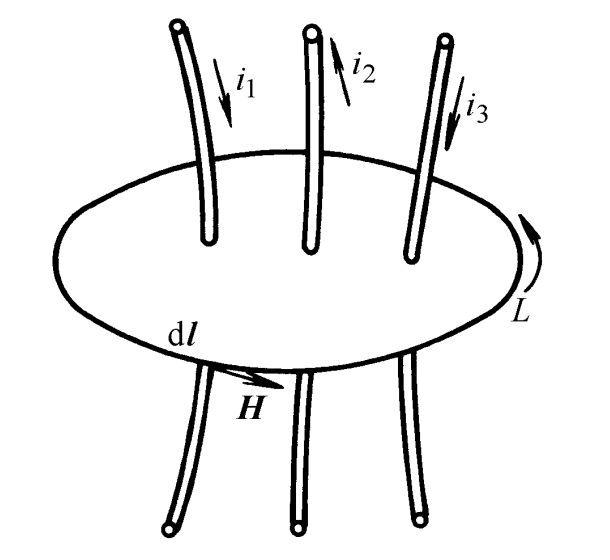
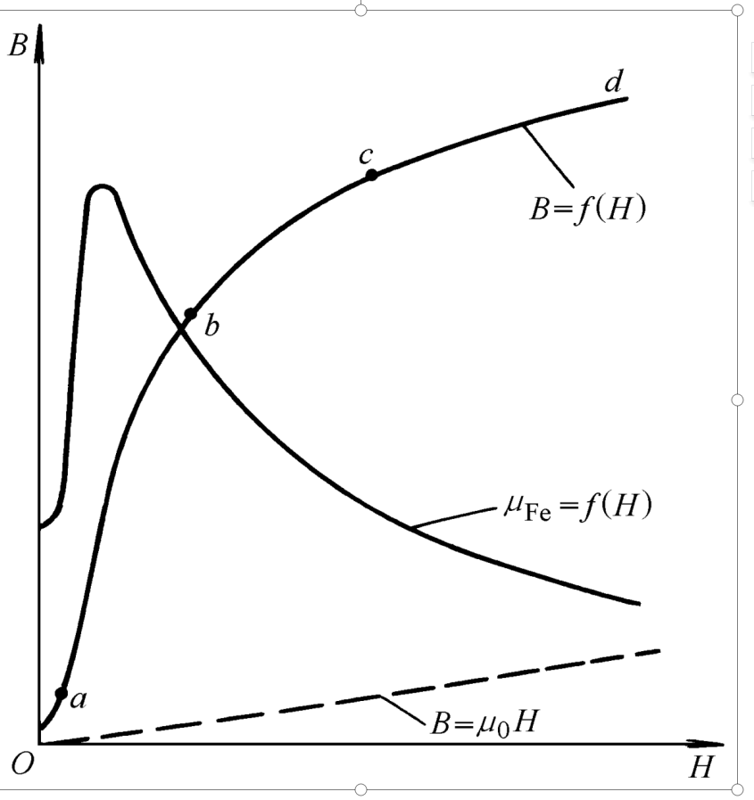
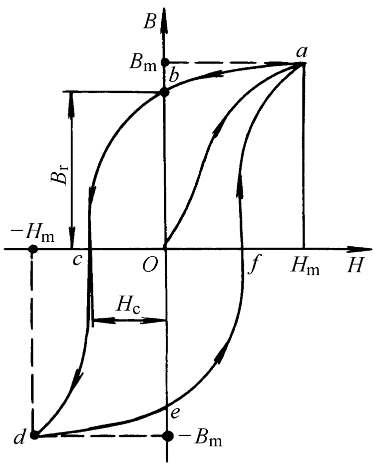

# 磁路 
## 磁路的基本知识和基本定律
### 磁场常用物理量
1. **磁感应强度B**: 表征磁场强弱及方向的物理量  
   - `单位`: 特斯拉$1T = 1Wb/m^2$  

2. **磁通**: 磁感应强度与垂直于磁场方向面积的乘积  
   - `公式`: $\Phi = \int B dA$  
   - `单位`: 韦伯$Wb$

3. **磁场强度H**:
   - `公式`: $H = B/\mu$  
      - $\mu$: 磁导率，用于表示物质磁导能力大小  
   - `单位`:$A/m$

### 磁路的相关概念
1. **磁路**: 磁通通过的路径称为磁路  
   - >磁路可以是铁磁物质，也可以是非磁体  
2. **励磁线圈**: 用以激励磁路产生磁通的载流线圈  
3. **励磁电流**: 励磁线圈中的电流称为励磁电流  
   - `电流为直流`: 磁路中的磁通是恒定的，称为直流磁路  
   - `电流为交流`: 磁路中的磁通随时间变化而变化，称为交流磁路  

### :star:磁路的基本定律
1. **安培环路定律**  
   - **概念**: 磁场强度H沿着任何一条闭合回线L的线积分等于该闭合回线所包围的总电流值  
   - **公式**: $\oint_{L} H\cdot dl = \sum i$  

2. **磁路的欧姆定律**  
   - **概念**: 作用在磁路上的磁动势F等于磁通内的磁通量$\Phi$乘以磁阻$R_m$
   - **公式**: $F = Ni = lB/\mu = \Phi R_m$  
   - > 铁磁材料的磁导率$\mu$和磁阻$R_m$不为常数，因此$R_m$用于计算并不方便  

3. **磁路的基尔霍夫第一定律**  
   - **概念**: 穿出或进入任一闭合面的总磁通恒等于0  
4. **磁路的基尔霍夫第二定律**  
   - **概念**: 沿任何闭合磁路的总磁动势恒等于各段磁路磁位降的代数和  
      - >$H_i$: 为磁路单位长度上的磁位降  

## 常用的铁磁材料及其特性
1. 铁磁物质的磁化:  
  

2. 铁磁材料的分类:  
   - 软磁材料  
   - 硬磁材料  

### 起始磁化曲线

**非铁磁材料**: B和H之间呈线性关系  
   - $B = \mu _0 H$  

**铁磁材料**: 随着外磁场的增强，铁磁材料的磁导率$\mu _{Fe}$会先增加在下降  
   - $B = f(H)$   

### 磁滞回线

剩磁: 当B随着H(0~Hm)升高而升到Bm，然后撤掉外磁场，铁磁材料仍然保留的磁场强度$B_r$称为剩磁  

### 铁心损耗  
铁心损耗: 铁心中的磁滞损耗和涡流损耗之和  
   - > 涡流损耗: 铁心内部由于涡流在铁心电阻上产生的热能损耗  
   - > 磁滞损耗: 材料被交流磁场反复磁化，磁畴相互摩擦而消耗的能量  

## 直流磁路的计算
**磁路计算的正问题**: 给定磁通量$Phi$,计算所需励磁磁动势   
**磁路计算的逆问题**: 给定励磁磁动势，计算磁路内的磁通量$\Phi$  

## 交流磁路的特点  
1. 在铁心处会产生磁滞损耗  
2. 磁通量随时间变化，在励磁线圈中产生感应电动势  
3. 磁饱和现象会导致电流、磁通和电动势波形畸变  

