# 第九章 直流电动机的电力拖动
## 他励直流电动机的机械特性
> 电动机的机械特性: 指电动机的转速n与电磁转矩T的关系,$n = f(T)$  

**基本公式**:  
1. 感应电动势:$E = C_E\Phi n$  
   - >$C_E = \frac{4pN}{60}$  
2. 电磁转矩:$T = C_T\Phi I_a$  
   - >$C_T = 9.55C_E$  

### 机械特性方程式
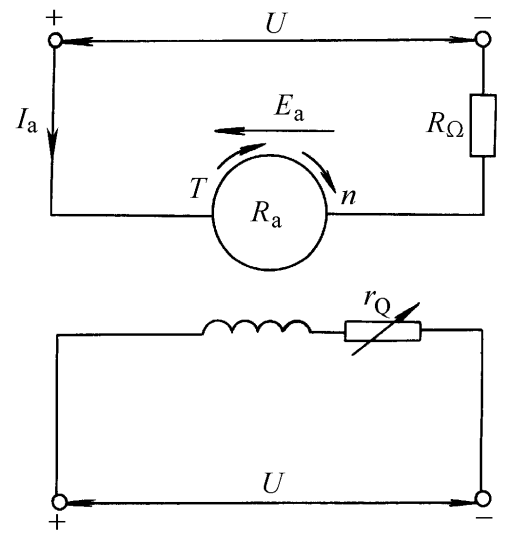

**励磁回路**:$U_f = R_fI_f$  
**电枢回路**:$U_a = I_aR_a + E$  
:star:**转速**:$n = \frac{E}{C_E\Phi} = \frac{U_a}{C_E\Phi} - \frac{R_a}{C_EC_T\Phi^2}T$  
   - >$\beta = R/(C_eC_T\Phi^2)$ 机械特性的斜率，$\beta$值越大，机械特性越软  

**额定转速变化率**:$\Delta n_N \% = \frac{n_0 -n_N}{n_N}\times 100\%$  
   - >$n_0$: 理想空载转速,即T = 0时  
   - >$n_N$: 额定转速  

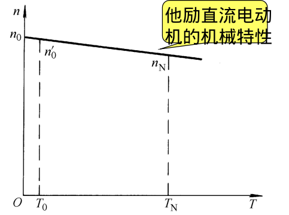

> tip:当电枢电流较大时，由于饱和的影响，产生去磁作用  

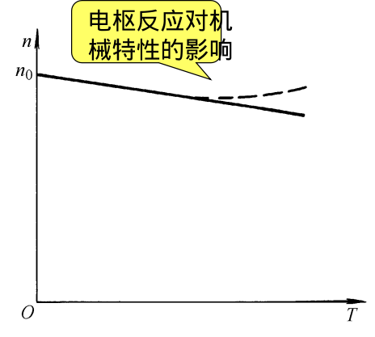

### 固有机械特性与人为机械特性
$n = \frac{U_a}{C_E\Phi} - \frac{R_a}{C_EC_T\Phi^2}T$  

$R_a = (\frac{1}{2} $~$ \frac{2}{3})\frac{U_NI_N-PN}{I_N^2}$  
#### 固有特性
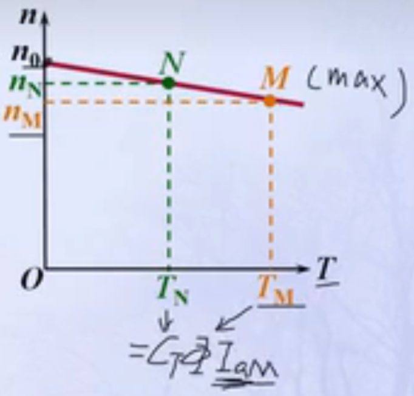

> $n_0$:理想空载转速  
> $n_N$:额定状态N点时的转速  
> $n_M$:临界状态(最大值)M点时的转速  

#### 人为特性
##### 增加电枢电路电阻时的人为特性
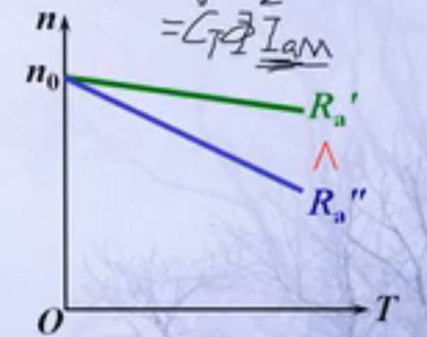

$R_a$增加时，斜率$\beta$增大，机械特性的硬度变软  

##### 改变电枢电压时的人为机械特性
$n_0$降低，斜率$\beta$不变  
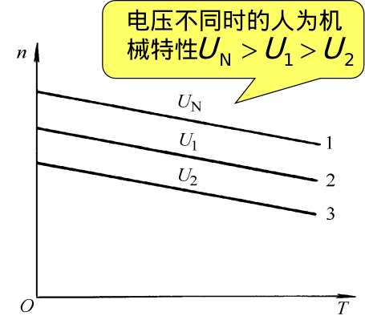

##### 减弱电动机磁通时的人为机械特性
改变电动机磁通$\Phi$，即改变励磁电流  
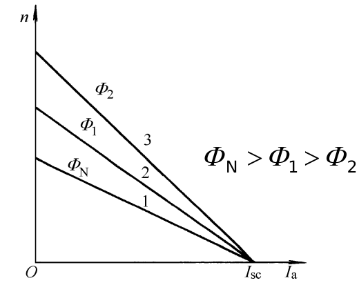

### 机械特性曲线的绘制
...

### 电力拖动稳定运行的条件
**必要条件**:$n = f(T),n = f(T_Z)$两种特性曲线有交点  
**充分条件**:原在交点处稳定运行，由于出现某种干扰作用（如电网电压波动、负载转矩的微小变化等），使原来两种特性的平衡变成不平衡，电动机转速便稍有变化，这时，当干扰消除后，拖动系统必须有能力使转速恢复到原来交点处的数值。

## 他励直流电动机的起动
> 起动: 使处于静止状态的电机，逐渐旋转起来，达到所需要的运动状态  

### 起动性能
**起动瞬间**: n = 0,E = 0,则有$U_a = R_aI_{ST}$  
有:$I_{ST} = \frac{U_a}{R_a} = (10 ~ 20)I_N$ $> I_{amax}$  
   - > tip: 直接起动电流过大，因此禁止直接起动  
   - >`解决办法`: 降低电枢电压起动(需要可调直流电源)  
   - >`解决办法`: :star:增加电枢电阻起动,在起动过程中再将起动电阻逐步切除  

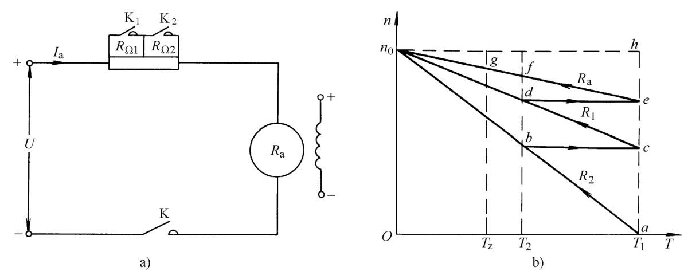

**分析**:  
1. 有电流$I_1$产生的起动转矩$T_1$,如图a点所示。电机开始起动,转矩T下降  
2. 到达b点后，切除电阻$R_{\Omega _2}$,转速不能突变，因此电流增大，转矩增大,到达c点  
3. 沿cd段进行变换，达d点后，切除电阻$R_{\Omega_1}$,到达e点  
4. 拖动系统继续加速到g点稳定运转，此时转速为$n_2$,转矩$T_e = T_z$  

### 起动电阻的计算
#### 图解解析法
...

#### 解析法(根据上图进行分析)
$I_1$: 起动过程中最大电流,需自己选取，如$I_1 = 2I_N$  
$I_2$: 切换电流  
> ab段电阻:$R_2 = R_a + R_{\Omega_1} + R_{\Omega_2}$  
> cd段电阻:$R_1 = R_a + R_{\Omega_1}$  
> eg段电阻:$R = R_a$  

b点:$I_2 = \frac{U-E_b}{R2}$  
c点:$I_1 = \frac{U-E_c}{R1}$  
b,c点转速相等:$E_b = E_c$  
得:$\frac{I_1}{I_2} = \frac{R_2}{R_1} = \frac{R_1}{R_a}$  
:star:推广到m级起动的情况:$\frac{I_1}{I_2} = \frac{R_m}{R_{m-1}} = \frac{R_{m-1}}{R_{m-2}} = ... =\frac{R_2}{R_1} = \frac{R_1}{R_a}$  

> $\beta = \sqrt[m]{\frac{R_m}{R_a}}$  
因此只要知道$\beta = \frac{I_1}{I_2}$,就可以算出各级的起动电阻  

### 他励直流电动机起动的过度过程
**电力拖动系统中一般存在一下三种惯性**:  
1. **机械惯性**: 反映在系统的飞轮惯量上，他使转速不能突变  
2. **电磁惯性**: 使电枢迪奥尼路和励磁电流不能突变，从而使磁通不能突变  
3. **热惯性**:电动机的温度不能突变  

**电力拖动的过度过程一般分为两种**:  
1. 机械过渡过程  
2. 电气-机械过度过程  

## 他励直流电动机的制动
**他励直流电动机的两种运转状态**:  
1. `电动运转状态`:电动机转矩的方向与转速的方向相同，此时电网向电动机输入电能，并变为机械能以带动负载。
2. `制动运转状态`:电动机转矩与转速的方向相反，此时，用电动机吸收机械能并转化为电能。  

电气制动分类:能耗制动，反接制动，回馈制动  
### 能耗制动
> tip: 转速是负值  

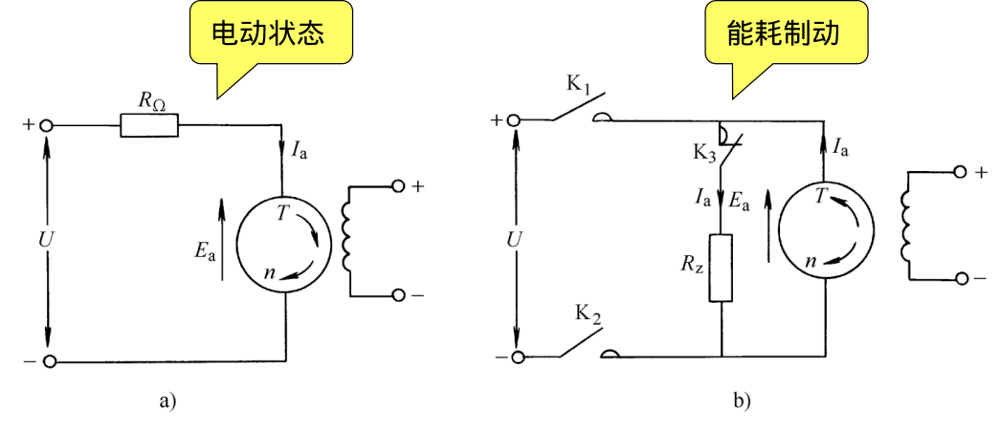

**特征**:$U = 0,R = R_a + R_z$  
**能耗制动**:动能转换成电能，被电阻消耗掉  
**能耗制动机械特性方程**:$n = - \frac{R_a + R_z}{C_eC_T\Phi^2}T_e$  

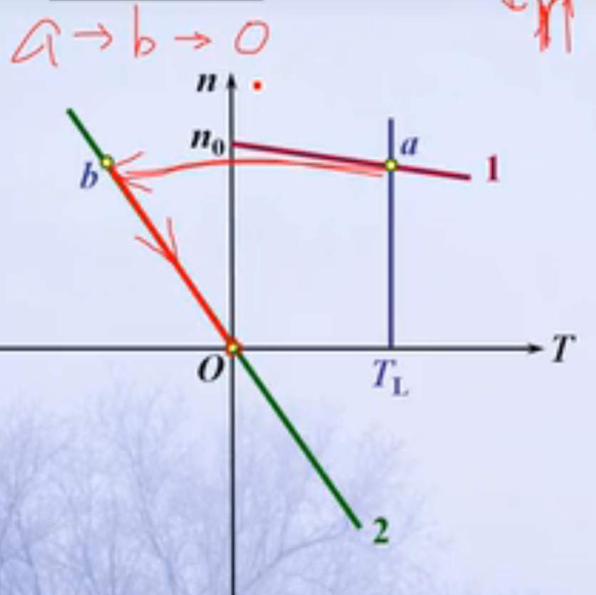
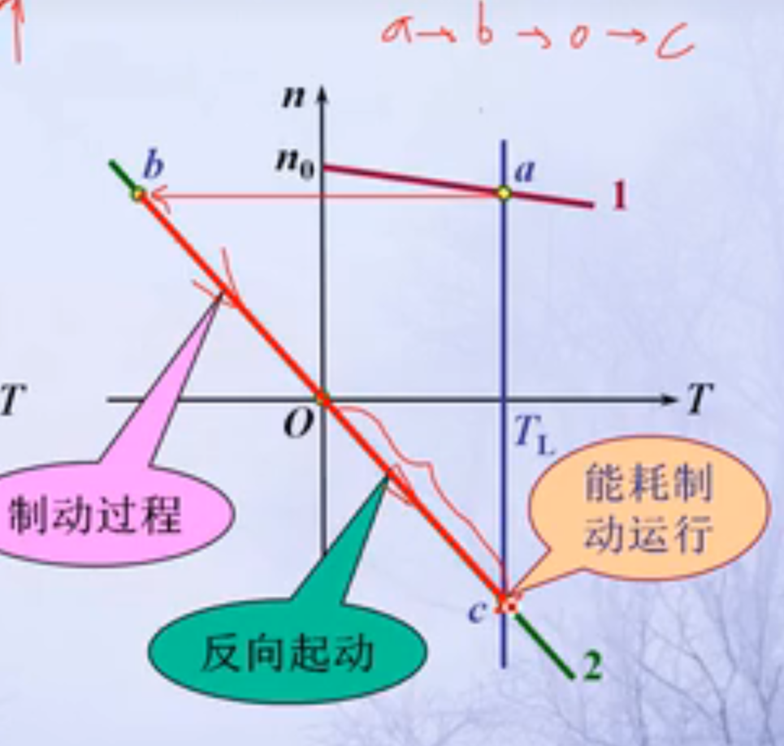

#### 解题须知
1. 能耗制动时最大电流出现在制动开始时   

### 反接制动
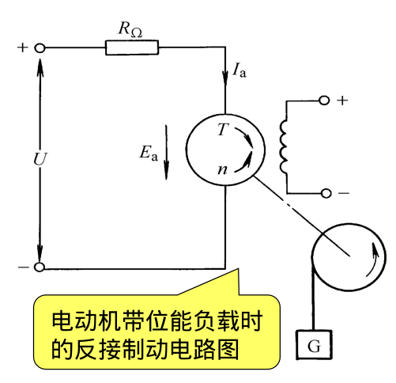
#### 转速反向的反接制动
> 转速反向而励磁磁场没变，则感应电动势方向改变，感应电动势实际方向应朝上(与图片并不一样)  

路电压平衡方程式:$I_a(R_a + R_{\Omega}) = U + E_a$  
转速反向的反接制动特性方程式为:$n = n_0 - \frac{R + R_\Omega}{C_eC_T\Phi^2}T$  
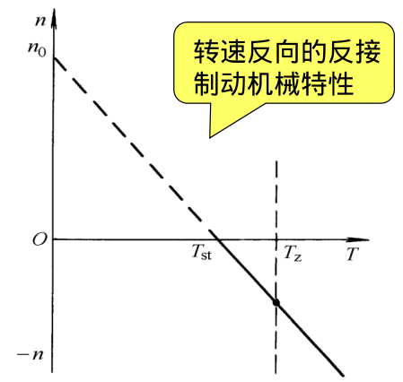

#### 电枢反接的反接制动
> 电枢电压反向而励磁磁场没变，因此感应电动势方向不变，感应电动势实际方向应正常朝下(与图片并不一样)  

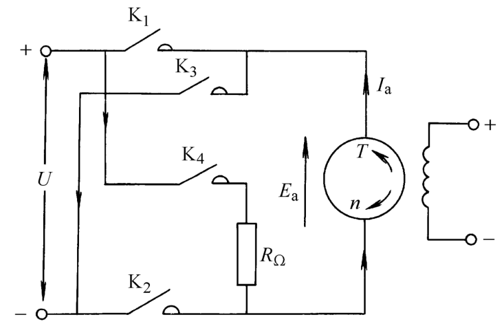

> 断开K1,K2,接通K3,K4  

电枢回路电压平衡方程式:$I_a(R_a + R_{\Omega}) = -U - E_a$  
电枢反接的反接制动特性方程式为:$n = -n_0 - \frac{R + R_\Omega}{C_eC_T\Phi^2}T$  

#### 解题步骤
1. 画出不同情况的反接制动的电路图  
2. 写出电动势平衡方程  
3. 根据题目进行分析

### 回馈制动(或称再生制动)
#### 位能负载拖动电动机
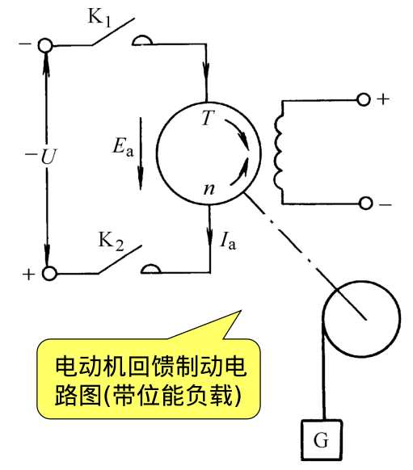

**特性**:转速反向，电压反向,感应电动势方向向上(由转动方向和励磁磁场决定)  

#### 他励电动机改变电枢电压调速
在降低电压的降速过程中，当突然降低电枢电压，感应电动势还来不及变化时，就会发生的情况，亦即出现了回馈制动状态。

## 他励直流电动机的调速
调速: 采用一定的方法来改变生产机械的工作速度，以满足生产的需要  
### 调速标准
分类: 技术指标和经济指标

#### 调速的技术指标
1. 调速范围: $D = \frac{n_{max}}{n_{min}} = \frac{v_{max}}{v_{min}}$  
   - >最大转速$n_{max}$,最小转速$n_{min}$  
   - >线速度$v$  

2. 静差率:$\delta = \frac{\Delta n_N}{n_0} \times 100\% = \frac{n_0 - n_N}{n_0} \times 100\%$  
   - >电动机的机械特性愈硬，则静差率愈小，相对稳定性就愈高  

3. 平滑性: $\phi = \frac{n_i}{n_{i-1}}$  
   - > 在一定的调速范围内，调速的级数越多，则认为调速月平滑  
   - > $\phi$越接近于1,平滑性越好  

4. 调速时的容许输出: 指电动机在得到充分利用的情况下，在调速过程中轴上所能输出的功率和转矩。 

#### 调速的经济指标
> 调速的经济指标决定于调速系统的设备投资及运行费用，而运行费用又决定于调速过程的损耗，它可用设备的效率来说明。  

**设备的效率**:$\eta = \frac{P_2}{P_2 + \Delta P}$

### 降低电枢端电压调速
#### 电枢串联电阻调速
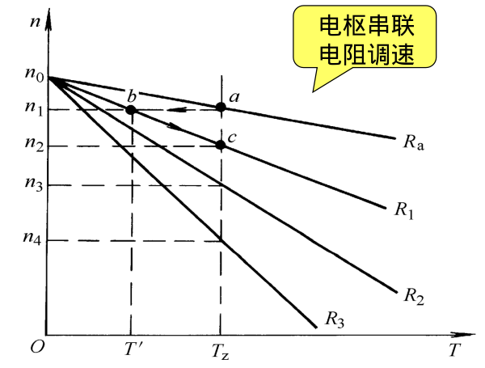

#### 降低电源电压调速
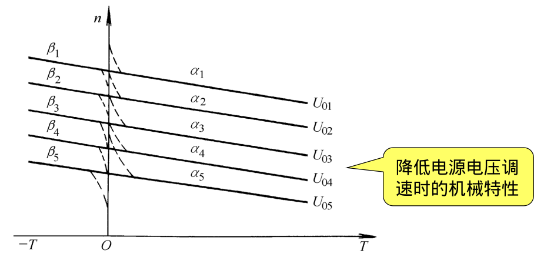

### 弱磁调速
减弱磁通:  
   - 小容量系统:励磁电路中串联可调电阻$r_\Omega$  
   - 大容量系统:单独的晶闸管蒸馏装置想电动机的励磁电路供电  

