# :star:第二章 直流电机
[直流电机结构](https://www.pengky.cn/dianjixilie022/3-kjdh-zhiliujijiegou/kjdh-zhiliujijiegou.html)
## :star: 重要知识点
1. 直流电机电枢绕组中元件(线圈)的结构:(如下图绿色框框)  
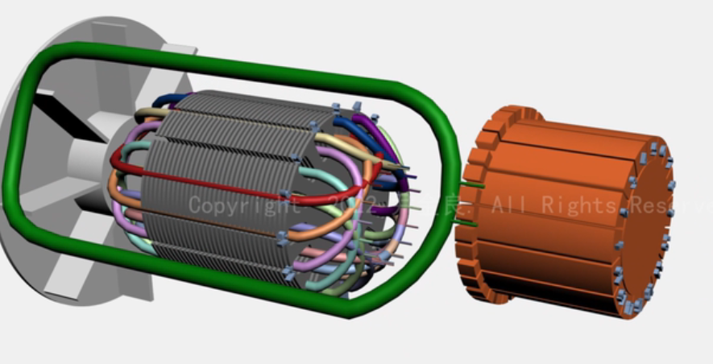

2. 以f为下表的变量，表示励磁相关的物理量
3. 以a为下标的变量，表示电枢相关的物理量
## 直流电机的工作原理及结构
### 直流电机的工作原理
> 背景: 安培定律(F = Bil)  

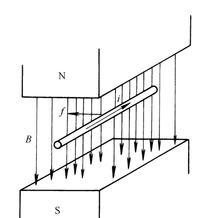

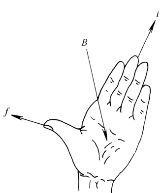

#### 直流电动机的工作原理
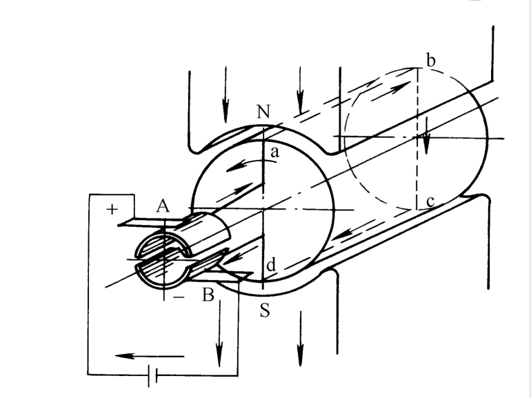

**原理**:线圈通入直流电流时,线圈边将会受到电磁力(提供了转矩),使得电枢开始转动  
   - 换向器的作用: 使得电枢线圈在N极的那边的电流方向总是一定的，这样可以使电枢总向一个固定的方向转动  
   - 受到力的方向: 利用左手定则  

#### 直流发动机的工作原理
用原动机拖动电枢逆时针方向恒速转动(提供机械能)，线圈ab,cd边分别切割不同极性磁场下的磁场，线圈中产生了交变电动势,由于换向器配合电刷对电流的换向作用，使得在电刷A、B端的电动势为直流电动势  

---
综上:**一台直流电机既可作为电动机运行，也可以作为发电机运行**  
> 作为电动机: 在电刷端加上直流电压(既提供电能),电枢将会旋转（产生了机械能)  
> 作为发电机: 用原动机拖动电枢转动(提供机械能),电刷端将会产生电动势(产生了电能)  

### 直流电机的结构
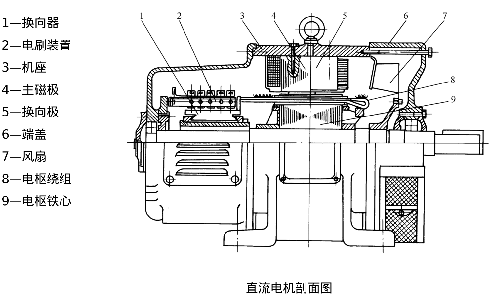

**定子**: 直流电机的静止部分,主要作用是产生磁场(由主磁极,换向极,机座和电刷装置等组成)  
**转子**: 通常称为电枢(由电枢铁心，电枢绕组，换向器，轴及风扇等组成),作用是产生电磁转矩和感应电动势  

#### 直流电机的静止部分
1. **主磁极**:  
   - 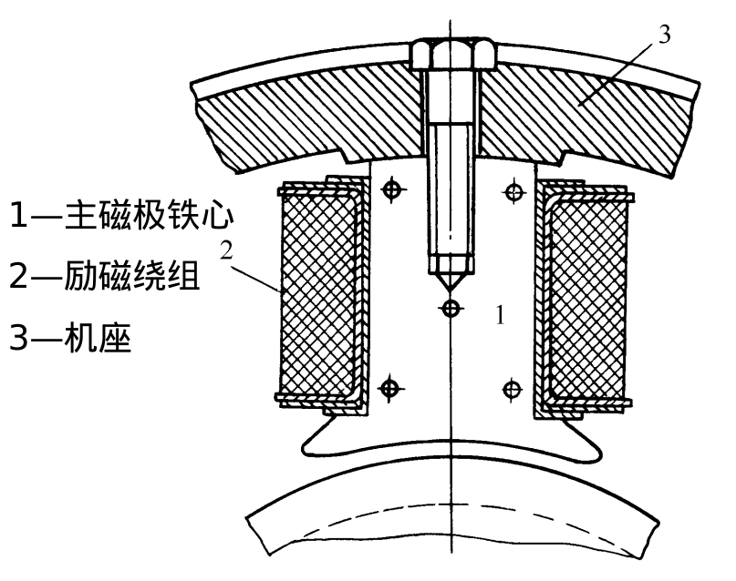  

2. **换向极**:装在两主磁极之间，用于改善换向  
   - 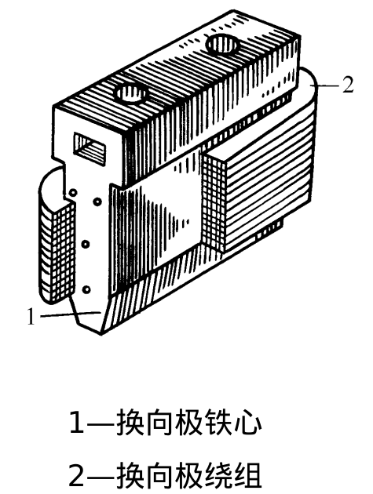 

3. 机座:  
   - 用于固定主磁极、换向极和端盖  
   - 作为磁路的一部分  

4. **电刷装置**:是把直流电引入或引出的装置  
   - 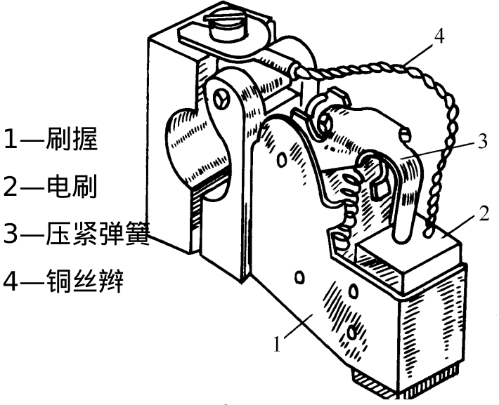

#### 直流电机的转动部分
1. **电枢铁心**: 
   - 作为主磁路的主要部分  
   - 嵌放电枢绕组  
   - 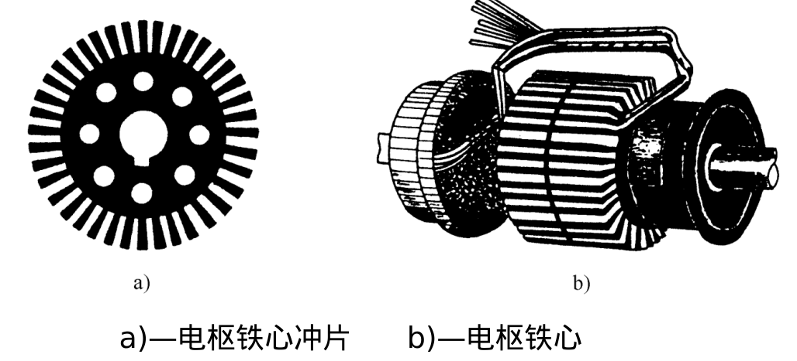

2. 电枢绕组:由许多按一定规律连接的线圈组成  
3. 换向器: 由许多换向片组成  
   - 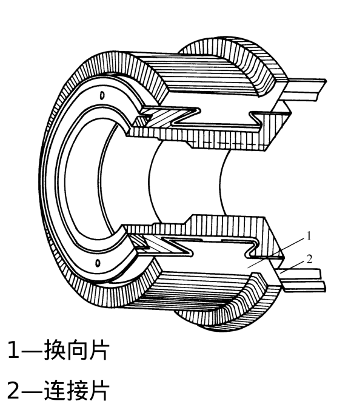

## 直流电机的铭牌数据(额定值)
1. **额定功率$P_N(kW)$**: 
   - 直流电动机:指轴上输出的机械功率，等于额定电压和额定电流和额定效率的乘积  
   - 直流发电机:指电机出线端输出的电功率，等于额定电压和额定电流的乘积  
2. **额定电压$U_N(V)$**  
3. **额定电流$I_N(A)$**  
4. **额定转速$n_N(r/min)$**  
5. **额定励磁电压$U_{fN}(V)$**  

## 直流电机的绕组
> **对绕组的要求**: 在能通过规定的电流和产生足够的电动势的前提下,尽可能节省有色金属和绝缘材料，并且要结构简单、运行可靠等  

### 各线圈不连接的多线圈装置
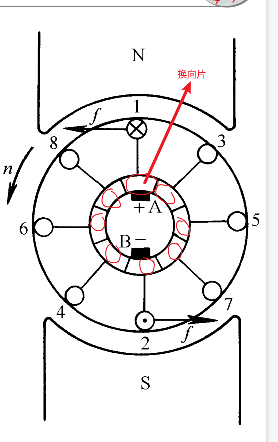

**组成**:4个线圈，8个换向器  
   - >线圈一: 1-2  
   - >线圈二: 3-4  
   - >线圈三: 5-6  
   - >线圈四: 7-8  

**缺点**: 随着电枢的转动，始终只有一个线圈有电流(因为始终只有一对换向器能和电刷相连)  

---
**解决办法**:用4个换向片将4个线圈都连接起来，使得4个线圈构成闭合绕组，<u>两个不同的元件边(如1,8)的连接同一个换向片</u>。每个元件的两个元件边连接2个不同的换向片。共用了4个换向片，节省了材料，提高了输出转矩。
   - > 元件: 绕组中的每个线圈为一个元件(如线圈一)  

**效果**: 四个线圈时刻都有电流通过
### 简单的绕组(解决办法的应用)
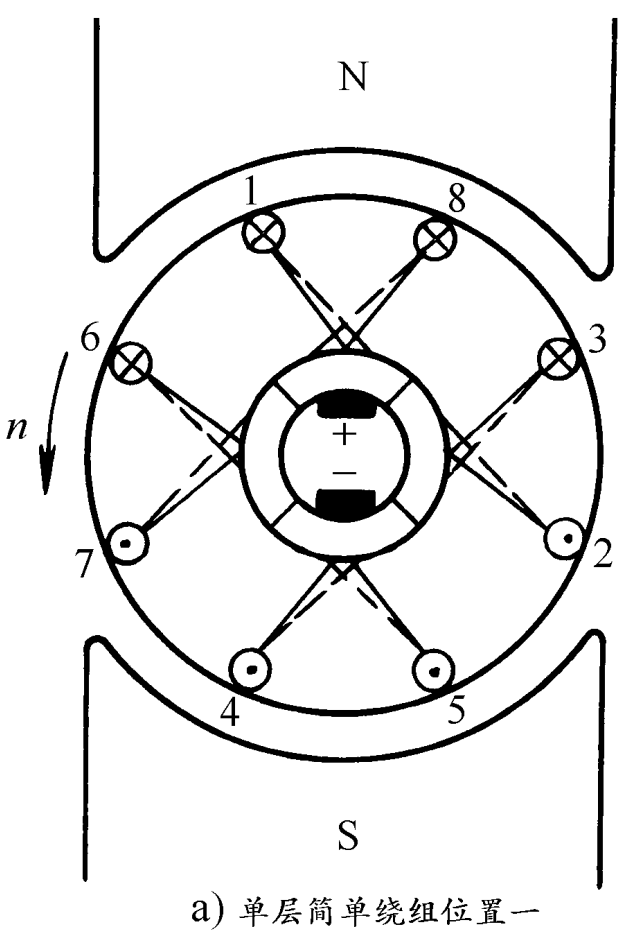
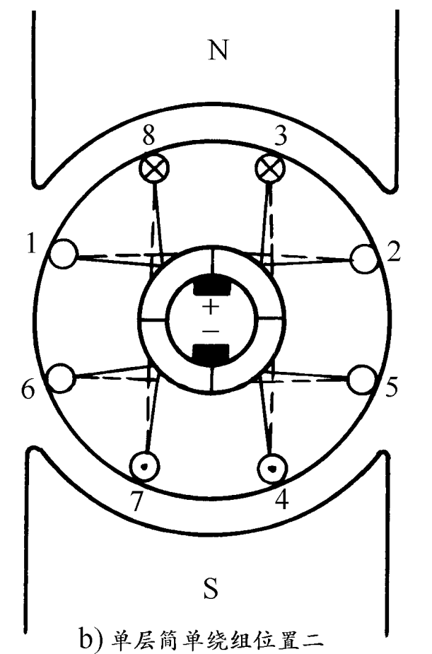
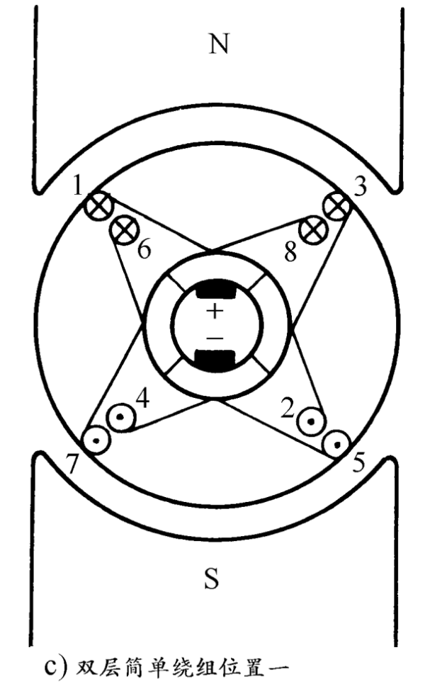
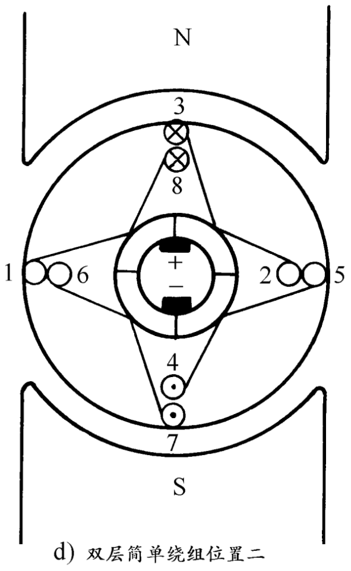

### 绕组的基本形式
:star:**直流电机电枢绕组的基本形式有两种**: 单叠绕组，单波绕组  
#### 单叠绕组
**构成**: 所有的相邻元件一次串联，即后一元件的首端与前一元件的末端连载一次，接到一个换向片上。最后一个元件末端与第一个元件首端连接再一次，构成一个闭合回路  
**特点**: 元件的两个端子连接在相邻的两个换向片上  

#### 单波绕组
单波绕组—不是把元件依串联，而是把相隔大约两个极距，即在磁场中的位置差不多相对应的元件连接起来。

### 直流电机的励磁方式及磁场
#### 直流电机的励磁方式
> 励磁磁场: 直流电机中，由磁极的励磁磁动势单独建立的磁场是电机的主磁场  
> 励磁方式: 指对励磁绕组如何供电，产生励磁磁动势而建立主磁场的问题  

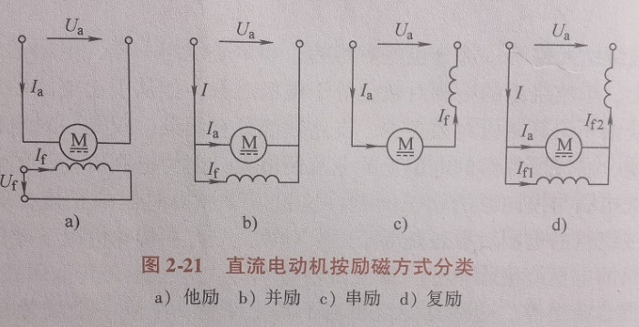

> 励磁绕组表示为图中的电感，且存在一定的阻值$R_f$  

> 电动机符号表示电枢绕组,由感应电动势E和电阻$R_a$组成  

> 反映了励磁绕组与电枢绕组的连接关系  

1. **他励直流电机**:励磁绕组与电枢绕组无连接关系，而是有其他直流电源对励磁绕组供电  
   - 他励直流电机基本工作情况分析:  
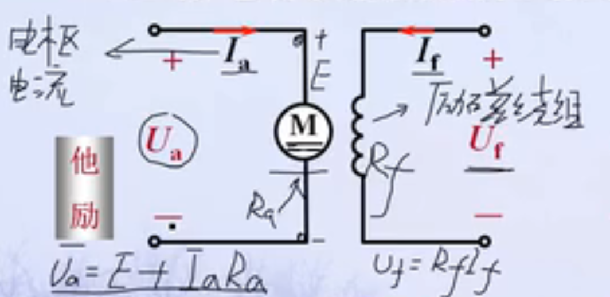
2. **并励直流电机**:励磁绕组与电枢绕组并联  
3. **串励直流电机**: 励磁绕组与电枢绕组串联  
4. **复励直流电机**: 两个励磁绕组，一个与电枢绕组并联，另一个与电枢绕组串联  

---
**直流电机的空载磁场(励磁磁场)**: 指电枢电流等于0或很小时，有励磁磁动势单独建立的磁场   
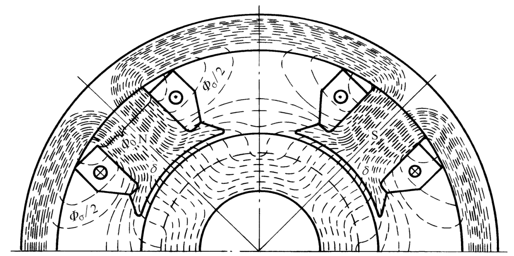

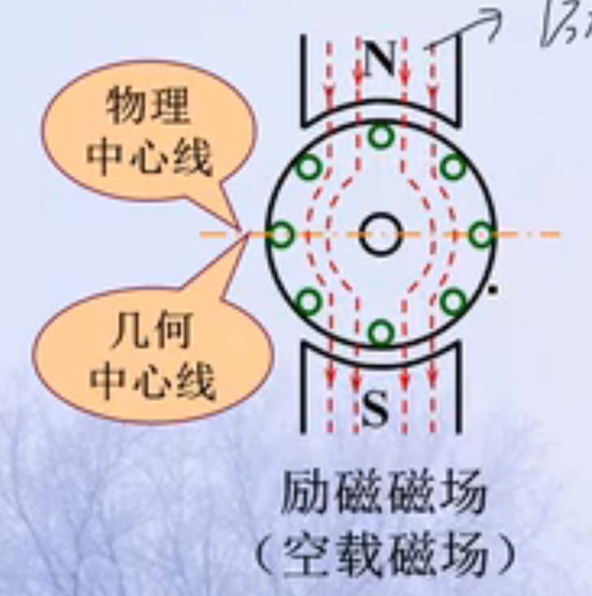

**直流电机的电枢磁场**:  
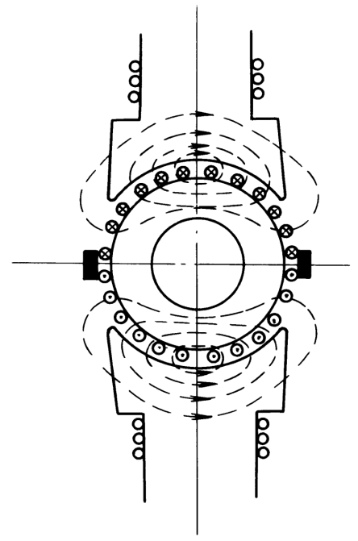

**直流电机的合成磁场**:  
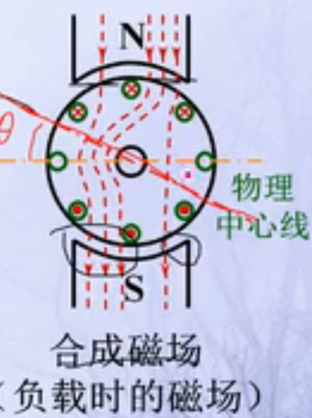

**电枢反应的影响**:使磁场发生畸变;呈去磁作用

### 感应电动势和电磁转矩的计算
#### 感应电动势($E_a$)的计算
**公式**: :star:$E_a = C_e\Phi n = C_e K_f I_f n = G_{af}I_f\Omega$  
   - n: 电枢的转速(r/min)  
   - $\Phi$: 大小与励磁电流相关,$\Phi = K_fI_f$
   - $C_e$: 电动势常数,$C_e = pZ/(60a)$
   - $\Omega$: 机械角速度
   - :star:$G_{af} = C_TK_f$  

#### 电磁转矩的计算
**公式**: :star:$T_e = C_T\Phi I_a$  
   - $G_T$: 电机的转矩常数，:star:$C_T=9.55C_e$  

#### 额定输出转矩
公式: $T_{em} = 9.55\frac{P_N}{n_N}$  

> 写题会用到的: 在总制动转矩保持不变的情况下，稳态时的电磁转矩会恢复到原来数值  

### 直流电机的运行原理
这是他励直流电机的工作原理:  

#### 电动势平衡方程
> 前提: 电机稳态运行  
   - > 非稳态时，电枢绕组和励磁绕组存在自感  

1. **电动机平衡方程**:  
> $U_a = G_{af}I_f\Omega + R_aI_a = E_a + R_aI_a$  
> $U_f = R_fI_f$

2. **发电机平衡方程**:  
> $E_a = U_a + R_aI_a$  
> $U_f = R_fI_f$

对于不同的励磁方式还有其他的方程(利用基尔霍夫定律),如并励直流电机有$U_a = U_f$  

#### 转矩平衡方程
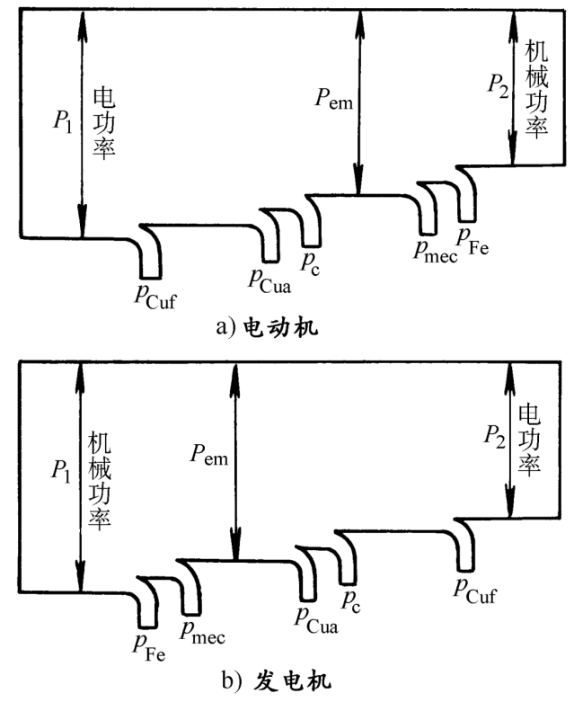

电动机(非稳态运行时):$T_e = T_2 + T_0 + J\frac{d\Omega}{dt}$  
   - >$T_2$: 负载制动转矩  
   - >$T_0$: 空载损耗转矩  

**电动机(稳态运行时)**:$T_e = T_2 + T_0$  

发电机(非稳态运行时):$T_1 = T_e + T_0 + J\frac{d\Omega}{dt}$  
   - >$T_1$: 原动机拖动转矩  

**发电机(稳态运行时)**:$T_1 = T_e + T_0$  

#### 电动机的各种损耗
**铜耗**:电流流过导体时，消耗在电阻上的损耗  
   - 电枢回路中的铜耗:$p_{Cua} = {I_a}^2 R_a$  

**电刷接触损耗**:$p_c = 2\Delta U_cI_a$  
   - >$2\Delta U_c$: 对正负电刷的总接触电压降  

**附加损耗$p_\Delta$**:
   - 无补偿绕组的电机: 按:star:额定输出功率的1%估算  
   - 有补偿绕组的电机: 按额定输出功率的0.5%估算  

机械损耗: 包括轴承及电刷的摩擦损耗
铁耗: 电动机的主磁通在磁路的铁磁材料中交变时所产生的损耗  

#### 各种电机的特性曲线
...

### 直流电机的换向
#### 换向的电磁现象  
1. 电抗电动势: 换向元件中出现的由自感与互感作用所引起的感应电动势
2. 电枢反应电动势

#### 改善换向的方法
1. 装设换向磁极: 在几何中性线处装
2. 大型直流电机在主磁极极靴内安装补偿绕组，补偿绕组与电枢绕组串联，产生磁动势抵消电枢反应磁动势

