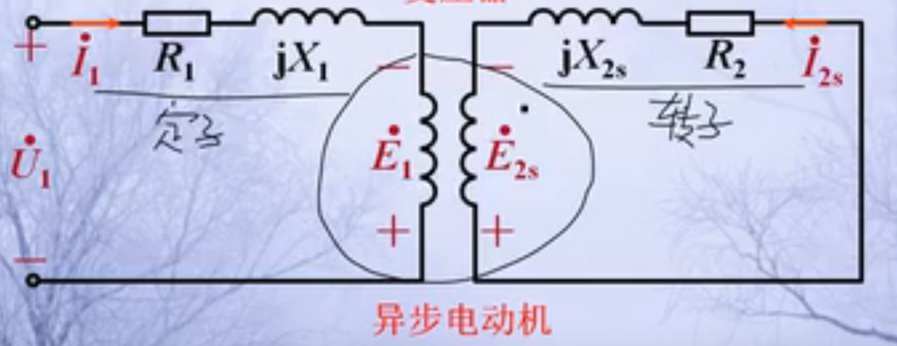
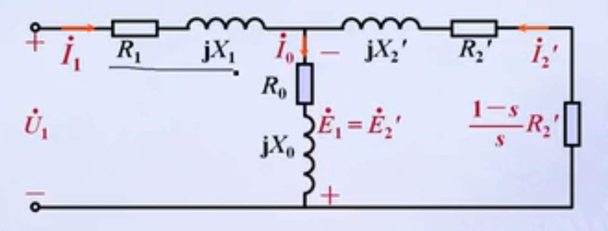
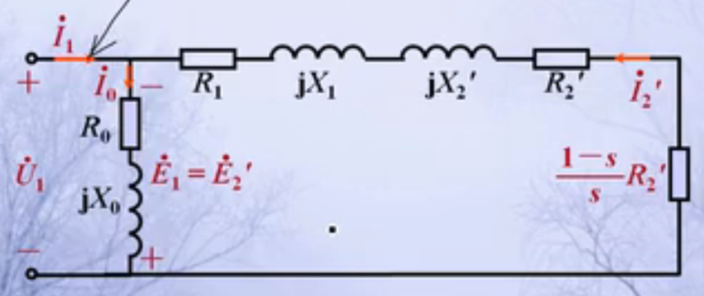
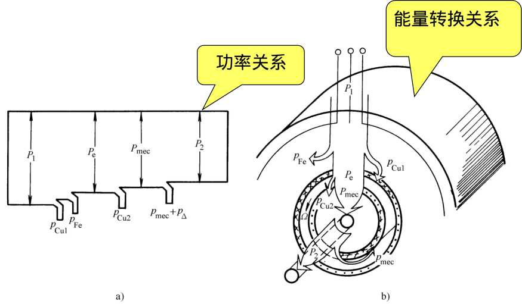

# 第五章 异步电机(二): 三相异步电动机的运行原理及单相异步电动机
## 三相异步电动机运行时的电磁过程

### 定子电路的电动势平衡方程
$\dot{U_1} = -\dot{E_1} + (R_1 + jX_1)\dot{I_1}$  
$\dot{U_1} = -\dot{E_1} + Z_1\dot{I_1}$  
$\dot{E_1} = -j4.44k_{w1}N_1f_1\Phi_m$  
   - >$k_{w1}N_1$: 定子绕组的有效匝数
   - >$f_1$:定子频率(等于电流频率),$f_1 = \frac{pn_0}{60}$  

### 转子电路的电动势平衡方程式
$\dot{E_{2s}} = (R_2 + jX_{2s})\dot{I}_{2s}$  
   - >$X_{2s}$: 转子绕组漏抗,$X_{2s} = 2\pi f_2L_2$  

**转子绕组电动势**:$\dot{E}_{2s} = -j4.44k_{w2}N_2f_2\Phi_m$  
   - >$f_2$: 转子频率,$f_2 = \frac{p(n_0-n)}{60} = sf_1$  
      - 可用于频率归算  

## 三相异步电动机的等效电路及相量图
$X_{2s} = 2\pi f_2L_2 = s2\pi f_1 L_2 = sX_2$  
   - **$X_2$**: 折算到静止时的转子漏电抗  

$E_{2s} = 4.44k_{w2}N_2f_2\Phi_m = s 4.44k_{w2}N_2f_1\Phi_m = sE_2$  
   - **$E_2$**: 折算到静止时的转子感应电动势  
 
$\begin{cases}
f_2 = sf_1 \\
X_{2s} = sX_2 \\
E_{2s} = s E_2
\end{cases}$

### 等效电路
> 先将频率归算后，再进行绕组归算，可得到异步电机的等效电路  

#### 频率归算
$\dot{I}_{2s} = \frac{s\dot{E_2}}{R_2 + jsX_2} = \frac{\dot{E_2}}{\frac{R_2}{s} + jX_2} = I_2'$    
> 式中$\dot{E_2},\dot{X_2}$均为静止转子电路中的电动势和漏电抗， 因此$I_2''$为表示镜子转子电路中电流  

> 用$R_2/s$代替$R_2$，可保持$\dot{I_2},F_2$不变的目的  

#### 绕组归算
1. **电动势的归算**:$E_2' = E_1 = k_eE_2$  
   - >$k_e = \frac{\dot{E_1}}{\dot{E_2}} = \frac{N_1k_{w1}}{N_2k_{w2}}$  
2. **电流的折算**:$I_2' = \frac{m_2N_2k_{w2}}{m_1N_1k_{w1}}I_2 = \frac{1}{k_i}I_2$  
   - >$K_i = \frac{m_1N_1k_{w1}}{m_2N_2k_{w2}}$  
3. **阻抗的折算**:  
   - $R_2' = k_ek_iR_2$  
   - $X_2' = k_ek_iX_2$  
   - $L_{2\sigma}' = k_ek_iL_{2\sigma}$ 

---
**经过频率和绕组归算后,可得等效电路**:  
$\begin{cases}
E_{2s} = sE_2 \\
X_{2s} = sX_2 \\
E_2' = k_eE_2 \\
I_2' = \frac{1}{k_i}I_2 \\
R_2'' = \frac{k_ek_iR_2}{s}  \\
X_2' = k_ek_iX_2  \\
L_{2\sigma}' = k_ek_iL_{2\sigma} \\
\end{cases}$

  

**该近似电路在任意工作情况下都能使用**:  

### 计算
1. 定子功率因数$\cos\phi_1$: 定子电流滞后/超前定子电压的角度的余弦值  
2. 输入功率: $P_1 = m_1U_1I_1\cos\phi_1$  

#### :star:线电压线电流，相电压相电流
线电压:两相之间的电压  
相电压: 相与零线之间的电压  
线电流: 从电源引出三根导线中的电流  
相电流: 三相电源中流过每相负载的电流  

### 相量图
**主磁通$\dot{\Phi}_m$**:画在垂直位置(或水平位置)，定为参考相量  
**$\dot{E_1},\dot{E_2'}$**:均滞后于$\dot{\Phi}_m$90度电角度  
**励磁电流$\dot{I}_m$**: 超前$\dot{\Phi}_m$一个$\alpha_{Fe}$的电角度  
根据阻抗性质来画出其他相量  

## 三相异步电动机的功率和转矩
### 功率转换过程

### 功率方程式
(1)$P_1 - p_{Cu1} -p_{Fe} = P_e$  
(2)$\begin{cases}
P_1 = m_1U_1I_1\cos\phi_1  \\
p_{Cu1} = m_1I_1^2R_1 \\
p_{Fe} = m_1I_m^2R_m \\
P_e = m_1E_2'I_2' \cos \phi_2' = m_1{I_2'}^2\frac{R_2'}{s}\\
\end{cases}$
> $U_1$: 定子相电压  
> $I_1$: 定子相电流  
> $\phi_1$: 定子功率因数角  
> $\phi_2'$: 转子功率因数角

(3)$\begin{cases}
p_{Cu2} = m_1(I_2')^2R_2' \\
P_e -p_{Cu2}   = P_{mech} \\
P_{mech} - (p_{mech} + p_{\Delta}) = P_2
\end{cases}$
> $P{mech}$: 总机械功率  
> $P_{\Delta}$: 附加损耗  

(4)**转子铜耗**:**$p_{Cu2}= sP_e$**  
> $sP_e$: 转差功率

(5)**总机械功率**:$P_{mech} = P_e -p_{Cu2} = (1-s)P_e$  

(6):star:$P_e = m_1(I_2')^2\frac{R_2'}{s}$  

### 转矩方程式
$T_e = T_2 + T_{mech} + T_{\Delta} \approx T_2 + T_0$  
> $T_2$: 电动势输出的机械转矩,$T_2 = \frac{P_2}{\Omega}$  
> $T_{mech}$: 机械损耗转矩  
> $T_{\Delta}$: 附加损耗转矩  
> $T_0$: 空载转矩,$T_0 = \frac{p_{mech}+p_\Delta}{\Omega}$   
> $T_e$: 电磁转矩  

### 电磁转矩公式
$T_e =  \frac{P_e}{\Omega_s} =\frac{p}{2\pi f_1}m_1E_2'I_2'\cos \phi_2'$  
> $\Omega_s$: 同步角速度  
>> **$\Omega_s = 2\pi\frac{n_s}{60}$**  

$T_e = \frac{P_{mech}}{\Omega}$  
> $\Omega$: 转子本身的机械角速度  
>> **$\Omega = 2\pi\frac{n}{60}$**  

$P_e = m_1E_2'I_2'\cos\phi_2'$  

