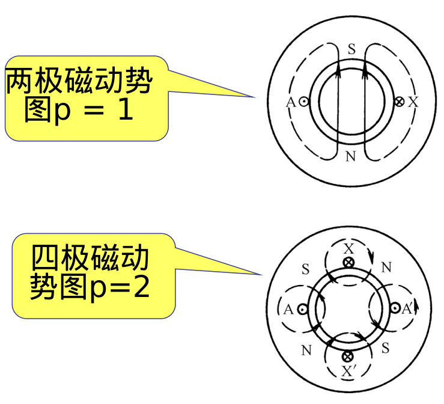
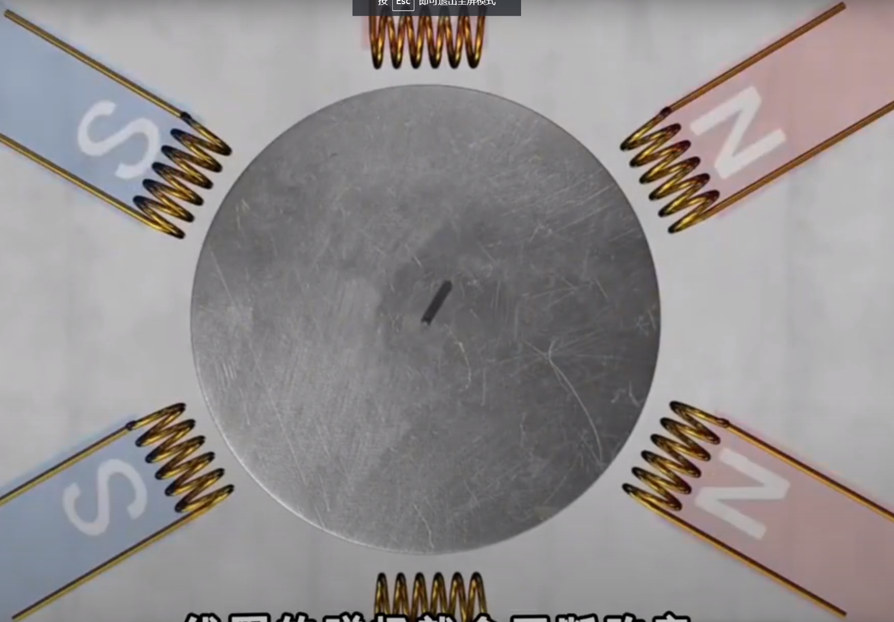
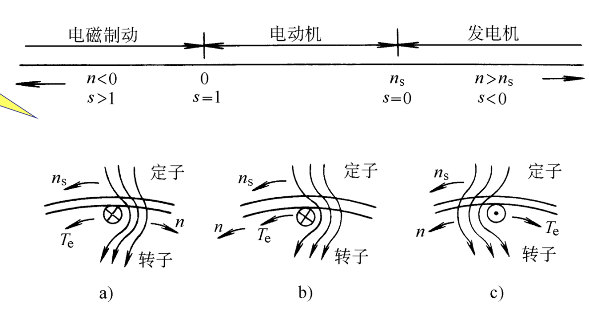
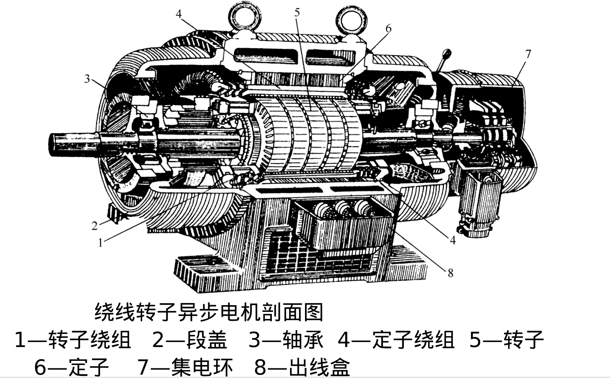
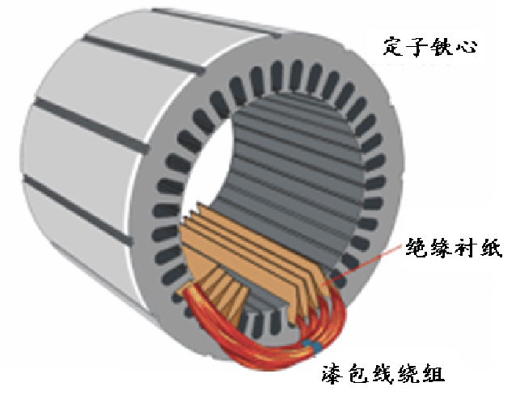
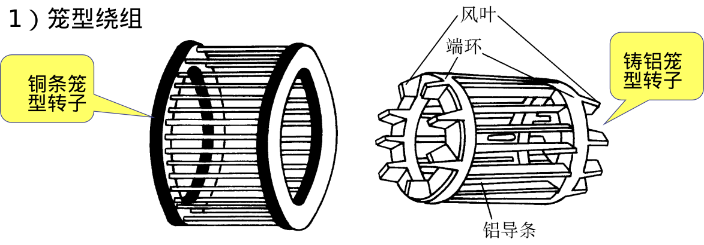

# 第四章-异步电机(一)三项异步电动机的基本原理
> 交流电机: 分为同步电机和异步电机  
>> 异步电机: 多为电动机  

## 三相异步电动机的工作原理及结构
### 三相异步电动机的工作原理与运行状态
> 原理: 通过一种旋转磁场与由这种旋转磁场借助感应作用在转子绕组内所感应的电流相互作用，以产生电磁转矩来实现拖动作用  

#### 旋转磁场的产生
**概念**: 一种极性与大小不变且以一定转速旋转的磁场  
**产生方式**: 在对称多相绕组中流过对称多相电流时会产生一种旋转磁场  

**旋转磁场(同步)转速**: $n_s = \frac{f_1}{p} (r/s) = \frac{60f_1}{p} (r/min)$  
   - > p: 磁极对数  

#### 三相异步电机的工作原理
**原理**: 利用三项对称绕组通对称多相电流产生的**旋转磁场**，对转子铁心上嵌有的均匀分布的导体做切割运动，从而在导体内产生感生电流，且导体受到电磁力，于是转子就跟着旋转磁场旋转  
> `感生电流`: 利用右手定则，根据磁场相对于导体运动的方向，磁场的方向，可得出导体内感生电流的方向  
> `电磁力`: 利用左手定则，根据电流方向，磁场方向，可以得出电磁力方向，从而得知转子铁心的旋转方向  

#### 三相异步电动机的转速与运行状态
三相异步电动机的转速(转子异步转速)n: 一般低于同步转速($n_s$)  
> 若转子转速达到同步转速，则旋转磁场与转子导体之间不再有相对运动，因而不在产生感应电动势，也没有电磁转矩来拖动机械负载  

**转差($n_s -n)$**: 异步电动机运行的必要条件  
**转差率**:$s = \frac{n_s-n}{n}\times 100\%$  

解题步骤:(给定额定转速n，判断电机的极数，同步转速和额定负载时的转差率)  
1. 通过$n_s = \frac{60f}{p}$,求出p = 1,2,3,...时的同步转速  
2. 已知异步转速n,因为n一般略小于同步转速，所以可以确定同步转速和极数  
3. 额定转差率:$s = \frac{n_s-n}{n}\times 100\%$  

---
**异步电机的三种运行状态**:  
1. 发电机状态: $n > n_s$,$s < 0$  
   - > 电磁转矩性质: 制动性质  
2. 电动机状态:$n < n_s$  
   - > 电磁转矩性质: 驱动性质  
3. 电磁制动状态:$n < 0$  
   - > 电磁转矩性质: 制动性质  

## 三相异步电动机的结构

### 定子

**组成**: 定子铁心，定子绕组和基座  
   - `定子铁心槽型`:半闭口，半开口，开口  

### 转子
**组成**: 转子铁心，转子绕组，转轴  

:star:**转子绕组分类**: 笼型转子，绕线转子  

## 三相异步电动机的铭牌数据
**额定功率**: 电动机在额定运行时输出的机械功率  
**额定电压**: 在额定运行状态下，电网加在定子绕组的线电压  
**额定电流**: 指电动机在额定电压下使用，输出额定功率时，定子绕组中的线电流  
**额定频率**: 50Hz  
**额定转速$n_N$**: 指电动机在额定电压，额定频率，额定功率下的转速，单位为r/min  
定子绕组的相数与联结法等  

## 三相异步电动机的定子绕阻(我认为不重要）
### 交流绕组的一些基本知识和基本量
1. **机械角度**: 电机圆周在几何上分为360度，这个角度称为机械角度  
2. **电角度**: 电角度 = p $\times$ 机械角度  
3. **线圈**: 组成交流绕组的单元  
4. **节距**: 一个线圈的两个边所跨定子圆周上的距离,用$y_1$表示  
    -  节距应接近极距$\tau$  
        - >$y_1 = \tau$: 整距绕组  
        - >$y_1 < \tau$: 短距绕组  
        - >$y_1 > \tau$: 长距绕组  
5. **槽距角$\alpha$**: 相邻槽之间的电角度  
    - 公式: $\alpha = \frac{p \times 360}{Q_1}$  
        - > $Q_1$: 定子槽数  
6. 极距$\tau$:$\tau = \frac{Q_1}{2p}$  
7. **每极每相槽数q**: 每一极每相所占槽数  
    - 公式: $q = \frac{Q_1}{2pm}$  
        - >m: 相数

### 交流绕组的排列和连接
...

### 三相单层绕组
单层绕组的每一个槽内只有一个线圈边，整个绕组的线圈数等于总槽数的一半

### 三相双层绕组
双层绕组的每个槽内都有上下两个线圈边，每个线圈的一个边放在某一个槽的上层，另一边放在相隔节距$y_1$的另一个槽的下层

## 三相异步电动机定子磁动势及磁场
短矩绕组,分布绕组可以减少谐波电动势和谐波磁场的影响  
...

## 三相异步电动机定子绕组的电动势
...

---

[左手，右手定则](https://idoogoo.com/blogs/1369/zuoyousgh/#:~:text=%E2%80%9C%E5%B7%A6%E6%89%8B%E5%AE%9A%E5%88%99%E2%80%9D%E5%8F%88%E5%8F%AB,%EF%BC%88%E5%AE%89%E5%9F%B9%E5%8A%9B%EF%BC%89%E7%9A%84%E6%96%B9%E5%90%91%E3%80%82)

